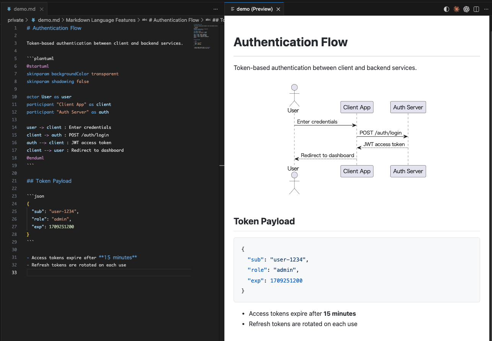
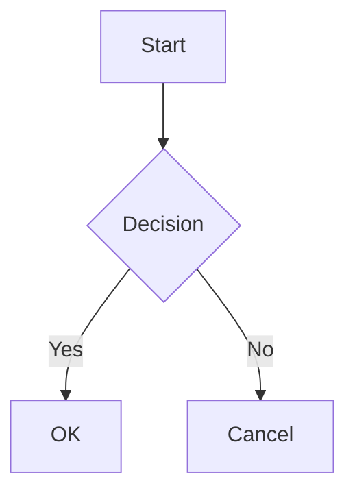

<p align="center">
  
</p>

<h1 align="center">PlantUML Markdown Preview</h1>

<p align="center">
  <strong>Render PlantUML &amp; Mermaid diagrams inline in Markdown. Export to self-contained HTML. Secure by design.</strong>
</p>

<p align="center">
  <a href="https://marketplace.visualstudio.com/items?itemName=yss-tazawa.plantuml-markdown-preview"></a>
  <a href="https://marketplace.visualstudio.com/items?itemName=yss-tazawa.plantuml-markdown-preview"></a>
  <a href="https://github.com/yss-tazawa/plantuml-markdown-preview/blob/main/LICENSE"></a>
</p>

<p align="center">
  
</p>

## Highlights

- **Inline PlantUML rendering** — diagrams appear directly in your Markdown preview, not in a separate panel
- **Mermaid support** — ```` ```mermaid ```` blocks rendered client-side with theme selection (no Java needed)
- **Diagram scale control** — adjust PlantUML and Mermaid diagram sizes independently
- **Local & Server rendering** — use Java locally (default, fully async) or render via a PlantUML server (no Java required)
- **Self-contained HTML export** — SVG diagrams embedded inline, configurable layout width and alignment
- **Bidirectional scroll sync** — editor and preview scroll together, both ways
- **14 preview themes** — 8 light + 6 dark themes including GitHub, Atom, Solarized, Dracula, Monokai, and more
- **Secure** — CSP nonce-based policy, no code execution from Markdown content
- **Internationalization** — English and Japanese UI

## Table of Contents

- [Features](#features)
- [Quick Start](#quick-start)
  - [Diagram Support](#diagram-support)
- [Usage](#usage)
- [Configuration](#configuration)
- [Keyboard Shortcuts](#keyboard-shortcuts)
- [FAQ](#faq)
- [Contributing](#contributing)
- [Third-Party Licenses](#third-party-licenses)
- [License](#license)

## Features

### Inline Diagram Preview

```` ```plantuml ```` and ```` ```mermaid ```` code blocks are rendered as inline SVG diagrams alongside your regular Markdown content.

- Real-time preview updates as you type (two-stage debouncing)
- Auto-refresh on file save
- Auto-follow when switching editor tabs
- Loading indicator during diagram rendering
- Syntax errors displayed inline with line numbers and source context
- PlantUML: rendered via Java (local) or PlantUML server — see [Local & Server Rendering](#local--server-rendering)
- Mermaid: rendered client-side using [mermaid.js](https://mermaid.js.org/) — no Java or external tools required

### Diagram Scale

Control the display size of PlantUML and Mermaid diagrams independently.

- **PlantUML scale** — `auto` (shrink to fit) or fixed percentage (70%–120%, default 100%). SVG stays crisp at any scale.
- **Mermaid scale** — `auto` (fit container) or fixed percentage (50%–100%, default 80%).

### Local & Server Rendering

Choose how PlantUML diagrams are rendered:

- **Local mode** (default) — uses Java + PlantUML jar on your machine. Diagrams never leave your computer. Rendering is fully asynchronous so the editor stays responsive.
- **Server mode** — sends PlantUML text to a PlantUML server for rendering. No Java installation required. Uses the public server (`https://www.plantuml.com/plantuml`) by default, or set your own self-hosted server URL for privacy.

If Java is not found when opening a preview, a notification offers to switch to server mode automatically.

### HTML Export

Export your Markdown document to a self-contained HTML file.

- PlantUML and Mermaid diagrams embedded as inline SVG
- Syntax highlighting CSS included — no external dependencies
- Export and open in browser in one command
- Configurable layout width (640px–1440px or unlimited) and alignment (center or left)

### Bidirectional Scroll Sync

Editor and preview stay in sync as you scroll either one.

- Accurate scroll mapping with smooth position tracking
- Smooth position restoration after re-render

### Themes

**Preview themes** control the overall document appearance:

**Light themes:**

| Theme | Style |
|-------|-------|
| GitHub Light | White background (default) |
| Atom Light | Soft gray text, Atom editor inspired |
| One Light | Off-white, balanced palette |
| Solarized Light | Warm beige, eye-friendly |
| Vue | Green accents, Vue.js docs inspired |
| Pen Paper Coffee | Warm paper, handwritten aesthetic |
| Coy | Near-white, clean design |
| VS | Classic Visual Studio colors |

**Dark themes:**

| Theme | Style |
|-------|-------|
| GitHub Dark | Dark background |
| Atom Dark | Tomorrow Night palette |
| One Dark | Atom-inspired dark |
| Dracula | Vibrant dark |
| Solarized Dark | Deep teal, eye-friendly |
| Monokai | Vivid syntax, Sublime Text inspired |

Switch preview themes instantly from the title bar icon — no re-render needed (CSS-only swap). PlantUML theme changes trigger a re-render.

**PlantUML themes** control diagram styling independently. The extension discovers
available themes from your PlantUML installation and presents them in a combined
QuickPick alongside preview themes.

**Mermaid themes** control Mermaid diagram styling: `default`, `dark`, `forest`, `neutral`, `base`. Also available in the QuickPick theme picker.

### Syntax Highlighting

190+ languages supported via highlight.js. Code blocks are styled to match your
selected preview theme.

### Security

- Content Security Policy with nonce-based script restrictions
- No code execution from Markdown content
- User-authored `<script>` tags are blocked
- Local image loading is on by default (`allowLocalImages`); set to `false` to block all local file access
- HTTP image loading is off by default (`allowHttpImages`); enabling adds `http:` to the CSP `img-src` directive, which allows unencrypted image requests — use only on trusted networks (intranet, local dev servers)

### Built-in Markdown Preview Integration

PlantUML and Mermaid diagrams also render in VS Code's built-in Markdown preview
(`Markdown: Open Preview to the Side`). No additional configuration needed.

> **Note:** The built-in preview does not support this extension's preview themes,
> bidirectional scroll sync, or HTML export. For the full feature set, use the
> extension's own preview panel (`Cmd+Alt+V` / `Ctrl+Alt+V`).
>
> **Note:** The built-in preview renders diagrams synchronously. Large or complex
> PlantUML diagrams may briefly freeze the editor. For heavy diagrams, use the
> extension's own preview panel instead.

## Quick Start

### Prerequisites

**Mermaid** — no prerequisites. Works out of the box.

**PlantUML (server mode)** — no prerequisites. Diagrams are sent to a PlantUML server for rendering.

**PlantUML (local mode)** — default:

| Tool | Purpose | Verify |
|------|---------|--------|
| Java (JRE or JDK) | Runs PlantUML | `java -version` |
| [Graphviz](https://graphviz.org/) | Optional — needed for class, component, and other layout-dependent diagrams (see [Diagram Support](#diagram-support)) | `dot -V` |

> **Note:** A PlantUML jar (LGPL) is bundled with the extension.
> No separate download is needed.
>
> **Tip:** If Java is not installed, the extension will offer to switch to server mode when you open a preview.

### Diagram Support

What works depends on your setup:

| Diagram | LGPL (bundled) | Win: GPLv2 jar | Mac/Linux: + Graphviz |
|---------|:-:|:-:|:-:|
| Sequence | ✓ | ✓ | ✓ |
| Activity (new syntax) | ✓ | ✓ | ✓ |
| Mind Map | ✓ | ✓ | ✓ |
| WBS | ✓ | ✓ | ✓ |
| Gantt | ✓ | ✓ | ✓ |
| JSON / YAML | ✓ | ✓ | ✓ |
| Salt / Wireframe | ✓ | ✓ | ✓ |
| Timing | ✓ | ✓ | ✓ |
| Network (nwdiag) | ✓ | ✓ | ✓ |
| Class | — | ✓ | ✓ |
| Use Case | — | ✓ | ✓ |
| Object | — | ✓ | ✓ |
| Component | — | ✓ | ✓ |
| Deployment | — | ✓ | ✓ |
| State | — | ✓ | ✓ |
| ER (Entity Relationship) | — | ✓ | ✓ |
| Activity (legacy) | — | ✓ | ✓ |

- **LGPL (bundled)** — works out of the box. No Graphviz needed.
- **Win: GPLv2 jar** — the [GPLv2 version](https://plantuml.com/download) bundles Graphviz (Windows only, auto-extracted). Set [`jarPath`](#configuration) to use it.
- **Mac/Linux: + Graphviz** — install [Graphviz](https://graphviz.org/) separately. Works with either LGPL or GPLv2 jar.

### Install

1. Open VS Code
2. Search for **PlantUML Markdown Preview** in the Extensions view (`Ctrl+Shift+X` / `Cmd+Shift+X`)
3. Click **Install**

### Setup

The extension works out of the box — no configuration is required.

**To use server mode** (no Java needed): Open VS Code settings (`Ctrl+,` / `Cmd+,`), search for `plantumlMarkdownPreview.renderMode`, and set it to `server`. Alternatively, the extension will prompt you to switch when Java is not detected.

**To use local mode** (default): The bundled LGPL jar supports sequence, activity, mind map, and other diagrams
without extra setup (see [Diagram Support](#diagram-support)).
To enable class, component, use case, and other layout-dependent diagrams,
follow the steps for your platform below.

#### Windows

1. Install Java if not already installed (open PowerShell and run):
   ```powershell
   winget install Microsoft.OpenJDK.21
   ```
2. If `java` is not on your PATH, find the full path in PowerShell:
   ```powershell
   Get-Command java
   # e.g. C:\Program Files\Microsoft\jdk-21.0.6.7-hotspot\bin\java.exe
   ```
   Open VS Code settings (`Ctrl+,`), search for `plantumlMarkdownPreview.javaPath`, and enter the path shown above
3. Download the [GPLv2 version of PlantUML](https://plantuml.com/download) (`plantuml-gplv2-*.jar`) to a folder of your choice (includes Graphviz — no separate install needed)
4. Open VS Code settings (`Ctrl+,`), search for `plantumlMarkdownPreview.jarPath`, and enter the full path to the downloaded `.jar` file (e.g. `C:\tools\plantuml-gplv2-1.2026.2.jar`)

#### Mac

1. Install Java and Graphviz via Homebrew:
   ```sh
   brew install openjdk graphviz
   ```
2. If `dot` is not on your PATH, find the full path and set it in VS Code:
   ```sh
   which dot
   # e.g. /opt/homebrew/bin/dot
   ```
   Open VS Code settings (`Cmd+,`), search for `plantumlMarkdownPreview.dotPath`, and enter the path shown above

#### Linux

1. Install Java and Graphviz:
   ```sh
   # Debian / Ubuntu
   sudo apt install default-jdk graphviz

   # Fedora
   sudo dnf install java-21-openjdk graphviz
   ```
2. If `dot` is not on your PATH, find the full path and set it in VS Code:
   ```sh
   which dot
   # e.g. /usr/bin/dot
   ```
   Open VS Code settings (`Ctrl+,`), search for `plantumlMarkdownPreview.dotPath`, and enter the path shown above

> **Note:** `javaPath` defaults to `"java"`. If left at the default, `JAVA_HOME/bin/java` is tried first, then `java` on PATH.
> `dotPath` and `jarPath` default to `"dot"` and the bundled jar respectively.
> Only configure them if these commands are not on your PATH or you want to use a different jar.

## Usage

### Open Preview

- **Keyboard shortcut:** `Cmd+Alt+V` (Mac) / `Ctrl+Alt+V` (Windows / Linux)
- **Context menu:** Right-click a `.md` file in the Explorer or inside the editor → **PlantUML Markdown Preview** → **Open Preview to Side**
- **Command Palette:** `PlantUML Markdown Preview: Open Preview to Side`

The preview uses its own theming independent of VS Code — default is a white background (GitHub Light).

### Export to HTML

- **Context menu:** Right-click a `.md` file → **PlantUML Markdown Preview** → **Export as HTML**
- **Preview panel:** Right-click inside the preview panel → **Export as HTML** or **Export as HTML & Open in Browser**
- **Command Palette:** `PlantUML Markdown Preview: Export as HTML`
- **Command Palette:** `PlantUML Markdown Preview: Export as HTML & Open in Browser`

The HTML file is saved alongside the source `.md` file. To export and open in
your browser in one step, choose **Export as HTML & Open in Browser**.

### Change Theme

Click the theme icon in the preview panel title bar, or use the Command Palette:

- **Command Palette:** `PlantUML Markdown Preview: Change Preview Theme`

The theme picker shows all three theme categories in a single list — preview themes, PlantUML themes, and Mermaid themes — so you can switch any of them from one place.

### PlantUML Syntax

````markdown
```plantuml
Alice -> Bob: Hello
Bob --> Alice: Hi!
```
````

`@startuml` / `@enduml` wrappers are added automatically if omitted.

### Mermaid Syntax

````markdown

````

## Configuration

All settings use the `plantumlMarkdownPreview.` prefix.

| Setting | Default | Description |
|---------|---------|-------------|
| `renderMode` | `"local"` | Rendering mode. `"local"` uses Java + PlantUML jar (diagrams stay on your machine). `"server"` sends diagrams to a PlantUML server (no Java required). |
| `serverUrl` | `"https://www.plantuml.com/plantuml"` | PlantUML server URL for server mode. Set to a self-hosted server URL for privacy. |
| `javaPath` | `"java"` | Path to Java executable. If set, used as-is; otherwise falls back to `JAVA_HOME/bin/java`, then `java` on PATH. (local mode only) |
| `jarPath` | `""` | Path to `plantuml.jar`. Leave empty to use the bundled jar (LGPL). (local mode only) |
| `dotPath` | `"dot"` | Path to Graphviz `dot` executable (local mode only) |
| `previewTheme` | `"github-light"` | Preview theme (see [Themes](#themes)) |
| `plantumlTheme` | `"default"` | PlantUML diagram theme. `"default"` applies no theme. Other values (e.g. `"cyborg"`, `"mars"`) are passed as `-theme` to PlantUML CLI or injected as `!theme` directive in server mode. |
| `plantumlScale` | `"100%"` | PlantUML diagram scale. `"auto"` shrinks diagrams that exceed container width. A percentage (70%–120%) renders at that fraction of natural size. |
| `mermaidTheme` | `"default"` | Mermaid diagram theme: `"default"`, `"dark"`, `"forest"`, `"neutral"`, or `"base"`. |
| `mermaidScale` | `"80%"` | Mermaid diagram scale. `"auto"` scales to fit container width. A percentage (50%–100%) renders at that fraction of natural size. |
| `htmlMaxWidth` | `"960px"` | Maximum width of the exported HTML body. Options: `"640px"` – `"1440px"`, or `"none"` for no limit. |
| `htmlAlignment` | `"center"` | HTML body alignment. `"center"` (default) or `"left"`. |
| `allowLocalImages` | `true` | Resolve relative image paths (e.g. ``) in the preview. Set to `false` to block all local file access. |
| `allowHttpImages` | `false` | Allow loading images over HTTP (unencrypted) in the preview. Useful for intranet or local development servers. |
| `debounceNoPlantUmlMs` | `100` | Debounce delay (ms) for non-PlantUML text changes |
| `debouncePlantUmlMs` | `300` | Debounce delay (ms) for PlantUML content changes |

> **Note:** `allowLocalImages` and `allowHttpImages` apply only to the preview panel. HTML export always outputs original image paths without CSP restrictions.

<details>
<summary><strong>Preview theme options</strong></summary>

| Value | Description |
|-------|-------------|
| `github-light` | GitHub Light — white background (default) |
| `atom-light` | Atom Light — soft gray text, Atom inspired |
| `one-light` | One Light — off-white, balanced palette |
| `solarized-light` | Solarized Light — warm beige, eye-friendly |
| `vue` | Vue — green accents, Vue.js docs inspired |
| `pen-paper-coffee` | Pen Paper Coffee — warm paper, handwritten aesthetic |
| `coy` | Coy — near-white, clean design |
| `vs` | VS — classic Visual Studio colors |
| `github-dark` | GitHub Dark — dark background |
| `atom-dark` | Atom Dark — Tomorrow Night palette |
| `one-dark` | One Dark — Atom-inspired dark |
| `dracula` | Dracula — vibrant dark palette |
| `solarized-dark` | Solarized Dark — deep teal, eye-friendly |
| `monokai` | Monokai — vivid syntax, Sublime Text inspired |

</details>

## Keyboard Shortcuts

| Command | Mac | Windows / Linux |
|---------|-----|-----------------|
| Open Preview to Side | `Cmd+Alt+V` | `Ctrl+Alt+V` |

## FAQ

<details>
<summary><strong>PlantUML diagrams are not rendering</strong></summary>

**Local mode:**
1. Run `java -version` in your terminal to confirm Java is installed
2. If you use class, component, or other layout-dependent diagrams, run `dot -V` to confirm Graphviz is installed (see [Diagram Support](#diagram-support))
3. If you set a custom `jarPath`, verify it points to a valid `plantuml.jar` file. If `jarPath` is empty (default), the bundled LGPL jar is used automatically
4. Check the VS Code Output panel for error messages

**Server mode:**
1. Verify the server URL is correct (default: `https://www.plantuml.com/plantuml`)
2. Check your network connection — the extension needs to reach the PlantUML server
3. If using a self-hosted server, ensure it is running and accessible
4. Requests to the server time out after 15 seconds (local mode also has a 15-second timeout per diagram)

</details>

<details>
<summary><strong>Can I use PlantUML without installing Java?</strong></summary>

Yes. Set `renderMode` to `"server"` in the extension settings. Server mode sends your
PlantUML text to a PlantUML server for rendering and does not require Java.
By default the public server at `https://www.plantuml.com/plantuml` is used.
For privacy, you can run your own PlantUML server and set `serverUrl` to its URL.

</details>

<details>
<summary><strong>Is my diagram data safe in server mode?</strong></summary>

In server mode, PlantUML source text is sent to the configured server.
The default public server (`https://www.plantuml.com/plantuml`) is operated by the
PlantUML project. If your diagrams contain sensitive information, consider
running a [self-hosted PlantUML server](https://plantuml.com/server) and setting
`serverUrl` to its URL, or use local mode (default) where diagrams never leave your machine.

</details>

<details>
<summary><strong>Diagrams look wrong with a dark theme</strong></summary>

Set a diagram theme to match your preview theme. Open the theme picker from the
title bar icon and select a dark PlantUML theme (e.g. `cyborg`, `mars`) or set the Mermaid theme to `dark`.

</details>

<details>
<summary><strong>Can I use <code>!theme</code> inside my PlantUML code?</strong></summary>

Yes. An inline `!theme` directive takes precedence over the extension setting.

</details>

## Contributing

See [CONTRIBUTING.md](CONTRIBUTING.md) for development setup, build instructions,
and pull request guidelines.

## Third-Party Licenses

This extension bundles the following third-party software:

- [PlantUML](https://plantuml.com/) (LGPL version) — [GNU Lesser General Public License v3 (LGPL-3.0)](https://www.gnu.org/licenses/lgpl-3.0.html). See the [PlantUML license page](https://plantuml.com/license) for details.
- [mermaid.js](https://mermaid.js.org/) — [MIT License](https://github.com/mermaid-js/mermaid/blob/develop/LICENSE)

## License

[MIT](LICENSE)
