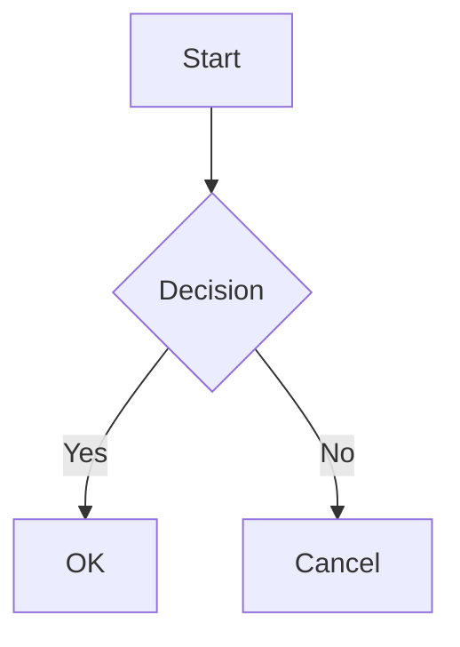

<p align="center">
  
</p>

<h1 align="center">PlantUML Markdown Preview</h1>

<p align="center">
  <strong>3 modes to fit your workflow. Render PlantUML, Mermaid &amp; D2 inline — fast, secure, or zero-setup.</strong>
</p>

<p align="center">
  <a href="https://marketplace.visualstudio.com/items?itemName=yss-tazawa.plantuml-markdown-preview"></a>
  <a href="https://marketplace.visualstudio.com/items?itemName=yss-tazawa.plantuml-markdown-preview"></a>
  <a href="https://github.com/yss-tazawa/plantuml-markdown-preview/blob/main/LICENSE"></a>
</p>

<p align="center">
  
</p>

## Choose Your Mode

| | **Fast** (default) | **Secure** | **Easy** |
|---|---|---|---|
| | Instant re-renders | Maximum privacy | Zero setup |
| | Runs a PlantUML server on localhost — no JVM startup cost, instant updates | No network, no background processes — everything stays on your machine | No Java needed — works out of the box with a PlantUML server |
| **Java** | 11+ required | 11+ required | Not required |
| **Network** | None | None | Required |
| **Privacy** | Local only | Local only | Diagram source sent to PlantUML server |
| **Setup** | [Install Java →](#prerequisites) | [Install Java →](#prerequisites) | No setup needed |

Switch between modes anytime with a single setting — no migration, no restart.

> See [Rendering Modes](#rendering-modes) for details and [Quick Start](#quick-start) for full setup instructions.

## Highlights

- **Inline PlantUML, Mermaid & D2 rendering** — diagrams appear directly in your Markdown preview, not in a separate panel
- **Secure by design** — CSP nonce-based policy blocks all code execution from Markdown content
- **Diagram scale control** — adjust PlantUML, Mermaid, and D2 diagram sizes independently
- **Self-contained HTML export** — SVG diagrams embedded inline, configurable layout width and alignment
- **PDF export** — one-click export via headless Chromium; diagrams auto-scaled to fit the page
- **Bidirectional scroll sync** — editor and preview scroll together, both ways
- **Navigation & TOC** — go-to-top / go-to-bottom buttons and a Table of Contents sidebar in the preview panel
- **Diagram Viewer** — right-click any diagram to open a pan & zoom panel with live sync and theme-matched background
- **PlantUML `!include` support** — included files are resolved and rendered inline
- **Standalone diagram preview** — open `.puml`, `.mmd`, and `.d2` files directly with pan & zoom, live updates, and theme support — no Markdown wrapper needed
- **Save or copy diagrams as PNG / SVG** — right-click any diagram in the preview or Diagram Viewer to save or copy to clipboard
- **Status bar indicator** — see the current rendering mode and local server state at a glance; click to switch modes
- **Find in preview** — use `Cmd+F` / `Ctrl+F` to search text in Diagram Viewer and standalone diagram previews
- **14 preview themes** — 8 light + 6 dark themes including GitHub, Atom, Solarized, Dracula, Monokai, and more
- **Code snippets** — type `plantuml-sequence`, `mermaid-sequence`, or `d2-sequence` in Markdown, or `seq` inside a fenced block, to expand diagram templates instantly
- **Internationalization** — English, Chinese (Simplified), and Japanese UI
- **Math support** — `$...$` inline and `$$...$$` block math rendered with [KaTeX](https://katex.org/)

## Table of Contents

- [Choose Your Mode](#choose-your-mode)
- [Highlights](#highlights)
- [Features](#features)
- [Quick Start](#quick-start)
- [Usage](#usage)
- [Configuration](#configuration)
- [Snippets](#snippets)
- [Keyboard Shortcuts](#keyboard-shortcuts)
- [FAQ](#faq)
- [Contributing](#contributing)
- [Third-Party Licenses](#third-party-licenses)
- [License](#license)

## Features

### Inline Diagram Preview

```` ```plantuml ````, ```` ```mermaid ````, and ```` ```d2 ```` code blocks are rendered as inline SVG diagrams alongside your regular Markdown content.

- Real-time preview updates as you type (two-stage debouncing)
- Auto-refresh on file save
- Auto-follow when switching editor tabs
- Loading indicator during diagram rendering
- Syntax errors displayed inline with line numbers and source context
- PlantUML: rendered via Java (Secure / Fast mode) or remote PlantUML server (Easy mode) — see [Rendering Modes](#rendering-modes)
- Mermaid: rendered client-side using [mermaid.js](https://mermaid.js.org/) — no Java or external tools required
- D2: rendered client-side using [@terrastruct/d2](https://d2lang.com/) (Wasm) — no external tools required

### Math Support

Render mathematical expressions using [KaTeX](https://katex.org/).

- **Inline math** — `$E=mc^2$` renders as an inline formula
- **Block math** — `$$\int_0^\infty e^{-x}\,dx = 1$$` renders as a centered display formula
- Server-side rendering — no JavaScript in the Webview, just HTML/CSS
- Works in both preview and HTML/PDF export
- Disable with `enableMath: false` if `$` symbols cause unwanted math parsing

### Diagram Scale

Control the display size of PlantUML, Mermaid, and D2 diagrams independently.

- **PlantUML scale** — `auto` (shrink to fit) or fixed percentage (70%–120%, default 100%). SVG stays crisp at any scale.
- **Mermaid scale** — `auto` (fit container) or fixed percentage (50%–100%, default 80%).
- **D2 scale** — `auto` (fit container) or fixed percentage (50%–100%, default 75%).

### Rendering Modes

Choose a preset mode that controls how PlantUML diagrams are rendered:

| | Fast (default) | Secure | Easy |
|---|---|---|---|
| **Java required** | Yes | Yes | No |
| **Network** | None (localhost only) | None | Required |
| **Privacy** | Diagrams stay on your machine | Diagrams stay on your machine | Diagram source sent to PlantUML server |
| **Speed** | Persistent PlantUML server — instant re-renders | JVM starts per render | Depends on network |
| **Concurrency** | 50 (parallel HTTP) | 1 (batch) | 5 (parallel HTTP) |

- **Fast mode** (default) — starts a persistent PlantUML server on `localhost`. Eliminates JVM startup cost on every edit, enabling instant re-renders with high concurrency. Diagrams never leave your machine.
- **Secure mode** — uses Java + PlantUML jar on your machine. Diagrams never leave your machine. No network access. Local images are blocked by default for maximum security.
- **Easy mode** — sends PlantUML source to a PlantUML server for rendering. No setup required. Uses the public server (`https://www.plantuml.com/plantuml`) by default, or set your own self-hosted server URL for privacy.

If Java is not found when opening a preview, a notification offers to switch to Easy mode.

### Status Bar

The status bar shows the current rendering mode (Fast / Secure / Easy) and, in Fast mode, the local server state (running, starting, error, stopped).

- Click the status bar item to switch modes via a quick pick — no need to open Settings
- Same as the **Select Rendering Mode** command in the Command Palette

### HTML Export

Export your Markdown document to a self-contained HTML file.

- PlantUML, Mermaid, and D2 diagrams embedded as inline SVG
- Syntax highlighting CSS included — no external dependencies
- Export and open in browser in one command
- Configurable layout width (640px–1440px or unlimited) and alignment (center or left)
- **Fit-to-width** option scales diagrams and images to fill the page width

### PDF Export

Export your Markdown document to PDF using a headless Chromium-based browser.

- Requires Chrome, Edge, or Chromium installed on your system
- Diagrams are automatically scaled to fit the page width
- Print margins are applied for a clean layout

### Navigation

- **Go to top / Go to bottom** — buttons in the top-right corner of the preview panel
- **Table of Contents sidebar** — click the TOC button to open a sidebar listing all headings; click a heading to jump to it

### Diagram Viewer

Right-click any PlantUML, Mermaid, or D2 diagram in the preview and select **Open in Diagram Viewer** to open it in a separate pan & zoom panel.

- Mouse wheel zoom (cursor-centered) and drag to pan
- Toolbar: Fit to Window, 1:1 reset, step zoom (+/-)
- Live sync — editor changes are reflected in real time while preserving your zoom position
- Background color matches the current preview theme
- Automatically closed when switching to a different source file
- **Save or copy as PNG / SVG** — right-click a diagram in the preview or Diagram Viewer to save it as a file or copy PNG to clipboard
- **Find in viewer** — press `Cmd+F` / `Ctrl+F` to open the find widget
- Disable with `enableDiagramViewer: false`

### PlantUML `!include` Support

Use `!include` directives to share common styles, macros, and component definitions across diagrams.

- Included files are resolved relative to the workspace root (or the directory set in `plantumlIncludePath`)
- Saving an included file automatically refreshes the preview (you can also click the **Reload** button ↻ to force a manual refresh)
- **Go to Include File** — right-click on a `!include` line in `.puml` or Markdown files to open the referenced file (menu item appears only when the cursor is on an `!include` line)
- Works in Fast and Secure modes. Not available in Easy mode (the remote server cannot access local files).

### Standalone Diagram Preview

Open `.puml`, `.plantuml`, `.mmd`, `.mermaid`, or `.d2` files directly — no Markdown wrapper needed.

- Same pan & zoom UI as the Diagram Viewer
- Live preview updates as you type (debounced)
- Auto-follow when switching between files of the same type
- Independent theme selection (preview theme + diagram theme)
- Save or copy as PNG / SVG via right-click
- **Find in preview** — press `Cmd+F` / `Ctrl+F` to open the find widget
- PlantUML: supports all three rendering modes (Fast / Secure / Easy)
- Mermaid: rendered client-side using mermaid.js
- D2: rendered using @terrastruct/d2 (Wasm) with configurable theme and layout engine

### Bidirectional Scroll Sync

Editor and preview stay in sync as you scroll either one.

- Anchor-based scroll mapping between editor and preview
- Stable position restoration after re-render

### Themes

**Preview themes** control the overall document appearance:

**Light themes:**

| Theme | Style |
|-------|-------|
| GitHub Light | White background (default) |
| Atom Light | Soft gray text, Atom editor inspired |
| One Light | Off-white, balanced palette |
| Solarized Light | Warm beige, eye-friendly |
| Vue | Green accents, Vue.js docs inspired |
| Pen Paper Coffee | Warm paper, handwritten aesthetic |
| Coy | Near-white, clean design |
| VS | Classic Visual Studio colors |

**Dark themes:**

| Theme | Style |
|-------|-------|
| GitHub Dark | Dark background |
| Atom Dark | Tomorrow Night palette |
| One Dark | Atom-inspired dark |
| Dracula | Vibrant dark |
| Solarized Dark | Deep teal, eye-friendly |
| Monokai | Vivid syntax, Sublime Text inspired |

Switch preview themes instantly from the title bar icon — no re-render needed (CSS-only swap). PlantUML theme changes trigger a re-render.

**PlantUML themes** control diagram styling independently. The extension discovers
available themes from your PlantUML installation and presents them in a combined
QuickPick alongside preview themes.

**Mermaid themes** control Mermaid diagram styling: `default`, `dark`, `forest`, `neutral`, `base`. Also available in the QuickPick theme picker.

**D2 themes** — 19 built-in themes (e.g. `Neutral Default`, `Dark Mauve`, `Terminal`). Configurable via the settings or QuickPick theme picker.

### Syntax Highlighting

190+ languages supported via highlight.js. Code blocks are styled to match your
selected preview theme.

### Security

- Content Security Policy with nonce-based script restrictions
- No code execution from Markdown content
- User-authored `<script>` tags are blocked
- Local image loading follows the mode preset by default (`allowLocalImages: "mode-default"`); Secure mode disables it for maximum security
- HTTP image loading is off by default (`allowHttpImages`); enabling adds `http:` to the CSP `img-src` directive, which allows unencrypted image requests — use only on trusted networks (intranet, local dev servers)

### Built-in Markdown Preview Integration

PlantUML, Mermaid, and D2 diagrams also render in VS Code's built-in Markdown preview
(`Markdown: Open Preview to the Side`). No additional configuration needed.

> **Note:** The built-in preview does not support this extension's preview themes,
> bidirectional scroll sync, or HTML export. For the full feature set, use the
> extension's own preview panel (`Cmd+Alt+V` / `Ctrl+Alt+V`).
>
> **Note:** The built-in preview renders diagrams synchronously. Large or complex
> PlantUML diagrams may briefly freeze the editor. For heavy diagrams, use the
> extension's own preview panel instead.

## Quick Start

### Prerequisites

**Mermaid** — no prerequisites. Works out of the box.

**D2** — no prerequisites. Rendered using built-in [D2](https://d2lang.com/) Wasm — works out of the box.

**PlantUML (Easy mode)** — no prerequisites. Diagram source is sent to a PlantUML server for rendering.

**PlantUML (Fast / Secure mode)** — default:

| Tool | Purpose | Verify |
|------|---------|--------|
| [Java 11+ (JRE or JDK)](#setup) | Runs PlantUML (bundled PlantUML 1.2026.2 requires Java 11+) | `java -version` |
| [Graphviz](https://graphviz.org/) | Optional — needed for class, component, and other layout-dependent diagrams (see [Diagram Support](#diagram-support)) | `dot -V` |

> **Note:** A PlantUML jar (LGPL, v1.2026.2) is bundled with the extension.
> No separate download is needed. **Java 11 or later is required.**
>
> **Tip:** If Java is not installed, the extension will offer to switch to Easy mode when you open a preview.

### Diagram Support

What works depends on your setup:

| Diagram | LGPL (bundled) | Win: GPLv2 jar | Mac/Linux: + Graphviz |
|---------|:-:|:-:|:-:|
| Sequence | ✓ | ✓ | ✓ |
| Activity (new syntax) | ✓ | ✓ | ✓ |
| Mind Map | ✓ | ✓ | ✓ |
| WBS | ✓ | ✓ | ✓ |
| Gantt | ✓ | ✓ | ✓ |
| JSON / YAML | ✓ | ✓ | ✓ |
| Salt / Wireframe | ✓ | ✓ | ✓ |
| Timing | ✓ | ✓ | ✓ |
| Network (nwdiag) | ✓ | ✓ | ✓ |
| Class | — | ✓ | ✓ |
| Use Case | — | ✓ | ✓ |
| Object | — | ✓ | ✓ |
| Component | — | ✓ | ✓ |
| Deployment | — | ✓ | ✓ |
| State | — | ✓ | ✓ |
| ER (Entity Relationship) | — | ✓ | ✓ |
| Activity (legacy) | — | ✓ | ✓ |

- **LGPL (bundled)** — works out of the box. No Graphviz needed.
- **Win: GPLv2 jar** — the [GPLv2 version](https://plantuml.com/download) bundles Graphviz (Windows only, auto-extracted). Set [`plantumlJarPath`](#configuration) to use it.
- **Mac/Linux: + Graphviz** — install [Graphviz](https://graphviz.org/) separately. Works with either LGPL or GPLv2 jar.

### Install

1. Open VS Code
2. Search for **PlantUML Markdown Preview** in the Extensions view (`Ctrl+Shift+X` / `Cmd+Shift+X`)
3. Click **Install**

### Setup

**Fast mode** (default): Starts a persistent local PlantUML server for instant re-renders. Requires Java 11+.

**To use Secure mode**: Set `mode` to `"secure"`. Uses Java 11+ per render without a background server or network access.

**To use Easy mode** (no setup required): Set `mode` to `"easy"`. Diagram source is sent to a PlantUML server for rendering. The extension will also prompt you to switch when Java is not detected.

**Fast and Secure modes**: The bundled LGPL jar supports sequence, activity, mind map, and other diagrams
without extra setup (see [Diagram Support](#diagram-support)).
To enable class, component, use case, and other layout-dependent diagrams,
follow the steps for your platform below.

#### Windows

1. Install Java if not already installed (open PowerShell and run):
   ```powershell
   winget install Microsoft.OpenJDK.21
   ```
2. If `java` is not on your PATH, find the full path in PowerShell:
   ```powershell
   Get-Command java
   # e.g. C:\Program Files\Microsoft\jdk-21.0.6.7-hotspot\bin\java.exe
   ```
   Open VS Code settings (`Ctrl+,`), search for `plantumlMarkdownPreview.javaPath`, and enter the path shown above
3. Download the [GPLv2 version of PlantUML](https://plantuml.com/download) (`plantuml-gplv2-*.jar`) to a folder of your choice (includes Graphviz — no separate install needed)
4. Open VS Code settings (`Ctrl+,`), search for `plantumlMarkdownPreview.plantumlJarPath`, and enter the full path to the downloaded `.jar` file (e.g. `C:\tools\plantuml-gplv2-1.2026.2.jar`)

#### Mac

1. Install Java and Graphviz via Homebrew:
   ```sh
   brew install openjdk graphviz
   ```
2. If `dot` is not on your PATH, find the full path and set it in VS Code:
   ```sh
   which dot
   # e.g. /opt/homebrew/bin/dot
   ```
   Open VS Code settings (`Cmd+,`), search for `plantumlMarkdownPreview.dotPath`, and enter the path shown above

#### Linux

1. Install Java and Graphviz:
   ```sh
   # Debian / Ubuntu
   sudo apt install default-jdk graphviz

   # Fedora
   sudo dnf install java-21-openjdk graphviz
   ```
2. If `dot` is not on your PATH, find the full path and set it in VS Code:
   ```sh
   which dot
   # e.g. /usr/bin/dot
   ```
   Open VS Code settings (`Ctrl+,`), search for `plantumlMarkdownPreview.dotPath`, and enter the path shown above

> **Note:** `javaPath` defaults to `"java"`. If left at the default, `JAVA_HOME/bin/java` is tried first, then `java` on PATH.
> `dotPath` and `plantumlJarPath` default to `"dot"` and the bundled jar respectively.
> Only configure them if these commands are not on your PATH or you want to use a different jar.

## Usage

### Open Preview

- **Keyboard shortcut:** `Cmd+Alt+V` (Mac) / `Ctrl+Alt+V` (Windows / Linux)
- **Context menu:** Right-click a `.md` file in the Explorer or inside the editor → **PlantUML Markdown Preview** → **Open Preview to Side**
- **Command Palette:** `PlantUML Markdown Preview: Open Preview to Side`

The preview uses its own theming independent of VS Code — default is a white background (GitHub Light).

### Open Diagram Preview

Open `.puml` / `.plantuml`, `.mmd` / `.mermaid`, or `.d2` files directly in a pan & zoom preview — no Markdown wrapper needed.

- **Keyboard shortcut:** `Cmd+Alt+V` (Mac) / `Ctrl+Alt+V` (Windows / Linux) — same shortcut, auto-selects based on file type
- **Context menu:** Right-click a `.puml` / `.plantuml`, `.mmd` / `.mermaid`, or `.d2` file in the Explorer or editor → **Preview PlantUML File** / **Preview Mermaid File** / **Preview D2 File**
- **Command Palette:** `PlantUML Markdown Preview: Preview PlantUML File`, `Preview Mermaid File`, or `Preview D2 File`

### Export to HTML

- **Context menu:** Right-click a `.md` file → **PlantUML Markdown Preview** → **Export as HTML**
- **Preview panel:** Right-click inside the preview panel → **Export as HTML** or **Export as HTML & Open in Browser**
- **Command Palette:** `PlantUML Markdown Preview: Export as HTML`
- **Command Palette:** `PlantUML Markdown Preview: Export as HTML & Open in Browser`
- **Command Palette:** `PlantUML Markdown Preview: Export as HTML (Fit to Width)`
- **Command Palette:** `PlantUML Markdown Preview: Export as HTML & Open in Browser (Fit to Width)`

The HTML file is saved alongside the source `.md` file. To export and open in
your browser in one step, choose **Export as HTML & Open in Browser**.

### Export to PDF

- **Context menu:** Right-click a `.md` file → **PlantUML Markdown Preview** → **Export as PDF**
- **Preview panel:** Right-click inside the preview panel → **Export as PDF** or **Export as PDF & Open**
- **Command Palette:** `PlantUML Markdown Preview: Export as PDF`
- **Command Palette:** `PlantUML Markdown Preview: Export as PDF & Open`

The PDF file is saved alongside the source `.md` file. Chrome, Edge, or Chromium is required.

### Save / Copy Diagram as PNG / SVG

- **Preview panel:** Right-click a diagram → **Copy Diagram as PNG**, **Save Diagram as PNG**, or **Save Diagram as SVG**
- **Diagram Viewer:** Right-click inside the viewer → **Copy Diagram as PNG**, **Save Diagram as PNG**, or **Save Diagram as SVG**
- **Standalone diagram preview:** Right-click inside the preview → **Copy Diagram as PNG**, **Save Diagram as PNG**, or **Save Diagram as SVG**

### Navigation

- **Go to top / Go to bottom:** Buttons in the top-right corner of the preview panel
- **Reload:** Click the ↻ button to manually refresh the preview and clear caches (included files are also refreshed automatically on save)
- **Table of Contents:** Click the TOC button in the top-right corner of the preview panel to open a sidebar listing all headings; click a heading to jump to it

### Change Theme

Click the theme icon in the preview panel title bar, or use the Command Palette:

- **Command Palette:** `PlantUML Markdown Preview: Change Preview Theme`

The theme picker shows all four theme categories in a single list — preview themes, PlantUML themes, Mermaid themes, and D2 themes — so you can switch any of them from one place.

### PlantUML Syntax

````markdown
```plantuml
Alice -> Bob: Hello
Bob --> Alice: Hi!
```
````

`@startuml` / `@enduml` wrappers are added automatically if omitted.

### Mermaid Syntax

````markdown

```mermaid
graph TD
    A[Start] --> B{Decision}
    B -->|Yes| C[OK]
    B -->|No| D[Cancel]
```
````

### D2 Syntax

````markdown
```d2
server -> db: query
db -> server: result
```
````

See [D2 documentation](https://d2lang.com/) for syntax details.

### Math Syntax

Inline math uses single dollar signs, block math uses double:

````markdown
Einstein's famous equation $E=mc^2$ shows mass-energy equivalence.

$$\int_0^\infty e^{-x}\,dx = 1$$
````

> Disable with `enableMath: false` if `$` symbols cause unwanted math parsing (e.g. `$100`).

## Snippets

Type a snippet prefix and press `Tab` to expand. Two sets of snippets are available:

### Markdown Snippets (outside fenced blocks)

Expand a complete `` ```plantuml ... ``` `` block including fences:

| Prefix | Diagram |
| --- | --- |
| `plantuml` | Empty PlantUML block |
| `plantuml-sequence` | Sequence diagram |
| `plantuml-class` | Class diagram |
| `plantuml-activity` | Activity diagram |
| `plantuml-usecase` | Use case diagram |
| `plantuml-component` | Component diagram |
| `plantuml-state` | State diagram |
| `plantuml-er` | ER diagram |
| `plantuml-object` | Object diagram |
| `plantuml-deployment` | Deployment diagram |
| `plantuml-mindmap` | Mindmap |
| `plantuml-gantt` | Gantt chart |

### PlantUML Snippets (inside fenced blocks)

Expand diagram body only (short prefixes):

| Prefix | Content |
| --- | --- |
| `seq` | Sequence diagram |
| `cls` | Class definition |
| `act` | Activity diagram |
| `uc` | Use case diagram |
| `comp` | Component diagram |
| `state` | State diagram |
| `er` | Entity definition |
| `obj` | Object diagram |
| `deploy` | Deployment diagram |
| `mind` | Mindmap |
| `gantt` | Gantt chart |
| `part` | participant declaration |
| `actor` | actor declaration |
| `note` | Note block |
| `intf` | interface definition |
| `pkg` | package definition |

### Mermaid Markdown Snippets (outside fenced blocks)

Expand a complete `` ```mermaid ... ``` `` block including fences:

| Prefix | Diagram |
| --- | --- |
| `mermaid` | Empty Mermaid block |
| `mermaid-flowchart` | Flowchart |
| `mermaid-sequence` | Sequence diagram |
| `mermaid-class` | Class diagram |
| `mermaid-state` | State diagram |
| `mermaid-er` | ER diagram |
| `mermaid-gantt` | Gantt chart |
| `mermaid-pie` | Pie chart |
| `mermaid-mindmap` | Mindmap |
| `mermaid-timeline` | Timeline |
| `mermaid-git` | Git graph |

### Mermaid Snippets (inside fenced blocks)

Expand diagram body only (short prefixes):

| Prefix | Content |
| --- | --- |
| `flow` | Flowchart |
| `seq` | Sequence diagram |
| `cls` | Class diagram |
| `state` | State diagram |
| `er` | ER diagram |
| `gantt` | Gantt chart |
| `pie` | Pie chart |
| `mind` | Mindmap |
| `timeline` | Timeline |
| `git` | Git graph |

### D2 Markdown Snippets (outside fenced blocks)

Expand a complete `` ```d2 ... ``` `` block including fences:

| Prefix | Diagram |
| --- | --- |
| `d2` | Empty D2 block |
| `d2-basic` | Basic connection |
| `d2-sequence` | Sequence diagram |
| `d2-class` | Class diagram |
| `d2-container` | Container (component diagram) |
| `d2-grid` | Grid layout |
| `d2-er` | ER diagram |
| `d2-flow` | Flowchart |
| `d2-icon` | Icon node |
| `d2-markdown` | Markdown text node |
| `d2-tooltip` | Tooltip and link |
| `d2-layers` | Layers/steps |
| `d2-style` | Custom style |

### D2 Snippets (inside fenced blocks)

Expand diagram body only (short prefixes):

| Prefix | Content |
| --- | --- |
| `conn` | Connection |
| `container` | Container (component diagram) |
| `seq` | Sequence diagram |
| `class` | Class diagram |
| `grid` | Grid layout |
| `sql` | SQL table (ER diagram) |
| `flow` | Flowchart |
| `icon` | Icon node |
| `md` | Markdown node |
| `tooltip` | Tooltip and link |
| `layers` | Layers/steps |
| `style` | Custom style |
| `direction` | Layout direction |

## Configuration

All settings use the `plantumlMarkdownPreview.` prefix.

| Setting | Default | Description |
|---------|---------|-------------|
| `mode` | `"fast"` | Preset mode. `"fast"` (default) — local server, instant re-renders. `"secure"` — no network, highest security. `"easy"` — no setup required (diagram source sent to PlantUML server). |
| `javaPath` | `"java"` | Path to Java executable. If set, used as-is; otherwise falls back to `JAVA_HOME/bin/java`, then `java` on PATH. (Fast and Secure modes) |
| `plantumlJarPath` | `""` | Path to `plantuml.jar`. Leave empty to use the bundled jar (LGPL). (Fast and Secure modes) |
| `dotPath` | `"dot"` | Path to Graphviz `dot` executable (Fast and Secure modes) |
| `plantumlIncludePath` | `""` | Base directory for PlantUML `!include` directives. Leave empty to use the workspace root. Not available in Easy mode. |
| `allowLocalImages` | `"mode-default"` | Resolve relative image paths (e.g. ``) in the preview. `"mode-default"` uses the mode preset (Fast: on, Secure: off, Easy: on). `"on"` / `"off"` to override. |
| `allowHttpImages` | `false` | Allow loading images over HTTP (unencrypted) in the preview. Useful for intranet or local development servers. |
| `previewTheme` | `"github-light"` | Preview theme (see [Themes](#themes)) |
| `plantumlTheme` | `"default"` | PlantUML diagram theme. `"default"` applies no theme. Other values (e.g. `"cyborg"`, `"mars"`) are passed as `-theme` to PlantUML CLI or injected as `!theme` directive in Easy mode. |
| `mermaidTheme` | `"default"` | Mermaid diagram theme: `"default"`, `"dark"`, `"forest"`, `"neutral"`, or `"base"`. |
| `plantumlScale` | `"100%"` | PlantUML diagram scale. `"auto"` shrinks diagrams that exceed container width. A percentage (70%–120%) renders at that fraction of natural size. |
| `mermaidScale` | `"80%"` | Mermaid diagram scale. `"auto"` scales to fit container width. A percentage (50%–100%) renders at that fraction of natural size. |
| `d2Theme` | `"Neutral Default"` | D2 diagram theme. 19 built-in themes available (e.g. `"Neutral Default"`, `"Dark Mauve"`, `"Terminal"`). |
| `d2Layout` | `"dagre"` | D2 layout engine: `"dagre"` (default, fast) or `"elk"` (better for complex graphs with many nodes). |
| `d2Scale` | `"75%"` | D2 diagram scale. `"auto"` scales to fit container width. A percentage (50%–100%) renders at that fraction of natural size. |
| `htmlMaxWidth` | `"960px"` | Maximum width of the exported HTML body. Options: `"640px"` – `"1440px"`, or `"none"` for no limit. |
| `htmlAlignment` | `"center"` | HTML body alignment. `"center"` (default) or `"left"`. |
| `enableMath` | `true` | Enable KaTeX math rendering. Supports `$...$` (inline) and `$$...$$` (block). Set to `false` if `$` symbols cause unwanted math parsing. |
| `debounceNoDiagramChangeMs` | _(empty)_ | Debounce delay (ms) for non-diagram text changes (diagrams served from cache). Leave empty to use the mode default (Fast: 100, Secure: 100, Easy: 100). |
| `debounceDiagramChangeMs` | _(empty)_ | Debounce delay (ms) for diagram content changes. Leave empty to use the mode default (Fast: 100, Secure: 300, Easy: 300). |
| `plantumlLocalServerPort` | `0` | Port for the local PlantUML server (Fast mode only). `0` = auto-assign a free port. |
| `plantumlServerUrl` | `"https://www.plantuml.com/plantuml"` | PlantUML server URL for Easy mode. Set to a self-hosted server URL for privacy. |
| `enableDiagramViewer` | `true` | Enable the "Open in Diagram Viewer" context menu item when right-clicking a diagram. Requires reopening the preview to take effect. |
| `retainPreviewContext` | `true` | Retain preview content when the tab is hidden. Prevents re-rendering on tab switch but uses more memory. Requires reopening the preview to take effect. |

> **Note:** `allowLocalImages` and `allowHttpImages` apply only to the preview panel. HTML export always outputs original image paths without CSP restrictions.

<details>
<summary><strong>Preview theme options</strong></summary>

| Value | Description |
|-------|-------------|
| `github-light` | GitHub Light — white background (default) |
| `atom-light` | Atom Light — soft gray text, Atom inspired |
| `one-light` | One Light — off-white, balanced palette |
| `solarized-light` | Solarized Light — warm beige, eye-friendly |
| `vue` | Vue — green accents, Vue.js docs inspired |
| `pen-paper-coffee` | Pen Paper Coffee — warm paper, handwritten aesthetic |
| `coy` | Coy — near-white, clean design |
| `vs` | VS — classic Visual Studio colors |
| `github-dark` | GitHub Dark — dark background |
| `atom-dark` | Atom Dark — Tomorrow Night palette |
| `one-dark` | One Dark — Atom-inspired dark |
| `dracula` | Dracula — vibrant dark palette |
| `solarized-dark` | Solarized Dark — deep teal, eye-friendly |
| `monokai` | Monokai — vivid syntax, Sublime Text inspired |

</details>

## Keyboard Shortcuts

| Command | Mac | Windows / Linux |
|---------|-----|-----------------|
| Open Preview to Side (Markdown) | `Cmd+Alt+V` | `Ctrl+Alt+V` |
| Preview PlantUML File | `Cmd+Alt+V` | `Ctrl+Alt+V` |
| Preview Mermaid File | `Cmd+Alt+V` | `Ctrl+Alt+V` |
| Preview D2 File | `Cmd+Alt+V` | `Ctrl+Alt+V` |
| Select Rendering Mode | — | — |

## FAQ

<details>
<summary><strong>PlantUML diagrams are not rendering</strong></summary>

**Fast / Secure mode:**
1. Run `java -version` in your terminal to confirm Java 11 or later is installed
2. If you use class, component, or other layout-dependent diagrams, run `dot -V` to confirm Graphviz is installed (see [Diagram Support](#diagram-support))
3. If you set a custom `plantumlJarPath`, verify it points to a valid `plantuml.jar` file. If the path does not exist, the extension falls back to the bundled jar with a warning. If `plantumlJarPath` is empty (default), the bundled LGPL jar is used automatically
4. Check the VS Code Output panel for error messages

**Easy mode:**
1. Verify the server URL is correct (default: `https://www.plantuml.com/plantuml`)
2. Check your network connection — the extension needs to reach the PlantUML server
3. If using a self-hosted server, ensure it is running and accessible
4. Requests to the server time out after 15 seconds (Fast and Secure modes also have a 15-second timeout per diagram)

</details>

<details>
<summary><strong>D2 diagrams are not rendering</strong></summary>

D2 is rendered using a built-in Wasm module — no external CLI is required.

1. Reload the VS Code window (`Developer: Reload Window`)
2. Check the VS Code Output panel for error messages
3. Ensure your D2 source syntax is valid

</details>

<details>
<summary><strong>Can I use PlantUML without installing Java?</strong></summary>

Yes. Set `mode` to `"easy"` in the extension settings. Easy mode sends your
PlantUML text to a PlantUML server for rendering and does not require Java.
By default the public server at `https://www.plantuml.com/plantuml` is used.
For privacy, you can run your own PlantUML server and set `plantumlServerUrl` to its URL.

</details>

<details>
<summary><strong>Secure mode is slow with many diagrams. How can I speed it up?</strong></summary>

Switch to **Fast mode** (`mode: "fast"`). It starts a persistent
PlantUML server on localhost, so re-renders are instant — no JVM startup cost per edit.
Concurrency is also much higher (50 parallel requests vs 1 in Secure mode).

</details>

<details>
<summary><strong>Is my diagram data safe in Easy mode?</strong></summary>

In Easy mode, PlantUML source text is sent to the configured server.
The default public server (`https://www.plantuml.com/plantuml`) is operated by the
PlantUML project. If your diagrams contain sensitive information, consider
running a [self-hosted PlantUML server](https://plantuml.com/server) and setting
`plantumlServerUrl` to its URL, or use Fast or Secure mode where diagrams never leave your machine.

</details>

<details>
<summary><strong>Diagrams look wrong with a dark theme</strong></summary>

Set a diagram theme to match your preview theme. Open the theme picker from the
title bar icon and select a dark PlantUML theme (e.g. `cyborg`, `mars`) or set the Mermaid theme to `dark`.

</details>

<details>
<summary><strong><code>!include</code> is not working</strong></summary>

`!include` requires Fast or Secure mode — it does not work in Easy mode because
the remote server cannot access your local files.

- Paths are resolved relative to the workspace root by default. Set `plantumlIncludePath` to use a different base directory.
- Saving an included file automatically refreshes the preview. You can also click the **Reload** button (↻) to force a manual refresh.

</details>

<details>
<summary><strong>Can I use <code>!theme</code> inside my PlantUML code?</strong></summary>

Yes. An inline `!theme` directive takes precedence over the extension setting.

</details>

## Contributing

See [CONTRIBUTING.md](CONTRIBUTING.md) for development setup, build instructions,
and pull request guidelines.

## Third-Party Licenses

This extension bundles the following third-party software:

- [PlantUML](https://plantuml.com/) (LGPL version) — [GNU Lesser General Public License v3 (LGPL-3.0)](https://www.gnu.org/licenses/lgpl-3.0.html). See the [PlantUML license page](https://plantuml.com/license) for details.
- [mermaid.js](https://mermaid.js.org/) — [MIT License](https://github.com/mermaid-js/mermaid/blob/develop/LICENSE)
- [KaTeX](https://katex.org/) — [MIT License](https://github.com/KaTeX/KaTeX/blob/main/LICENSE)
- [@terrastruct/d2](https://d2lang.com/) (Wasm build) — [Mozilla Public License 2.0 (MPL-2.0)](https://github.com/terrastruct/d2/blob/master/LICENSE.txt)

## License

[MIT](LICENSE)
