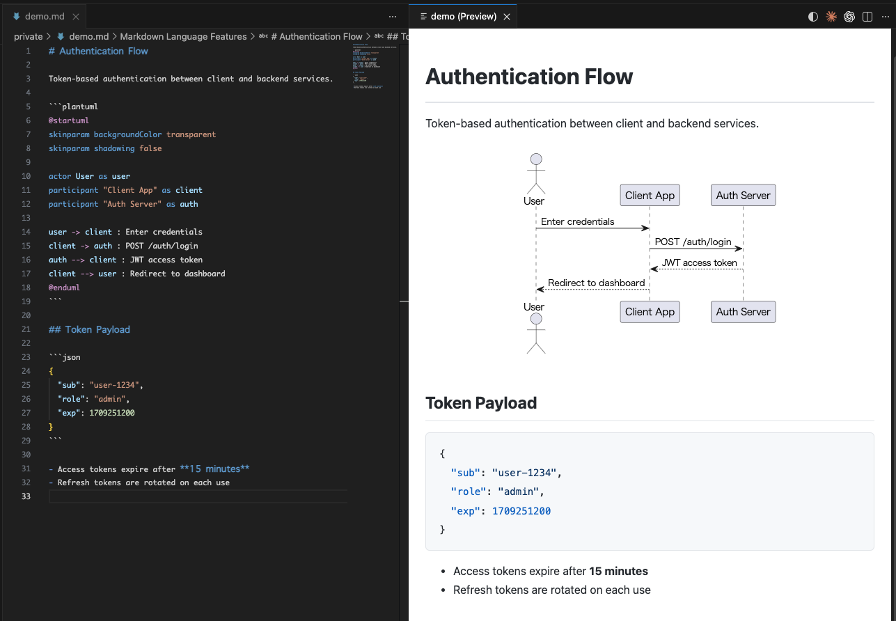
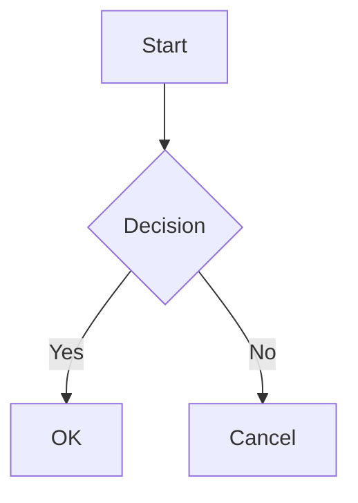

<p align="center">
  <a href="https://yss-tazawa.github.io/plantuml-markdown-preview/">English</a> | <a href="https://yss-tazawa.github.io/plantuml-markdown-preview/#/zh-cn/">简体中文</a> | <a href="https://yss-tazawa.github.io/plantuml-markdown-preview/#/ja/">日本語</a> | <a href="https://yss-tazawa.github.io/plantuml-markdown-preview/#/es/">Español</a> | <a href="https://yss-tazawa.github.io/plantuml-markdown-preview/#/pt-br/">Português</a> | <a href="https://yss-tazawa.github.io/plantuml-markdown-preview/#/ko/">한국어</a> | <strong>繁體中文</strong>
</p>

<p align="center">
  
</p>

<h1 align="center">PlantUML Markdown Preview</h1>

<p align="center">
  <strong>3 種模式適配您的工作流程。內嵌渲染 PlantUML、Mermaid 和 D2 — 快速、安全或零設定。</strong>
</p>

<p align="center">
  <a href="https://marketplace.visualstudio.com/items?itemName=yss-tazawa.plantuml-markdown-preview"></a>
  <a href="https://marketplace.visualstudio.com/items?itemName=yss-tazawa.plantuml-markdown-preview"></a>
  <a href="https://github.com/yss-tazawa/plantuml-markdown-preview/blob/main/LICENSE"></a>
</p>

<p align="center">
  
</p>

## 選擇模式

| | **Fast**（預設） | **Secure** | **Easy** |
| --- | --- | --- | --- |
| | 即時重新渲染 | 最高隱私保護 | 零設定 |
| | 在 localhost 執行 PlantUML 伺服器 — 無 JVM 啟動開銷，即時更新 | 無網路、無背景程序 — 一切在本機完成 | 無需 Java — 使用 PlantUML 伺服器開箱即用 |
| **Java** | 需要 11+ | 需要 11+ | 不需要 |
| **網路** | 無 | 無 | 需要 |
| **隱私** | 僅本機 | 僅本機 | 圖表原始碼傳送至 PlantUML 伺服器 |
| **設定** | [安裝 Java →](#前置條件) | [安裝 Java →](#前置條件) | 無需設定 |

隨時透過單一設定切換模式 — 無需遷移，無需重啟。

> 詳情請參閱[渲染模式](#渲染模式)，完整設定說明請參閱[快速開始](#快速開始)。

## 亮點

- **內嵌渲染 PlantUML、Mermaid 和 D2** — 圖表直接顯示在 Markdown 預覽中，而非獨立面板
- **安全設計** — 基於 CSP nonce 的策略阻止所有來自 Markdown 內容的程式碼執行
- **圖表縮放控制** — 獨立調整 PlantUML、Mermaid 和 D2 圖表大小
- **自包含 HTML 匯出** — SVG 圖表內嵌，可設定版面寬度和對齊方式
- **PDF 匯出** — 透過無頭 Chromium 一鍵匯出，圖表自動縮放適配頁面
- **雙向捲動同步** — 編輯器與預覽雙向聯動捲動
- **導覽與目錄** — 跳至頂部/底部按鈕及預覽面板目錄側邊欄
- **圖表檢視器** — 右鍵任意圖表開啟平移和縮放面板，即時同步並匹配主題背景
- **獨立圖表預覽** — 直接預覽 `.puml`、`.plantuml`、`.mmd`、`.mermaid`、`.d2` 檔案，支援平移縮放、即時更新和主題 — 無需 Markdown 包裝
- **儲存/複製圖表為 PNG/SVG** — 在預覽或圖表檢視器中右鍵圖表儲存或複製到剪貼簿
- **14 種預覽主題** — 淺色 8 種 + 深色 6 種（GitHub、Atom、Solarized、Dracula、Monokai 等）
- **編輯器輔助** — PlantUML、Mermaid、D2 的關鍵字補全、顏色選擇器和程式碼片段
- **國際化** — 支援英語、簡體中文 / 繁體中文、西班牙語、巴西葡萄牙語、日語和韓語介面
- **數學公式支援** — 使用 [KaTeX](https://katex.org/) 渲染 `$...$` 行內公式和 `$$...$$` 區塊公式

## 目錄

- [選擇模式](#選擇模式)
- [亮點](#亮點)
- [功能](#功能)
- [快速開始](#快速開始)
- [使用方式](#使用方式)
- [設定](#設定)
- [程式碼片段](#程式碼片段)
- [顏色選擇器](#顏色選擇器)
- [關鍵字補全](#關鍵字補全)
- [鍵盤快捷鍵](#鍵盤快捷鍵)
- [常見問題](#常見問題)
- [貢獻](#貢獻)
- [第三方授權](#第三方授權)
- [授權](#授權)

## 功能

### 內嵌圖表預覽

```` ```plantuml ````、```` ```mermaid ````、```` ```d2 ```` 程式碼區塊與一般 Markdown 內容一起渲染為內嵌 SVG 圖表。

- 輸入時即時更新預覽（兩階段防抖）
- 儲存檔案時自動更新
- 切換編輯器分頁時自動跟隨
- 圖表渲染時顯示載入指示器
- 內嵌顯示語法錯誤，附帶行號和原始碼上下文
- PlantUML：透過 Java（Secure/Fast 模式）或遠端 PlantUML 伺服器（Easy 模式）渲染
- Mermaid：使用 [mermaid.js](https://mermaid.js.org/) 在用戶端渲染 — 無需 Java 或外部工具
- D2：使用 [@terrastruct/d2](https://d2lang.com/)（Wasm）在用戶端渲染 — 無需外部工具

### 數學公式支援

使用 [KaTeX](https://katex.org/) 渲染數學公式。

- **行內公式** — `$E=mc^2$` 渲染為行內公式
- **區塊公式** — `$$\int_0^\infty e^{-x}\,dx = 1$$` 渲染為置中公式
- 伺服器端渲染 — Webview 中無需 JavaScript，僅使用 HTML/CSS
- 適用於預覽和 HTML/PDF 匯出
- 如果 `$` 符號導致意外的公式解析，可透過 `enableMath: false` 停用

### 圖表縮放

獨立控制 PlantUML、Mermaid 和 D2 的圖表顯示大小。

- **PlantUML 縮放** — `auto`（縮小以適應寬度）或固定百分比（70%–120%，預設 100%）。SVG 在任何縮放比例下都保持清晰。
- **Mermaid 縮放** — `auto`（適應容器寬度）或固定百分比（50%–100%，預設 80%）
- **D2 縮放** — `auto`（適應容器寬度）或固定百分比（50%–100%，預設 70%）

### 渲染模式

控制 PlantUML 圖表渲染方式的預設模式：

| | Fast（預設） | Secure | Easy |
| --- | --- | --- | --- |
| **需要 Java** | 是 | 是 | 否 |
| **網路** | 無（僅 localhost） | 無 | 需要 |
| **隱私** | 圖表保留在本機 | 圖表保留在本機 | 圖表原始碼傳送至 PlantUML 伺服器 |
| **速度** | 即時（常駐本機伺服器） | 較慢（每次啟動 JVM） | 依賴網路 |

- **Fast 模式**（預設）— 在 `localhost` 啟動常駐 PlantUML 伺服器。消除每次編輯的 JVM 啟動開銷，實現即時重新渲染。圖表不會傳送到機器外部。
- **Secure 模式** — 在本機使用 Java + PlantUML jar。圖表不會傳送到機器外部。無網路存取。為最高安全性，預設封鎖本機圖片。
- **Easy 模式** — 將 PlantUML 原始碼傳送至伺服器渲染。無需設定。預設使用公共伺服器（`https://www.plantuml.com/plantuml`）。可設定自己的伺服器 URL 保護隱私。

未偵測到 Java 時，開啟預覽會提示切換到 Easy 模式。

### 狀態列

- **模式徽章** — 狀態列顯示目前渲染模式（Fast/Secure/Easy）。點擊可切換模式
- **伺服器狀態** — Fast 模式下顯示伺服器狀態（啟動中/執行中/已停止）

### HTML 匯出

將 Markdown 文件匯出為獨立 HTML 檔案。

- PlantUML、Mermaid 和 D2 圖表嵌入為行內 SVG
- 包含語法醒目提示 CSS — 無需外部依賴
- 一條命令即可匯出並在瀏覽器中開啟
- 可設定版面寬度（640px–1440px 或無限制）和對齊方式（置中或靠左）
- **響應式** 模式和 **像素寬度預設**（640–1440px），支援置中或靠左對齊

### PDF 匯出

使用無頭 Chromium 瀏覽器將 Markdown 文件匯出為 PDF。

- 需要系統安裝 Chrome、Edge 或 Chromium
- 支援直向和橫向
- 文字和圖表均勻縮放（`pdfScale` 設定，預設 0.625）
- 套用列印邊界確保整潔版面

### 批次圖表匯出

將 Markdown 檔案中的所有圖表匯出為個別的 PNG 或 SVG 檔案。

- 按文件順序匯出所有 PlantUML / Mermaid / D2 圖表
- 輸出目錄名稱可自訂（預設：`{檔名}_diagrams`）
- 需要開啟預覽（透過預覽 Webview 渲染）

### 導覽與目錄

- **跳至頂部/底部** — 預覽面板右上角的按鈕
- **目錄側邊欄** — 點擊 TOC 按鈕開啟列出所有標題的側邊欄；點擊標題跳轉

### 圖表檢視器

右鍵預覽中的任意圖表，選擇**在圖表檢視器中開啟**，開啟平移和縮放專用面板。

- 滑鼠滾輪縮放（以游標為中心）、拖曳平移
- 工具列：適應視窗、1:1 重設、步進縮放（+/−）
- 即時同步 — 編輯器變更即時反映，縮放位置保持不變
- 背景色與目前預覽主題匹配
- 切換到其他來源檔案時自動關閉
- **儲存/複製為 PNG/SVG** — 右鍵圖表儲存或複製到剪貼簿
- **檢視器內搜尋** — 按 `Cmd+F` / `Ctrl+F` 開啟搜尋功能
- 可透過 `enableDiagramViewer: false` 停用

### PlantUML `!include` 支援

使用 `!include` 指令在圖表間共享通用樣式、巨集和元件定義。

- 包含檔案相對於工作區根目錄（或 `plantumlIncludePath` 設定的目錄）解析
- 儲存包含檔案時自動重新整理預覽（也可點擊**重新載入**按鈕 ↻ 手動重新整理）
- **前往 Include 檔案** — 在 `.puml` 或 Markdown 檔案的 `!include` 行右鍵開啟參照檔案（僅在游標位於 `!include` 行時顯示選單項目）
- **開啟 Include 來源檔案** — 在預覽中右鍵點擊 PlantUML 圖表，直接開啟其包含檔案
- 適用於 Fast 和 Secure 模式。Easy 模式不可用（遠端伺服器無法存取本機檔案）

### 獨立圖表預覽

直接開啟 `.puml`、`.plantuml`、`.mmd`、`.mermaid`、`.d2` 檔案 — 無需 Markdown 包裝。

- 與圖表檢視器相同的平移縮放 UI
- 輸入時即時更新預覽（防抖）
- 在同類型檔案間切換時自動跟隨
- 獨立主題選擇（預覽主題+圖表主題）
- 右鍵儲存/複製為 PNG/SVG
- **預覽內搜尋** — `Cmd+F` / `Ctrl+F` 開啟搜尋功能
- PlantUML：支援三種渲染模式（Fast/Secure/Easy）
- Mermaid：使用 mermaid.js 用戶端渲染
- D2：使用 @terrastruct/d2（Wasm）渲染，可設定主題和版面引擎

### 雙向捲動同步

編輯器與預覽在任意一側捲動時保持同步。

- 基於錨點的捲動對應
- 重新渲染後位置穩定恢復

### 主題

**預覽主題**控制文件整體外觀：

**淺色主題：**

| 主題 | 風格 |
| --- | --- |
| GitHub Light | 白色背景（預設） |
| Atom Light | 柔和灰色文字，Atom 編輯器風格 |
| One Light | 米白色，均衡配色 |
| Solarized Light | 暖米色，護眼 |
| Vue | 綠色點綴，Vue.js 文件風格 |
| Pen Paper Coffee | 溫暖紙張感，手寫風格 |
| Coy | 近白色，簡潔設計 |
| VS | 經典 Visual Studio 配色 |

**深色主題：**

| 主題 | 風格 |
| --- | --- |
| GitHub Dark | 深色背景 |
| Atom Dark | Tomorrow Night 配色 |
| One Dark | Atom 風格暗色 |
| Dracula | 鮮豔暗色 |
| Solarized Dark | 深青色，護眼 |
| Monokai | 鮮豔語法，Sublime Text 風格 |

透過標題列圖示即時切換預覽主題 — 無需重新渲染（僅 CSS 切換）。PlantUML 主題變更會觸發重新渲染。

**PlantUML 主題**獨立控制圖表樣式。擴充功能從 PlantUML 安裝中發現可用主題，並與預覽主題合併在同一個 QuickPick 中顯示。

**Mermaid 主題**控制 Mermaid 圖表樣式：`default`、`dark`、`forest`、`neutral`、`base`。也可透過 QuickPick 主題選擇器選擇。

**D2 主題** — 19 種內建主題（如 `Neutral Default`、`Dark Mauve`、`Terminal`）。可透過設定或 QuickPick 主題選擇器設定。

### 語法高亮

透過 highlight.js 支援 190+ 種語言。程式碼區塊樣式與所選預覽主題匹配。

### 安全性

- 基於 nonce 的指令碼限制內容安全原則（CSP）
- 阻止所有來自 Markdown 內容的程式碼執行
- 阻止使用者撰寫的 `<script>` 標籤
- 本機圖片載入預設遵循模式預設（`allowLocalImages: "mode-default"`）；Secure 模式為最高安全性預設停用
- HTTP 圖片載入預設關閉（`allowHttpImages`）；啟用後會將 `http:` 加入 CSP `img-src` 指令，允許未加密的圖片請求 — 僅在可信網路（內網、本機開發伺服器）使用

### 與 VS Code 內建 Markdown 預覽整合

PlantUML、Mermaid 和 D2 圖表也可在 VS Code 內建 Markdown 預覽（`Markdown: 開啟側邊預覽`）中渲染。無需額外設定。

> **注意：** 內建預覽不支援此擴充功能的預覽主題、雙向捲動同步或 HTML 匯出。如需完整功能，請使用擴充功能自帶的預覽面板（`Cmd+Alt+V` / `Ctrl+Alt+V`）。
>
> **注意：** 內建預覽以同步方式渲染圖表。大型或複雜的 PlantUML 圖表可能導致編輯器短暫卡頓。對於複雜圖表，建議使用擴充功能自帶的預覽面板。

## 快速開始

### 前置條件

**Mermaid** — 無前置條件，開箱即用。

**D2** — 無前置條件，使用內建 [D2](https://d2lang.com/) Wasm，開箱即用。

**PlantUML（Easy 模式）** — 無前置條件。圖表原始碼傳送至 PlantUML 伺服器渲染。

**PlantUML（Fast/Secure 模式）** — 預設：

| 工具 | 用途 | 驗證 |
| --- | --- | --- |
| [Java 11+（JRE 或 JDK）](#設置) | 執行 PlantUML（內建 PlantUML 1.2026.2 需要 Java 11+） | `java -version` |
| [Graphviz](https://graphviz.org/) | 選用 — 類別圖、元件圖等版面相關圖表需要 | `dot -V` |

> **注意：** PlantUML jar（LGPL，v1.2026.2）已內建於擴充功能中，無需另行下載。**需要 Java 11 或更高版本。**
>
> **提示：** 如未安裝 Java，開啟預覽時擴充功能會提示切換到 Easy 模式。

### 圖表支援

可用圖表取決於您的設定：

| 圖表 | LGPL（內建） | Win: GPLv2 jar | Mac/Linux: + Graphviz |
| --- | :-: | :-: | :-: |
| 循序圖 | ✓ | ✓ | ✓ |
| 活動圖（新語法） | ✓ | ✓ | ✓ |
| 心智圖 | ✓ | ✓ | ✓ |
| WBS | ✓ | ✓ | ✓ |
| 甘特圖 | ✓ | ✓ | ✓ |
| JSON / YAML | ✓ | ✓ | ✓ |
| Salt / 線框圖 | ✓ | ✓ | ✓ |
| 時序圖 | ✓ | ✓ | ✓ |
| 網路圖（nwdiag） | ✓ | ✓ | ✓ |
| 類別圖 | — | ✓ | ✓ |
| 使用案例圖 | — | ✓ | ✓ |
| 物件圖 | — | ✓ | ✓ |
| 元件圖 | — | ✓ | ✓ |
| 部署圖 | — | ✓ | ✓ |
| 狀態圖 | — | ✓ | ✓ |
| ER 圖 | — | ✓ | ✓ |
| 活動圖（舊語法） | — | ✓ | ✓ |

- **LGPL（內建）** — 開箱即用，無需 Graphviz。
- **Win: GPLv2 jar** — [GPLv2 版本](https://plantuml.com/download)內建 Graphviz（僅 Windows，自動解壓）。透過 `plantumlJarPath` 設定使用。
- **Mac/Linux: + Graphviz** — 另外安裝 [Graphviz](https://graphviz.org/)。LGPL 或 GPLv2 jar 均可使用。

### 安裝

1. 開啟 VS Code
2. 在擴充功能檢視（`Ctrl+Shift+X` / `Cmd+Shift+X`）中搜尋 **PlantUML Markdown Preview**
3. 點擊**安裝**

### 設置

**Fast 模式**（預設）：啟動常駐本機 PlantUML 伺服器，即時重新渲染。需要 Java 11+。

**使用 Secure 模式**：將 `mode` 設為 `"secure"`。無背景伺服器或網路存取，每次渲染使用 Java 11+。

**使用 Easy 模式**（無需設定）：將 `mode` 設為 `"easy"`。圖表原始碼傳送至 PlantUML 伺服器渲染。未偵測到 Java 時擴充功能也會提示切換。

**Fast 和 Secure 模式**：內建 LGPL jar 無需額外設定即可支援循序圖、活動圖、心智圖等。要啟用類別圖、元件圖、使用案例圖等版面相關圖表，請按以下平台步驟操作。

#### Windows

1. 如未安裝 Java，請安裝（開啟 PowerShell 執行）：

   ```powershell
   winget install Microsoft.OpenJDK.21
   ```

2. 如 `java` 不在 PATH 中，在 PowerShell 中查詢完整路徑：

   ```powershell
   Get-Command java
   # 例：C:\Program Files\Microsoft\jdk-21.0.6.7-hotspot\bin\java.exe
   ```

   開啟 VS Code 設定（`Ctrl+,`），搜尋 `plantumlMarkdownPreview.javaPath`，輸入上述路徑

3. 將 [GPLv2 版 PlantUML](https://plantuml.com/download)（`plantuml-gplv2-*.jar`）下載到任意資料夾（內建 Graphviz — 無需另外安裝）
4. 開啟 VS Code 設定（`Ctrl+,`），搜尋 `plantumlMarkdownPreview.plantumlJarPath`，輸入下載的 `.jar` 完整路徑（如 `C:\tools\plantuml-gplv2-1.2026.2.jar`）

#### Mac

1. 透過 Homebrew 安裝 Java 和 Graphviz：

   ```sh
   brew install openjdk graphviz
   ```

2. 如 `dot` 不在 PATH 中，查詢完整路徑並在 VS Code 中設定：

   ```sh
   which dot
   # 例：/opt/homebrew/bin/dot
   ```

   開啟 VS Code 設定（`Cmd+,`），搜尋 `plantumlMarkdownPreview.dotPath`，輸入上述路徑

#### Linux

1. 安裝 Java 和 Graphviz：

   ```sh
   # Debian / Ubuntu
   sudo apt install default-jdk graphviz

   # Fedora
   sudo dnf install java-21-openjdk graphviz
   ```

2. 如 `dot` 不在 PATH 中，查詢完整路徑並在 VS Code 中設定：

   ```sh
   which dot
   # 例：/usr/bin/dot
   ```

   開啟 VS Code 設定（`Ctrl+,`），搜尋 `plantumlMarkdownPreview.dotPath`，輸入上述路徑

> **注意：** `javaPath` 預設為 `"java"`。預設情況下先嘗試 `JAVA_HOME/bin/`（Windows 上為 `JAVA_HOME\bin\`）下的 Java 可執行檔，再嘗試 PATH 中的 `java`。`dotPath` 和 `plantumlJarPath` 分別預設為 `"dot"` 和內建 jar。僅在這些命令不在 PATH 中或需要使用其他 jar 時才進行設定。

## 使用方式

### 開啟預覽

- **鍵盤快捷鍵：** `Cmd+Alt+V`（Mac）/ `Ctrl+Alt+V`（Windows/Linux）
- **右鍵選單：** 在檔案總管或編輯器中右鍵 `.md` 檔案 → **PlantUML Markdown Preview** → **在側邊開啟預覽**
- **命令面板：** `PlantUML Markdown Preview: Open Preview to Side`

預覽使用獨立於 VS Code 的主題 — 預設為白色背景（GitHub Light）。

### 開啟圖表預覽

直接在平移縮放預覽中開啟 `.puml`/`.plantuml`、`.mmd`/`.mermaid`、`.d2` 檔案 — 無需 Markdown 包裝。

- **鍵盤快捷鍵：** `Cmd+Alt+V`（Mac）/ `Ctrl+Alt+V`（Windows/Linux）— 相同快捷鍵，根據檔案類型自動選擇
- **右鍵選單：** 在檔案總管或編輯器中右鍵對應檔案 → **預覽 PlantUML 檔案** / **預覽 Mermaid 檔案** / **預覽 D2 檔案**
- **命令面板：** `PlantUML Markdown Preview: Preview PlantUML File`、`Preview Mermaid File` 或 `Preview D2 File`

### 匯出為 HTML

- **右鍵選單：** 右鍵 `.md` 檔案 → **PlantUML Markdown Preview** → **匯出為 HTML** → 選擇寬度選項
- **預覽面板：** 在預覽內右鍵 → **匯出為 HTML** 或 **匯出為 HTML 並開啟**

子選單提供以下寬度選項：

| 選項 | 說明 |
| ---- | ---- |
| Current Settings | 使用目前設定匯出（無響應式 CSS） |
| Responsive | 使用者設定的縮放；溢出的圖表縮小以適應 |
| 640px – 1440px | 固定像素寬度 |
| Responsive (Left-Aligned) | 與響應式相同，但靠左對齊 |
| 640px – 1440px (Left-Aligned) | 固定寬度，靠左對齊 |

HTML 檔案儲存在來源 `.md` 檔案旁邊。

### 匯出為 PDF

- **右鍵選單：** 右鍵 `.md` 檔案 → **PlantUML Markdown Preview** → **匯出為 PDF** → **直向** 或 **橫向**
- **預覽面板：** 在預覽內右鍵 → **匯出為 PDF** 或 **匯出為 PDF 並開啟** → **直向** 或 **橫向**

PDF 檔案儲存在來源 `.md` 檔案旁邊。需要 Chrome、Edge 或 Chromium。
`pdfScale` 設定（預設 0.625）控制文字和圖表的整體縮放。

### 儲存/複製圖表為 PNG/SVG

- **預覽面板：** 右鍵圖表 → **複製圖表為 PNG**、**儲存圖表為 PNG** 或 **儲存圖表為 SVG**
- **圖表檢視器：** 在檢視器內右鍵 → 同上
- **獨立圖表預覽：** 在預覽內右鍵 → 同上

### 匯出所有圖表

- **右鍵選單：** 右鍵點擊 `.md` 檔案 → **PlantUML Markdown Preview** → **Export All Diagrams as PNG** 或 **Export All Diagrams as SVG**
- **預覽面板：** 在預覽面板內右鍵 → **Export All Diagrams as PNG** 或 **Export All Diagrams as SVG**
- **命令面板：** `PlantUML Markdown Preview: Export All Diagrams as PNG` / `Export All Diagrams as SVG`

儲存對話框可選擇輸出目錄名稱（預設：`{檔名}_diagrams`）。每個圖表按文件順序儲存為 `diagram-1.png`、`diagram-2.png` 等。需要開啟預覽。

### 導覽

- **跳至頂部/底部：** 預覽面板右上角的按鈕
- **重新載入：** 點擊 ↻ 按鈕手動重新整理預覽並清除快取
- **目錄：** 點擊預覽面板右上角的 TOC 按鈕開啟側邊欄

### 更改主題

點擊預覽面板標題列的主題圖示，或使用命令面板：

- **命令面板：** `PlantUML Markdown Preview: Change Preview Theme`

主題選擇器在同一個清單中顯示所有四種主題類別 — 預覽主題、PlantUML 主題、Mermaid 主題和 D2 主題 — 可從同一處切換任何主題。

### PlantUML 語法

````markdown
```plantuml
Alice -> Bob: Hello
Bob --> Alice: Hi!
```
````

省略 `@startuml` / `@enduml` 時自動加入。

### Mermaid 語法

````markdown

````

### D2 語法

````markdown
```d2
server -> db: query
db -> server: result
```
````

語法詳情請參閱 [D2 文件](https://d2lang.com/)。

### 數學語法

行內數學使用單個美元符號，區塊數學使用雙美元符號：

````markdown
愛因斯坦的著名公式 $E=mc^2$ 展示了質能等價。

$$\int_0^\infty e^{-x}\,dx = 1$$
````

> 如果 `$` 符號導致意外的數學解析（如 `$100`），可透過 `enableMath: false` 停用。

## 程式碼片段

輸入程式碼片段前綴並按 `Tab` 展開。提供兩種程式碼片段：

- **Markdown 程式碼片段**（圍欄區塊外）— 前綴為 `plantuml-`、`mermaid-` 或 `d2-`，展開為完整圍欄區塊
- **模板程式碼片段**（圍欄區塊內）— 前綴為 `tmpl-`，僅展開圖表主體。輸入 `tmpl` 查看所有可用模板

### Markdown 程式碼片段（圍欄區塊外）

展開為包含圍欄的完整 `` ```plantuml ... ``` `` 區塊：

| 前綴 | 圖表 |
| --- | --- |
| `plantuml` | 空 PlantUML 區塊 |
| `plantuml-sequence` | 循序圖 |
| `plantuml-class` | 類別圖 |
| `plantuml-activity` | 活動圖 |
| `plantuml-usecase` | 使用案例圖 |
| `plantuml-component` | 元件圖 |
| `plantuml-state` | 狀態圖 |
| `plantuml-er` | ER 圖 |
| `plantuml-object` | 物件圖 |
| `plantuml-deployment` | 部署圖 |
| `plantuml-mindmap` | 心智圖 |
| `plantuml-gantt` | 甘特圖 |

### PlantUML 程式碼片段（圍欄區塊內）

圖表模板（輸入 `tmpl` 查看全部）：

| 前綴 | 內容 |
| --- | --- |
| `tmpl-seq` | 循序圖 |
| `tmpl-cls` | 類別定義 |
| `tmpl-act` | 活動圖 |
| `tmpl-uc` | 使用案例圖 |
| `tmpl-comp` | 元件圖 |
| `tmpl-state` | 狀態圖 |
| `tmpl-er` | 實體定義 |
| `tmpl-obj` | 物件圖 |
| `tmpl-deploy` | 部署圖 |
| `tmpl-mind` | 心智圖 |
| `tmpl-gantt` | 甘特圖 |

短程式碼片段：

| 前綴 | 內容 |
| --- | --- |
| `part` | participant 宣告 |
| `actor` | actor 宣告 |
| `note` | 備註區塊 |
| `intf` | interface 定義 |
| `pkg` | package 定義 |

### Mermaid Markdown 程式碼片段

| 前綴 | 圖表 |
| --- | --- |
| `mermaid` | 空 Mermaid 區塊 |
| `mermaid-flow` | 流程圖 |
| `mermaid-sequence` | 循序圖 |
| `mermaid-class` | 類別圖 |
| `mermaid-state` | 狀態圖 |
| `mermaid-er` | ER 圖 |
| `mermaid-gantt` | 甘特圖 |
| `mermaid-pie` | 圓餅圖 |
| `mermaid-mindmap` | 心智圖 |
| `mermaid-timeline` | 時間線 |
| `mermaid-git` | Git 圖 |

### Mermaid 程式碼片段（圍欄區塊內）

圖表模板（輸入 `tmpl` 查看全部）：

| 前綴 | 內容 |
| --- | --- |
| `tmpl-flow` | 流程圖 |
| `tmpl-seq` | 循序圖 |
| `tmpl-cls` | 類別圖 |
| `tmpl-state` | 狀態圖 |
| `tmpl-er` | ER 圖 |
| `tmpl-gantt` | 甘特圖 |
| `tmpl-pie` | 圓餅圖 |
| `tmpl-mind` | 心智圖 |
| `tmpl-timeline` | 時間線 |
| `tmpl-git` | Git 圖 |

### D2 Markdown 程式碼片段

| 前綴 | 圖表 |
| --- | --- |
| `d2` | 空 D2 區塊 |
| `d2-basic` | 基本連線 |
| `d2-sequence` | 循序圖 |
| `d2-class` | 類別圖 |
| `d2-comp` | 元件圖 |
| `d2-grid` | 格狀版面 |
| `d2-er` | ER 圖 |
| `d2-flow` | 流程圖 |
| `d2-icon` | 圖示節點 |
| `d2-markdown` | Markdown 文字節點 |
| `d2-tooltip` | 工具提示和連結 |
| `d2-layers` | 層/步驟 |
| `d2-style` | 自訂樣式 |

### D2 程式碼片段（圍欄區塊內）

圖表模板（輸入 `tmpl` 查看全部）：

| 前綴 | 內容 |
| --- | --- |
| `tmpl-seq` | 循序圖 |
| `tmpl-cls` | 類別圖 |
| `tmpl-comp` | 元件圖 |
| `tmpl-er` | ER 圖 |
| `tmpl-flow` | 流程圖 |
| `tmpl-grid` | 格狀版面 |

短程式碼片段：

| 前綴 | 內容 |
| --- | --- |
| `conn` | 連線 |
| `icon` | 圖示節點 |
| `md` | Markdown 節點 |
| `tooltip` | 工具提示和連結 |
| `layers` | 層/步驟 |
| `style` | 自訂樣式 |
| `direction` | 版面方向 |

## 顏色選擇器

PlantUML、Mermaid 和 D2 的顏色色板和行內顏色選擇器。適用於獨立檔案（`.puml`、`.mmd`、`.d2`）和 Markdown 圍欄區塊。

- **6 位十六進位** — `#FF0000`、`#1565C0` 等
- **3 位十六進位** — `#F00`、`#ABC` 等
- **顏色名稱**（僅 PlantUML）— `#Red`、`#LightBlue`、`#Salmon` 等（20 種顏色）
- 選擇新顏色後自動替換為 `#RRGGBB` 格式
- 註解行會被排除（PlantUML 用 `'`、Mermaid 用 `%%`、D2 用 `#`）

## 關鍵字補全

PlantUML、Mermaid 和 D2 的上下文感知關鍵字建議。適用於獨立檔案和 Markdown 圍欄區塊。

### PlantUML

- **行首關鍵字** — `@startuml`、`participant`、`class`、`skinparam`、`!include` 等
- **`skinparam` 參數** — 輸入 `skinparam` 後加空格，會提示 `backgroundColor`、`defaultFontName`、`arrowColor` 等
- **顏色名稱** — 輸入 `#` 會提示顏色（`Red`、`Blue`、`LightGreen` 等）
- **觸發字元**：`@`、`!`、`#`

### Mermaid

- **圖表類型宣告** — `flowchart`、`sequenceDiagram`、`classDiagram`、`gantt` 等（第一行）
- **圖表特定關鍵字** — 根據宣告的圖表類型提供不同建議（如流程圖的 `subgraph`、循序圖的 `participant`）
- **方向值** — 輸入 `direction` 後加空格可取得 `TB`、`LR` 等

### D2

- **形狀類型** — 輸入 `shape:` 可取得建議（`rectangle`、`cylinder`、`person` 等）
- **樣式屬性** — 輸入 `style.` 可取得 `fill`、`stroke`、`font-size` 等
- **方向值** — 輸入 `direction:` 可取得 `right`、`down`、`left`、`up`
- **約束值** — 輸入 `constraint:` 可取得 `primary_key`、`foreign_key`、`unique`
- **觸發字元**：`:`、`.`

## 設定

所有設定使用 `plantumlMarkdownPreview.` 前置詞。

| 設定 | 預設值 | 說明 |
| --- | --- | --- |
| `mode` | `"fast"` | 預設模式。`"fast"`（預設）— 本機伺服器，即時重新渲染。`"secure"` — 無網路，最高安全性。`"easy"` — 無需設定（圖表原始碼傳送至 PlantUML 伺服器）。 |
| `javaPath` | `"java"` | Java 執行檔路徑。設定後直接使用；否則回退到 `JAVA_HOME/bin/java`，再到 PATH 中的 `java`。（Fast 和 Secure 模式） |
| `plantumlJarPath` | `""` | `plantuml.jar` 路徑。留空使用內建 jar（LGPL）。（Fast 和 Secure 模式） |
| `dotPath` | `"dot"` | Graphviz `dot` 執行檔路徑（Fast 和 Secure 模式） |
| `plantumlIncludePath` | `""` | PlantUML `!include` 指令的基礎目錄。留空使用工作區根目錄。Easy 模式不可用。 |
| `allowLocalImages` | `"mode-default"` | 在預覽中解析相對圖片路徑。`"mode-default"` 使用模式預設（Fast: 開，Secure: 關，Easy: 開）。 |
| `allowHttpImages` | `false` | 允許在預覽中透過 HTTP 載入圖片。適用於內網或本機開發伺服器。 |
| `previewTheme` | `"github-light"` | 預覽主題 |
| `plantumlTheme` | `"default"` | PlantUML 圖表主題 |
| `mermaidTheme` | `"default"` | Mermaid 圖表主題：`"default"`、`"dark"`、`"forest"`、`"neutral"` 或 `"base"` |
| `plantumlScale` | `"100%"` | PlantUML 圖表縮放。`"auto"` 縮小超出容器寬度的圖表。 |
| `mermaidScale` | `"80%"` | Mermaid 圖表縮放。`"auto"` 適應容器寬度。 |
| `d2Theme` | `"Neutral Default"` | D2 圖表主題。19 種內建主題可用。 |
| `d2Layout` | `"dagre"` | D2 版面引擎：`"dagre"`（預設，快速）或 `"elk"`（適合複雜圖）。 |
| `d2Scale` | `"70%"` | D2 圖表縮放。`"auto"` 在超出容器寬度時自動縮小。百分比（50%–100%）按原始大小的指定比例顯示。 |
| `htmlMaxWidth` | `"960px"` | 匯出 HTML 的最大寬度。 |
| `htmlAlignment` | `"center"` | HTML 對齊方式。`"center"`（預設）或 `"left"`。 |
| `pdfScale` | `0.625` | PDF 匯出縮放比例。均勻縮放文字和圖表。範圍: 0.1–2.0。 |
| `enableMath` | `true` | 啟用 KaTeX 數學渲染。支援 `$...$`（行內）和 `$$...$$`（區塊）。如 `$` 符號導致意外的數學解析，可設為 `false`。 |
| `debounceNoDiagramChangeMs` | _(空)_ | 非圖表文字變更的防抖延遲（毫秒）。圖表從快取中提供。留空使用模式預設值（Fast: 100, Secure: 100, Easy: 100）。 |
| `debounceDiagramChangeMs` | _(空)_ | 圖表內容變更的防抖延遲（毫秒）。留空使用模式預設值（Fast: 100, Secure: 300, Easy: 300）。 |
| `plantumlLocalServerPort` | `0` | 本機 PlantUML 伺服器連接埠（僅 Fast 模式）。`0` = 自動指派空閒連接埠。 |
| `plantumlServerUrl` | `"https://www.plantuml.com/plantuml"` | Easy 模式的 PlantUML 伺服器 URL。 |
| `enableDiagramViewer` | `true` | 啟用右鍵選單中的「在圖表檢視器中開啟」項目。 |
| `retainPreviewContext` | `true` | 索引標籤隱藏時保留預覽內容。防止切換時重新渲染，但使用更多記憶體（需要重新開啟預覽才會生效）。 |

> **注意：** `allowLocalImages` 和 `allowHttpImages` 僅適用於預覽面板。HTML 匯出始終輸出原始圖片路徑，不受 CSP 限制。

<details>
<summary><strong>預覽主題選項</strong></summary>

| 值 | 說明 |
| --- | --- |
| `github-light` | GitHub Light — 白色背景（預設） |
| `atom-light` | Atom Light — 柔和灰色文字，Atom 風格 |
| `one-light` | One Light — 淡白色，均衡色調 |
| `solarized-light` | Solarized Light — 暖米色，護眼 |
| `vue` | Vue — 綠色點綴，Vue.js 文件風格 |
| `pen-paper-coffee` | Pen Paper Coffee — 暖紙色，手寫風格 |
| `coy` | Coy — 近白色，簡潔設計 |
| `vs` | VS — 經典 Visual Studio 配色 |
| `github-dark` | GitHub Dark — 深色背景 |
| `atom-dark` | Atom Dark — Tomorrow Night 色調 |
| `one-dark` | One Dark — Atom 風格深色 |
| `dracula` | Dracula — 鮮豔深色 |
| `solarized-dark` | Solarized Dark — 深青色，護眼 |
| `monokai` | Monokai — 鮮明語法，Sublime Text 風格 |

</details>

## 鍵盤快捷鍵

| 命令 | Mac | Windows / Linux |
| --- | --- | --- |
| 在側邊開啟預覽（Markdown） | `Cmd+Alt+V` | `Ctrl+Alt+V` |
| 預覽 PlantUML 檔案 | `Cmd+Alt+V` | `Ctrl+Alt+V` |
| 預覽 Mermaid 檔案 | `Cmd+Alt+V` | `Ctrl+Alt+V` |
| 預覽 D2 檔案 | `Cmd+Alt+V` | `Ctrl+Alt+V` |
| 選擇渲染模式 | — | — |

## 常見問題

<details>
<summary><strong>PlantUML 圖表無法渲染</strong></summary>

**Fast/Secure 模式：**

1. 執行 `java -version` 確認已安裝 Java 11 或更高版本
2. 如使用類別圖、元件圖等，執行 `dot -V` 確認已安裝 Graphviz（參閱[圖表支援](#圖表支援)）
3. 如設定了自訂 `plantumlJarPath`，確認路徑指向有效的 `plantuml.jar` 檔案
4. 查看 VS Code 輸出面板中的錯誤訊息

**Easy 模式：**

1. 確認伺服器 URL 正確（預設：`https://www.plantuml.com/plantuml`）
2. 確認網路連線正常
3. 如使用自行架設的伺服器，確認伺服器正在執行且可存取
4. 伺服器請求在 15 秒後逾時（Fast 及 Secure 模式也有每張圖表 15 秒的逾時限制）

</details>

<details>
<summary><strong>D2 圖表無法渲染</strong></summary>

D2 使用內建 Wasm 模組渲染 — 無需外部 CLI。

1. 重新載入 VS Code 視窗（`Developer: Reload Window`）
2. 查看 VS Code 輸出面板中的錯誤訊息
3. 確認 D2 原始碼語法正確

</details>

<details>
<summary><strong>可以不安裝 Java 使用 PlantUML 嗎？</strong></summary>

可以。在擴充功能設定中將 `mode` 設為 `"easy"`。Easy 模式將 PlantUML 文字傳送至 PlantUML 伺服器渲染，無需 Java。預設使用公共伺服器 `https://www.plantuml.com/plantuml`。為保護隱私，可架設自己的 PlantUML 伺服器並設定 `plantumlServerUrl`。

</details>

<details>
<summary><strong>Secure 模式在多圖表時很慢。如何加速？</strong></summary>

切換到 **Fast 模式**（`mode: "fast"`）。Fast 模式在 localhost 啟動常駐 PlantUML 伺服器，重新渲染即時完成 — 無需每次編輯都啟動 JVM。

</details>

<details>
<summary><strong>Easy 模式下我的圖表資料安全嗎？</strong></summary>

在 Easy 模式下，PlantUML 原始碼會發送到已設定的伺服器。
預設的公共伺服器（`https://www.plantuml.com/plantuml`）由 PlantUML 專案營運。如果您的圖表包含敏感資訊，請考慮執行[自架 PlantUML 伺服器](https://plantuml.com/server)並將 `plantumlServerUrl` 設定為其 URL，或使用 Fast 或 Secure 模式，讓圖表資料不會離開您的電腦。

</details>

<details>
<summary><strong>深色主題下圖表顯示異常</strong></summary>

設定與預覽主題匹配的圖表主題。從標題列圖示開啟主題選擇器，選擇深色 PlantUML 主題（如 `cyborg`、`mars`）或將 Mermaid 主題設為 `dark`。

</details>

<details>
<summary><strong><code>!include</code> 無法運作</strong></summary>

`!include` 需要 Fast 或 Secure 模式 — Easy 模式不可用，因為遠端伺服器無法存取本機檔案。

- 路徑預設相對於工作區根目錄解析。設定 `plantumlIncludePath` 可使用不同的基礎目錄。
- 儲存包含檔案會自動重新整理預覽。也可點擊**重新載入**按鈕（↻）手動重新整理。

</details>

<details>
<summary><strong>Easy 模式下圖表資料安全嗎？</strong></summary>

Easy 模式下，PlantUML 原始文字會傳送至設定的伺服器。預設的公共伺服器（`https://www.plantuml.com/plantuml`）由 PlantUML 專案營運。如圖表包含敏感資訊，建議架設[自行託管的 PlantUML 伺服器](https://plantuml.com/server)並設定 `plantumlServerUrl`，或使用圖表不會離開本機的 Fast 或 Secure 模式。

</details>

<details>
<summary><strong>可以在 PlantUML 程式碼中使用 <code>!theme</code> 嗎？</strong></summary>

可以。行內的 `!theme` 指令優先於擴充功能設定。

</details>

## 貢獻

開發環境設定、建置說明和 PR 指南請參閱 [CONTRIBUTING.md](CONTRIBUTING.md)。

## 第三方授權

此擴充功能包含以下第三方軟體：

- [PlantUML](https://plantuml.com/)（LGPL 版本）— [GNU Lesser General Public License v3 (LGPL-3.0)](https://www.gnu.org/licenses/lgpl-3.0.html)
- [mermaid.js](https://mermaid.js.org/) — [MIT License](https://github.com/mermaid-js/mermaid/blob/develop/LICENSE)
- [KaTeX](https://katex.org/) — [MIT License](https://github.com/KaTeX/KaTeX/blob/main/LICENSE)
- [@terrastruct/d2](https://d2lang.com/)（Wasm 建置）— [Mozilla Public License 2.0 (MPL-2.0)](https://github.com/terrastruct/d2/blob/master/LICENSE.txt)

## 授權

[MIT](LICENSE)
