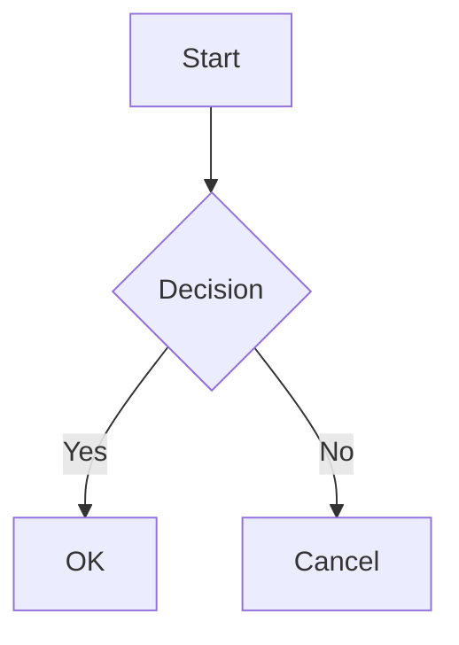

<p align="center">
  <a href="#/">English</a> | <a href="#/zh-cn/">简体中文</a> | <a href="#/zh-tw/">繁體中文</a> | <a href="#/ko/">한국어</a> | <a href="#/ja/">日本語</a> | <strong>Español</strong> | <a href="#/pt-br/">Português</a>
</p>

<p align="center">
  
</p>

<h1 align="center">PlantUML Markdown Preview</h1>

<p align="center">
  <strong>3 modos que se adaptan a tu flujo de trabajo. Renderiza PlantUML, Mermaid y D2 de forma integrada: rápido, seguro o sin configuración.</strong>
</p>

<p align="center">
  <a href="https://marketplace.visualstudio.com/items?itemName=yss-tazawa.plantuml-markdown-preview"></a>
  <a href="https://marketplace.visualstudio.com/items?itemName=yss-tazawa.plantuml-markdown-preview"></a>
  <a href="https://github.com/yss-tazawa/plantuml-markdown-preview/blob/main/LICENSE"></a>
</p>

<p align="center">
  
</p>

## Elige tu modo

| | **Fast** (por defecto) | **Secure** | **Easy** |
|---|---|---|---|
| | Redibujado instantáneo | Máxima privacidad | Sin configuración |
| | Ejecuta un servidor PlantUML en localhost: sin coste de inicio de JVM, actualizaciones instantáneas | Sin red, sin procesos en segundo plano: todo permanece en tu máquina | No requiere Java: funciona de inmediato con un servidor PlantUML |
| **Java** | 11+ requerido | 11+ requerido | No requerido |
| **Red** | Ninguna | Ninguna | Requerida |
| **Privacidad** | Solo local | Solo local | El código del diagrama se envía al servidor PlantUML |
| **Configuración** | [Instalar Java →](#requisitos-previos) | [Instalar Java →](#requisitos-previos) | No requiere configuración |

Cambia entre modos en cualquier momento con un solo ajuste: sin migración, sin reiniciar.

> Consulta [Modos de renderizado](#modos-de-renderizado) para más detalles e [Inicio rápido](#inicio-rápido) para las instrucciones completas de configuración.

## Puntos destacados

- **Renderizado integrado de PlantUML, Mermaid y D2**: los diagramas aparecen directamente en tu vista previa de Markdown, no en un panel separado.
- **Seguro por diseño**: la política basada en CSP nonce bloquea toda ejecución de código desde el contenido Markdown.
- **Control de escala de diagramas**: ajusta los tamaños de los diagramas PlantUML, Mermaid y D2 de forma independiente.
- **Exportación HTML autónoma**: diagramas SVG incrustados, con ancho de diseño y alineación configurables.
- **Exportación a PDF**: exportación con un clic a través de Chromium sin cabecera (headless); los diagramas se escalan automáticamente para ajustarse a la página.
- **Sincronización de desplazamiento bidireccional**: el editor y la vista previa se desplazan juntos en ambas direcciones.
- **Navegación y TOC**: botones para ir al principio/final y una barra lateral de Tabla de contenidos en el panel de vista previa.
- **Visor de diagramas (Diagram Viewer)**: haz clic derecho en cualquier diagrama para abrir un panel de desplazamiento y zoom con sincronización en vivo y fondo adaptado al tema.
- **Vista previa de diagramas independiente**: abre archivos `.puml`, `.plantuml`, `.mmd`, `.mermaid` y `.d2` directamente con zoom, actualizaciones en vivo y soporte de temas, sin necesidad de un envoltorio Markdown.
- **Guardar o copiar diagramas como PNG / SVG**: haz clic derecho en cualquier diagrama en la vista previa o en el Visor de diagramas para guardarlo o copiarlo al portapapeles.
- **14 temas de vista previa**: 8 temas claros + 6 oscuros, incluyendo GitHub, Atom, Solarized, Dracula, Monokai y más.
- **Asistencia al editor**: autocompletado de palabras clave, selector de color y fragmentos de código para PlantUML, Mermaid y D2.
- **Internacionalización**: interfaz en inglés, chino (simplificado / tradicional), japonés, coreano, español y portugués brasileño.
- **Soporte para matemáticas**: matemáticas en línea `$...$` y en bloque `$$...$$` renderizadas con [KaTeX](https://katex.org/).

## Tabla de contenidos

- [Elige tu modo](#elige-tu-modo)
- [Puntos destacados](#puntos-destacados)
- [Funcionalidades](#funcionalidades)
- [Inicio rápido](#inicio-rápido)
- [Uso](#uso)
- [Configuración](#configuración)
- [Fragmentos de código](#fragmentos-de-código)
- [Autocompletado de palabras clave](#autocompletado-de-palabras-clave)
- [Atajos de teclado](#atajos-de-teclado)
- [Preguntas frecuentes](#preguntas-frecuentes)
- [Contribuciones](#contribuciones)
- [Licencias de terceros](#licencias-de-terceros)
- [Licencia](#licencia)

## Funcionalidades

### Vista previa de diagramas integrada

Los bloques de código ```` ```plantuml ````, ```` ```mermaid ```` y ```` ```d2 ```` se renderizan como diagramas SVG integrados junto con tu contenido Markdown normal.

- Actualizaciones de vista previa en tiempo real mientras escribes (antirrebote de dos etapas).
- Refresco automático al guardar el archivo.
- Seguimiento automático al cambiar de pestañas en el editor.
- Indicador de carga durante el renderizado del diagrama.
- Errores de sintaxis mostrados de forma integrada con números de línea y contexto del código fuente.
- PlantUML: renderizado a través de Java (modo Secure / Fast) o servidor PlantUML remoto (modo Easy). Consulta [Modos de renderizado](#modos-de-renderizado).
- Mermaid: renderizado en el lado del cliente usando [mermaid.js](https://mermaid.js.org/), sin necesidad de Java ni herramientas externas.
- D2: renderizado en el lado del cliente usando [@terrastruct/d2](https://d2lang.com/) (Wasm), sin necesidad de herramientas externas.

### Soporte para matemáticas

Renderiza expresiones matemáticas usando [KaTeX](https://katex.org/).

- **Matemáticas en línea** — `$E=mc^2$` se renderiza como una fórmula integrada.
- **Matemáticas en bloque** — `$$\int_0^\infty e^{-x}\,dx = 1$$` se renderiza como una fórmula centrada.
- Renderizado en el lado del servidor: sin JavaScript en el Webview, solo HTML/CSS.
- Funciona tanto en la vista previa como en la exportación a HTML/PDF.
- Desactívalo con `enableMath: false` si los símbolos `$` causan un procesamiento matemático no deseado.

### Escala de diagramas

Controla el tamaño de visualización de los diagramas PlantUML, Mermaid y D2 de forma independiente.

- **PlantUML scale** — `auto` (reducir para ajustar) o porcentaje fijo (70%–120%, por defecto 100%). El SVG se mantiene nítido en cualquier escala.
- **Mermaid scale** — `auto` (ajustar al contenedor) o porcentaje fijo (50%–100%, por defecto 80%).
- **D2 scale** — `auto` (ajustar al contenedor) o porcentaje fijo (50%–100%, por defecto 75%).

### Modos de renderizado

Elige un modo preestablecido que controla cómo se renderizan los diagramas PlantUML:

| | Fast (por defecto) | Secure | Easy |
|---|---|---|---|
| **Java requerido** | Sí | Sí | No |
| **Red** | Ninguna (solo localhost) | Ninguna | Requerida |
| **Privacidad** | Los diagramas permanecen en tu máquina | Los diagramas permanecen en tu máquina | El código se envía al servidor PlantUML |
| **Velocidad** | Servidor PlantUML persistente: redibujado instantáneo | Inicio de JVM por renderizado | Depende de la red |
| **Concurrencia** | 50 (HTTP en paralelo) | 1 (lote) | 5 (HTTP en paralelo) |

- **Modo Fast** (por defecto) — inicia un servidor PlantUML persistente en `localhost`. Elimina el coste de inicio de la JVM en cada edición, permitiendo redibujados instantáneos con alta concurrencia. Los diagramas nunca salen de tu máquina.
- **Modo Secure** — usa Java + el archivo jar de PlantUML en tu máquina. Los diagramas nunca salen de tu máquina. Sin acceso a la red. Las imágenes locales se bloquean por defecto para una seguridad máxima.
- **Modo Easy** — envía el código fuente de PlantUML a un servidor PlantUML para su renderizado. No requiere configuración. Usa el servidor público (`https://www.plantuml.com/plantuml`) por defecto, o establece tu propia URL de servidor autohospedado para mayor privacidad.

Si no se encuentra Java al abrir una vista previa, una notificación te ofrecerá cambiar al modo Easy.

### Barra de estado

La barra de estado muestra el modo de renderizado actual (Fast / Secure / Easy) y, en el modo Fast, el estado del servidor local (iniciado, iniciando, error, detenido).

- Haz clic en el elemento de la barra de estado para cambiar de modo a través de un menú de selección rápida, sin necesidad de abrir los Ajustes.
- Equivale al comando `Select Rendering Mode` en la Paleta de comandos.

### Exportación HTML

Exporta tu documento Markdown a un archivo HTML autónomo.

- Diagramas PlantUML, Mermaid y D2 incrustados como SVG integrados.
- CSS de resaltado de sintaxis incluido: sin dependencias externas.
- Exporta y abre en el navegador con un solo comando.
- Ancho de diseño configurable (640px–1440px o ilimitado) y alineación (centrada o izquierda).
- **Opción Fit-to-width** escala los diagramas e imágenes para llenar el ancho de la página.

### Exportación a PDF

Exporta tu documento Markdown a PDF usando un navegador basado en Chromium sin cabecera.

- Requiere Chrome, Edge o Chromium instalado en tu sistema.
- Los diagramas se escalan automáticamente para ajustarse al ancho de la página.
- Se aplican márgenes de impresión para un diseño limpio.

### Navegación

- **Ir arriba / Ir abajo** — botones en la esquina superior derecha del panel de vista previa.
- **Barra lateral de Tabla de contenidos** — haz clic en el botón TOC para abrir una barra lateral que enumera todos los encabezados; haz clic en un encabezado para saltar a él.

### Visor de diagramas (Diagram Viewer)

Haz clic derecho en cualquier diagrama PlantUML, Mermaid o D2 en la vista previa y selecciona **Open in Diagram Viewer** para abrirlo en un panel separado con zoom y desplazamiento.

- Zoom con la rueda del ratón (centrado en el cursor) y arrastrar para desplazar.
- Barra de herramientas: Ajustar a la ventana, restablecer 1:1, zoom por pasos (+/-).
- Sincronización en vivo: los cambios en el editor se reflejan en tiempo real preservando tu posición de zoom.
- El color de fondo coincide con el tema actual de la vista previa.
- Se cierra automáticamente al cambiar a un archivo fuente diferente.
- **Guardar o copiar como PNG / SVG** — haz clic derecho en un diagrama en la vista previa o en el Visor de diagramas para guardarlo como archivo o copiar el PNG al portapapeles.
- **Buscar en el visor** — presiona `Cmd+F` / `Ctrl+F` para abrir el widget de búsqueda.
- Desactívalo con `enableDiagramViewer: false`.

### Soporte para `!include` de PlantUML

Usa las directivas `!include` para compartir estilos comunes, macros y definiciones de componentes entre diagramas.

- Los archivos incluidos se resuelven de forma relativa a la raíz del espacio de trabajo (o al directorio establecido en `plantumlIncludePath`).
- Guardar un archivo incluido refresca automáticamente la vista previa (también puedes hacer clic en el botón **Reload** ↻ para forzar un refresco manual).
- **Go to Include File** — haz clic derecho en una línea `!include` en archivos `.puml` o Markdown para abrir el archivo referenciado (la opción del menú solo aparece cuando el cursor está sobre una línea `!include`).
- **Open Include Source** — haz clic derecho en un diagrama PlantUML en la vista previa para abrir sus archivos incluidos directamente.
- Funciona en los modos Fast y Secure. No disponible en el modo Easy (el servidor remoto no puede acceder a archivos locales).

### Vista previa de diagramas independiente

Abre archivos `.puml`, `.plantuml`, `.mmd`, `.mermaid` o `.d2` directamente, sin necesidad de un envoltorio Markdown.

- Misma interfaz de zoom y desplazamiento que el Visor de diagramas.
- Actualizaciones de vista previa en vivo mientras escribes (con antirrebote).
- Seguimiento automático al cambiar entre archivos del mismo tipo.
- Selección de tema independiente (tema de vista previa + tema de diagrama).
- Guardar o copiar como PNG / SVG mediante clic derecho.
- **Buscar en la vista previa** — presiona `Cmd+F` / `Ctrl+F` para abrir el widget de búsqueda.
- PlantUML: soporta los tres modos de renderizado (Fast / Secure / Easy).
- Mermaid: renderizado en el lado del cliente usando mermaid.js.
- D2: renderizado usando @terrastruct/d2 (Wasm) con tema y motor de diseño configurables.

### Sincronización de desplazamiento bidireccional

El editor y la vista previa se mantienen sincronizados mientras te desplazas por cualquiera de los dos.

- Mapeo de desplazamiento basado en anclas entre el editor y la vista previa.
- Restauración de posición estable tras el redibujado.

### Temas

Los **temas de vista previa** controlan la apariencia general del documento:

**Temas claros:**

| Tema | Estilo |
|-------|-------|
| GitHub Light | Fondo blanco (por defecto) |
| Atom Light | Texto gris suave, inspirado en el editor Atom |
| One Light | Blanco roto, paleta equilibrada |
| Solarized Light | Beige cálido, agradable a la vista |
| Vue | Acentos verdes, inspirado en la documentación de Vue.js |
| Pen Paper Coffee | Papel cálido, estética manuscrita |
| Coy | Casi blanco, diseño limpio |
| VS | Colores clásicos de Visual Studio |

**Temas oscuros:**

| Tema | Estilo |
|-------|-------|
| GitHub Dark | Fondo oscuro |
| Atom Dark | Paleta Tomorrow Night |
| One Dark | Oscuro inspirado en Atom |
| Dracula | Oscuro vibrante |
| Solarized Dark | Turquesa profundo, agradable a la vista |
| Monokai | Sintaxis vívida, inspirado en Sublime Text |

Cambia los temas de vista previa instantáneamente desde el icono de la barra de título: es un cambio solo de CSS que no requiere redibujado. Los cambios de tema de PlantUML sí provocan un redibujado.

Los **temas de PlantUML** controlan el estilo del diagrama de forma independiente. La extensión descubre los temas disponibles de tu instalación de PlantUML y los presenta en un QuickPick combinado junto con los temas de vista previa.

Los **temas de Mermaid** controlan el estilo de los diagramas Mermaid: `default`, `dark`, `forest`, `neutral`, `base`. También disponibles en el selector de temas QuickPick.

Los **temas de D2**: 19 temas integrados (ej. `Neutral Default`, `Dark Mauve`, `Terminal`). Configurables mediante los ajustes o el selector de temas QuickPick.

### Resaltado de sintaxis

Soporte para más de 190 lenguajes a través de highlight.js. Los bloques de código se estilizan para coincidir con el tema de vista previa seleccionado.

### Seguridad

- Content Security Policy con restricciones de scripts basadas en nonce.
- Sin ejecución de código desde el contenido Markdown.
- Las etiquetas `<script>` escritas por el usuario son bloqueadas.
- La carga de imágenes locales sigue el preajuste del modo por defecto (`allowLocalImages: "mode-default"`); el modo Secure la desactiva para una seguridad máxima.
- La carga de imágenes por HTTP está desactivada por defecto (`allowHttpImages`); activarla añade `http:` a la directiva `img-src` de la CSP, lo que permite peticiones de imágenes no cifradas; úsalo solo en redes de confianza (intranets, servidores de desarrollo locales).

### Integración con la vista previa de Markdown integrada de VS Code

Los diagramas PlantUML, Mermaid y D2 también se renderizan en la vista previa de Markdown integrada de VS Code (`Markdown: Open Preview to the Side`). No se requiere configuración adicional.

> **Nota:** La vista previa integrada no soporta los temas de vista previa de esta extensión, la sincronización de desplazamiento bidireccional ni la exportación HTML. Para el conjunto completo de funciones, usa el panel de vista previa de la propia extensión (`Cmd+Alt+V` / `Ctrl+Alt+V`).
>
> **Nota:** La vista previa integrada renderiza los diagramas de forma síncrona. Los diagramas PlantUML grandes o complejos pueden congelar brevemente el editor. Para diagramas pesados, usa el panel de vista previa de la extensión en su lugar.

## Inicio rápido

### Requisitos previos

**Mermaid** — sin requisitos previos. Funciona de inmediato.

**D2** — sin requisitos previos. Renderizado mediante el Wasm de [D2](https://d2lang.com/) integrado: funciona de inmediato.

**PlantUML (modo Easy)** — sin requisitos previos. El código del diagrama se envía a un servidor PlantUML para su renderizado.

**PlantUML (modo Fast / Secure)** — por defecto:

| Herramienta | Propósito | Verificar |
|------|---------|--------|
| [Java 11+ (JRE o JDK)](#configuración) | Ejecuta PlantUML (el PlantUML 1.2026.2 incluido requiere Java 11+) | `java -version` |
| [Graphviz](https://graphviz.org/) | Opcional: necesario para diagramas de clase, componentes y otros dependientes del diseño (ver [Soporte de diagramas](#soporte-de-diagramas)) | `dot -V` |

> **Nota:** Un archivo jar de PlantUML (LGPL, v1.2026.2) viene incluido con la extensión. No es necesario descargarlo por separado. **Se requiere Java 11 o posterior.**
>
> **Consejo:** Si Java no está instalado, la extensión ofrecerá cambiar al modo Easy cuando abras una vista previa.

### Soporte de diagramas

Lo que funciona depende de tu configuración:

| Diagrama | LGPL (incluido) | Win: jar GPLv2 | Mac/Linux: + Graphviz |
|---------|:-:|:-:|:-:|
| Secuencia | ✓ | ✓ | ✓ |
| Actividad (nueva sintaxis) | ✓ | ✓ | ✓ |
| Mapa mental | ✓ | ✓ | ✓ |
| WBS | ✓ | ✓ | ✓ |
| Gantt | ✓ | ✓ | ✓ |
| JSON / YAML | ✓ | ✓ | ✓ |
| Salt / Wireframe | ✓ | ✓ | ✓ |
| Tiempo (Timing) | ✓ | ✓ | ✓ |
| Red (nwdiag) | ✓ | ✓ | ✓ |
| Clase | — | ✓ | ✓ |
| Casos de uso | — | ✓ | ✓ |
| Objeto | — | ✓ | ✓ |
| Componente | — | ✓ | ✓ |
| Despliegue | — | ✓ | ✓ |
| Estado | — | ✓ | ✓ |
| ER (Entidad-Relación) | — | ✓ | ✓ |
| Actividad (antigua) | — | ✓ | ✓ |

- **LGPL (incluido)** — funciona de inmediato. No requiere Graphviz.
- **Win: jar GPLv2** — la [versión GPLv2](https://plantuml.com/download) incluye Graphviz (solo Windows, se extrae automáticamente). Configura [`plantumlJarPath`](#configuración) para usarlo.
- **Mac/Linux: + Graphviz** — instala [Graphviz](https://graphviz.org/) por separado. Funciona tanto con el jar LGPL como con el GPLv2.

### Instalar

1. Abre VS Code.
2. Busca **PlantUML Markdown Preview** en la vista de Extensiones (`Ctrl+Shift+X` / `Cmd+Shift+X`).
3. Haz clic en **Install**.

### Configuración

**Modo Fast** (por defecto): Inicia un servidor PlantUML local persistente para redibujados instantáneos. Requiere Java 11+.

**Para usar el modo Secure**: Establece `mode` en `"secure"`. Usa Java 11+ por renderizado sin un servidor en segundo plano ni acceso a la red.

**Para usar el modo Easy** (sin configuración): Establece `mode` en `"easy"`. El código del diagrama se envía a un servidor PlantUML para su renderizado. La extensión también te pedirá cambiar cuando no se detecte Java.

**Modos Fast y Secure**: El jar LGPL incluido soporta diagramas de secuencia, actividad, mapas mentales y otros sin configuración adicional (ver [Soporte de diagramas](#soporte-de-diagramas)). Para habilitar diagramas de clase, componentes, casos de uso y otros dependientes del diseño, sigue los pasos para tu plataforma a continuación.

#### Windows

1. Instala Java si aún no está instalado (abre PowerShell y ejecuta):
   ```powershell
   winget install Microsoft.OpenJDK.21
   ```
2. Si `java` no está en tu PATH, busca la ruta completa en PowerShell:
   ```powershell
   Get-Command java
   # ej. C:\Program Files\Microsoft\jdk-21.0.6.7-hotspot\bin\java.exe
   ```
   Abre los ajustes de VS Code (`Ctrl+,`), busca `plantumlMarkdownPreview.javaPath` e introduce la ruta mostrada arriba.
3. Descarga la [versión GPLv2 de PlantUML](https://plantuml.com/download) (`plantuml-gplv2-*.jar`) en una carpeta de tu elección (incluye Graphviz; no requiere instalación por separado).
4. Abre los ajustes de VS Code (`Ctrl+,`), busca `plantumlMarkdownPreview.plantumlJarPath` e introduce la ruta completa al archivo `.jar` descargado (ej. `C:\tools\plantuml-gplv2-1.2026.2.jar`).

#### Mac

1. Instala Java y Graphviz a través de Homebrew:
   ```sh
   brew install openjdk graphviz
   ```
2. Si `dot` no está en tu PATH, busca la ruta completa y establécela en VS Code:
   ```sh
   which dot
   # ej. /opt/homebrew/bin/dot
   ```
   Abre los ajustes de VS Code (`Cmd+,`), busca `plantumlMarkdownPreview.dotPath` e introduce la ruta mostrada arriba.

#### Linux

1. Instala Java y Graphviz:
   ```sh
   # Debian / Ubuntu
   sudo apt install default-jdk graphviz

   # Fedora
   sudo dnf install java-21-openjdk graphviz
   ```
2. Si `dot` no está en tu PATH, busca la ruta completa y establécela en VS Code:
   ```sh
   which dot
   # ej. /usr/bin/dot
   ```
   Abre los ajustes de VS Code (`Ctrl+,`), busca `plantumlMarkdownPreview.dotPath` e introduce la ruta mostrada arriba.

> **Nota:** `javaPath` por defecto es `"java"`. Si se deja por defecto, se intenta primero con `JAVA_HOME/bin/java`, luego con `java` en el PATH. `dotPath` y `plantumlJarPath` tienen como valor por defecto `"dot"` y el jar incluido respectivamente. Solo configúralos si estos comandos no están en tu PATH o si quieres usar un jar diferente.

## Uso

### Abrir vista previa

- **Atajo de teclado:** `Cmd+Alt+V` (Mac) / `Ctrl+Alt+V` (Windows / Linux).
- **Menú contextual:** Haz clic derecho en un archivo `.md` en el Explorador o dentro del editor → **PlantUML Markdown Preview** → **Open Preview to Side**.
- **Paleta de comandos:** `PlantUML Markdown Preview: Open Preview to Side`.

La vista previa usa sus propios temas independientes de VS Code; el predeterminado es fondo blanco (GitHub Light).

### Abrir vista previa de diagrama

Abre archivos `.puml` / `.plantuml`, `.mmd` / `.mermaid` o `.d2` directamente en una vista previa con zoom y desplazamiento, sin necesidad de un envoltorio Markdown.

- **Atajo de teclado:** `Cmd+Alt+V` (Mac) / `Ctrl+Alt+V` (Windows / Linux): el mismo atajo selecciona automáticamente según el tipo de archivo.
- **Menú contextual:** Haz clic derecho en un archivo `.puml` / `.plantuml`, `.mmd` / `.mermaid` o `.d2` en el Explorador o en el editor → **Preview PlantUML File** / **Preview Mermaid File** / **Preview D2 File**.
- **Paleta de comandos:** `PlantUML Markdown Preview: Preview PlantUML File`, `Preview Mermaid File` o `Preview D2 File`.

### Exportar a HTML

- **Menú contextual:** Haz clic derecho en un archivo `.md` → **PlantUML Markdown Preview** → **Export as HTML**.
- **Panel de vista previa:** Haz clic derecho dentro del panel de vista previa → **Export as HTML** o **Export as HTML & Open in Browser**.
- **Paleta de comandos:** `PlantUML Markdown Preview: Export as HTML`.
- **Paleta de comandos:** `PlantUML Markdown Preview: Export as HTML & Open in Browser`.
- **Paleta de comandos:** `PlantUML Markdown Preview: Export as HTML (Fit to Width)`.
- **Paleta de comandos:** `PlantUML Markdown Preview: Export as HTML & Open in Browser (Fit to Width)`.

El archivo HTML se guarda junto al archivo `.md` fuente. Para exportar y abrir en tu navegador en un solo paso, elige **Export as HTML & Open in Browser**.

### Exportar a PDF

- **Menú contextual:** Haz clic derecho en un archivo `.md` → **PlantUML Markdown Preview** → **Export as PDF**.
- **Panel de vista previa:** Haz clic derecho dentro del panel de vista previa → **Export as PDF** o **Export as PDF & Open**.
- **Paleta de comandos:** `PlantUML Markdown Preview: Export as PDF`.
- **Paleta de comandos:** `PlantUML Markdown Preview: Export as PDF & Open`.

El archivo PDF se guarda junto al archivo `.md` fuente. Se requiere Chrome, Edge o Chromium.

### Guardar / Copiar diagrama como PNG / SVG

- **Panel de vista previa:** Haz clic derecho en un diagrama → **Copy Diagram as PNG**, **Save Diagram as PNG** o **Save Diagram as SVG**.
- **Visor de diagramas:** Haz clic derecho dentro del visor → **Copy Diagram as PNG**, **Save Diagram as PNG** o **Save Diagram as SVG**.
- **Vista previa de diagrama independiente:** Haz clic derecho dentro de la vista previa → **Copy Diagram as PNG**, **Save Diagram as PNG** o **Save Diagram as SVG**.

### Navegación

- **Ir arriba / Ir abajo:** Botones en la esquina superior derecha del panel de vista previa.
- **Recargar:** Haz clic en el botón ↻ para refrescar manualmente la vista previa y limpiar cachés (los archivos incluidos también se refrescan automáticamente al guardar).
- **Tabla de contenidos:** Haz clic en el botón TOC en la esquina superior derecha del panel de vista previa para abrir una barra lateral que enumera todos los encabezados; haz clic en un encabezado para saltar a él.

### Cambiar tema

Haz clic en el icono de tema en la barra de título del panel de vista previa, o usa la Paleta de comandos:

- **Paleta de comandos:** `PlantUML Markdown Preview: Change Preview Theme`.

El selector de temas muestra las cuatro categorías de temas en una sola lista (temas de vista previa, temas de PlantUML, temas de Mermaid y temas de D2), para que puedas cambiar cualquiera de ellos desde un solo lugar.

### Sintaxis de PlantUML

````markdown
```plantuml
Alice -> Bob: Hello
Bob --> Alice: Hi!
```
````

Los envoltorios `@startuml` / `@enduml` se añaden automáticamente si se omiten.

### Sintaxis de Mermaid

````markdown

````

### Sintaxis de D2

````markdown
```d2
server -> db: query
db -> server: result
```
````

Consulta la [documentación de D2](https://d2lang.com/) para detalles sobre la sintaxis.

### Sintaxis de matemáticas

Las matemáticas en línea usan un signo de dólar simple, las de bloque usan dos:

````markdown
La famosa ecuación de Einstein $E=mc^2$ muestra la equivalencia masa-energía.

$$\int_0^\infty e^{-x}\,dx = 1$$
````

> Desactívalo con `enableMath: false` si los símbolos `$` causan un procesamiento matemático no deseado (ej. `$100`).

## Fragmentos de código

Escribe un prefijo de fragmento y presiona `Tab` para expandirlo. Hay dos conjuntos de fragmentos disponibles:

- **Fragmentos de Markdown** (fuera de bloques delimitados): prefijados con `plantuml-`, `mermaid-` o `d2-`, expanden un bloque delimitado completo.
- **Fragmentos de plantilla** (dentro de bloques delimitados): prefijados con `tmpl-`, expanden solo el cuerpo del diagrama. Escribe `tmpl` para ver todas las plantillas disponibles.

### Fragmentos de Markdown (fuera de bloques delimitados)

Expanden un bloque `` ```plantuml ... ``` `` completo incluyendo los delimitadores:

| Prefijo | Diagrama |
| --- | --- |
| `plantuml` | Bloque PlantUML vacío |
| `plantuml-sequence` | Diagrama de secuencia |
| `plantuml-class` | Diagrama de clases |
| `plantuml-activity` | Diagrama de actividad |
| `plantuml-usecase` | Diagrama de casos de uso |
| `plantuml-component` | Diagrama de componentes |
| `plantuml-state` | Diagrama de estados |
| `plantuml-er` | Diagrama ER |
| `plantuml-object` | Diagrama de objetos |
| `plantuml-deployment` | Diagrama de despliegue |
| `plantuml-mindmap` | Mapa mental |
| `plantuml-gantt` | Diagrama de Gantt |

### Fragmentos de PlantUML (dentro de bloques delimitados)

Plantillas de diagramas (escribe `tmpl` para ver todas):

| Prefijo | Contenido |
| --- | --- |
| `tmpl-seq` | Diagrama de secuencia |
| `tmpl-cls` | Definición de clase |
| `tmpl-act` | Diagrama de actividad |
| `tmpl-uc` | Diagrama de casos de uso |
| `tmpl-comp` | Diagrama de componentes |
| `tmpl-state` | Diagrama de estados |
| `tmpl-er` | Definición de entidad |
| `tmpl-obj` | Diagrama de objetos |
| `tmpl-deploy` | Diagrama de despliegue |
| `tmpl-mind` | Mapa mental |
| `tmpl-gantt` | Diagrama de Gantt |

Fragmentos cortos:

| Prefijo | Contenido |
| --- | --- |
| `part` | declaración de participante |
| `actor` | declaración de actor |
| `note` | bloque de nota |
| `intf` | definición de interfaz |
| `pkg` | definición de paquete |

### Fragmentos Markdown de Mermaid (fuera de bloques delimitados)

Expanden un bloque `` ```mermaid ... ``` `` completo incluyendo los delimitadores:

| Prefijo | Diagrama |
| --- | --- |
| `mermaid` | Bloque Mermaid vacío |
| `mermaid-flow` | Diagrama de flujo |
| `mermaid-sequence` | Diagrama de secuencia |
| `mermaid-class` | Diagrama de clases |
| `mermaid-state` | Diagrama de estados |
| `mermaid-er` | Diagrama ER |
| `mermaid-gantt` | Diagrama de Gantt |
| `mermaid-pie` | Gráfico circular |
| `mermaid-mindmap` | Mapa mental |
| `mermaid-timeline` | Línea de tiempo |
| `mermaid-git` | Gráfico de Git |

### Fragmentos de Mermaid (dentro de bloques delimitados)

Plantillas de diagramas (escribe `tmpl` para ver todas):

| Prefijo | Contenido |
| --- | --- |
| `tmpl-flow` | Diagrama de flujo |
| `tmpl-seq` | Diagrama de secuencia |
| `tmpl-cls` | Diagrama de clases |
| `tmpl-state` | Diagrama de estados |
| `tmpl-er` | Diagrama ER |
| `tmpl-gantt` | Diagrama de Gantt |
| `tmpl-pie` | Gráfico circular |
| `tmpl-mind` | Mapa mental |
| `tmpl-timeline` | Línea de tiempo |
| `tmpl-git` | Gráfico de Git |

### Fragmentos Markdown de D2 (fuera de bloques delimitados)

Expanden un bloque `` ```d2 ... ``` `` completo incluyendo los delimitadores:

| Prefijo | Diagrama |
| --- | --- |
| `d2` | Bloque D2 vacío |
| `d2-basic` | Conexión básica |
| `d2-sequence` | Diagrama de secuencia |
| `d2-class` | Diagrama de clases |
| `d2-comp` | Diagrama de componentes |
| `d2-grid` | Diseño de cuadrícula |
| `d2-er` | Diagrama ER |
| `d2-flow` | Diagrama de flujo |
| `d2-icon` | Nodo con icono |
| `d2-markdown` | Nodo de texto Markdown |
| `d2-tooltip` | Información sobre herramientas y enlace |
| `d2-layers` | Capas/pasos |
| `d2-style` | Estilo personalizado |

### Fragmentos de D2 (dentro de bloques delimitados)

Plantillas de diagramas (escribe `tmpl` para ver todas):

| Prefijo | Contenido |
| --- | --- |
| `tmpl-seq` | Diagrama de secuencia |
| `tmpl-cls` | Diagrama de clases |
| `tmpl-comp` | Diagrama de componentes |
| `tmpl-er` | Diagrama ER |
| `tmpl-flow` | Diagrama de flujo |
| `tmpl-grid` | Diseño de cuadrícula |

Fragmentos cortos:

| Prefijo | Contenido |
| --- | --- |
| `conn` | Conexión |
| `icon` | Nodo con icono |
| `md` | Nodo Markdown |
| `tooltip` | Información sobre herramientas y enlace |
| `layers` | Capas/pasos |
| `style` | Estilo personalizado |
| `direction` | Dirección del diseño |

## Selector de color

Muestras de color y un selector de color integrado para PlantUML, Mermaid y D2. Funciona en archivos independientes (`.puml`, `.mmd`, `.d2`) y bloques delimitados de Markdown.

- **Hexadecimal de 6 dígitos** — `#FF0000`, `#1565C0` etc.
- **Hexadecimal de 3 dígitos** — `#F00`, `#ABC` etc.
- **Colores con nombre** (solo PlantUML) — `#Red`, `#LightBlue`, `#Salmon` etc. (20 colores).
- Al elegir un nuevo color, el valor se reemplaza con el formato `#RRGGBB`.
- Las líneas de comentario están excluidas (`'` para PlantUML, `%%` para Mermaid, `#` para D2).

## Autocompletado de palabras clave

Sugerencias de palabras clave sensibles al contexto para PlantUML, Mermaid y D2. Funciona tanto en archivos independientes como en bloques delimitados de Markdown.

### PlantUML

- **Palabras clave al inicio de línea** — `@startuml`, `participant`, `class`, `skinparam`, `!include`, etc.
- **Parámetros de `skinparam`** — escribe `skinparam` seguido de un espacio para obtener sugerencias como `backgroundColor`, `defaultFontName`, `arrowColor`, etc.
- **Nombres de colores** — escribe `#` para obtener sugerencias de colores (`Red`, `Blue`, `LightGreen`, etc.).
- **Caracteres activadores**: `@`, `!`, `#`.

### Mermaid

- **Declaraciones de tipo de diagrama** — `flowchart`, `sequenceDiagram`, `classDiagram`, `gantt`, etc. en la primera línea.
- **Palabras clave específicas del diagrama** — las sugerencias cambian según el tipo de diagrama declarado (ej. `subgraph` para flowchart, `participant` para secuencia).
- **Valores de dirección** — escribe `direction` seguido de un espacio para obtener `TB`, `LR`, etc.

### D2

- **Tipos de formas** — escribe `shape:` para obtener sugerencias (`rectangle`, `cylinder`, `person`, etc.).
- **Propiedades de estilo** — escribe `style.` para obtener `fill`, `stroke`, `font-size`, etc.
- **Valores de dirección** — escribe `direction:` para obtener `right`, `down`, `left`, `up`.
- **Valores de restricción** — escribe `constraint:` para obtener `primary_key`, `foreign_key`, `unique`.
- **Caracteres activadores**: `:`, `.`.

## Configuración

Todos los ajustes usan el prefijo `plantumlMarkdownPreview.`.

| Ajuste | Por defecto | Descripción |
|---------|---------|-------------|
| `mode` | `"fast"` | Modo preestablecido. `"fast"` (por defecto): servidor local, redibujados instantáneos. `"secure"`: sin red, máxima seguridad. `"easy"`: sin configuración (el código se envía al servidor PlantUML). |
| `javaPath` | `"java"` | Ruta al ejecutable de Java. Si se establece, se usa tal cual; si no, intenta con `JAVA_HOME/bin/java`, luego con `java` en el PATH. (Modos Fast y Secure). |
| `plantumlJarPath` | `""` | Ruta al archivo `plantuml.jar`. Déjalo vacío para usar el jar incluido (LGPL). (Modos Fast y Secure). |
| `dotPath` | `"dot"` | Ruta al ejecutable `dot` de Graphviz (Modos Fast y Secure). |
| `plantumlIncludePath` | `""` | Directorio base para las directivas `!include` de PlantUML. Déjalo vacío para usar la raíz del espacio de trabajo. No disponible en el modo Easy. |
| `allowLocalImages` | `"mode-default"` | Resuelve rutas de imágenes relativas (ej. ``) en la vista previa. `"mode-default"` usa el preajuste del modo (Fast: activado, Secure: desactivado, Easy: activado). `"on"` / `"off"` para anular. |
| `allowHttpImages` | `false` | Permite cargar imágenes por HTTP (no cifrado) en la vista previa. Útil para intranets o servidores de desarrollo locales. |
| `previewTheme` | `"github-light"` | Tema de vista previa (ver [Temas](#temas)). |
| `plantumlTheme` | `"default"` | Tema del diagrama PlantUML. `"default"` no aplica tema. Otros valores (ej. `"cyborg"`, `"mars"`) se pasan como `-theme` a la CLI de PlantUML o se inyectan como directiva `!theme` en el modo Easy. |
| `mermaidTheme` | `"default"` | Tema del diagrama Mermaid: `"default"`, `"dark"`, `"forest"`, `"neutral"` o `"base"`. |
| `plantumlScale` | `"100%"` | Escala del diagrama PlantUML. `"auto"` reduce los diagramas que exceden el ancho del contenedor. Un porcentaje (70%–120%) renderiza a esa fracción del tamaño natural. |
| `mermaidScale` | `"80%"` | Escala del diagrama Mermaid. `"auto"` escala para ajustarse al ancho del contenedor. Un porcentaje (50%–100%) renderiza a esa fracción del tamaño natural. |
| `d2Theme` | `"Neutral Default"` | Tema del diagrama D2. 19 temas integrados disponibles (ej. `"Neutral Default"`, `"Dark Mauve"`, `"Terminal"`). |
| `d2Layout` | `"dagre"` | Motor de diseño de D2: `"dagre"` (por defecto, rápido) o `"elk"` (mejor para gráficos complejos con muchos nodos). |
| `d2Scale` | `"75%"` | Escala del diagrama D2. `"auto"` escala para ajustarse al ancho del contenedor. Un porcentaje (50%–100%) renderiza a esa fracción del tamaño natural. |
| `htmlMaxWidth` | `"960px"` | Ancho máximo del cuerpo del HTML exportado. Opciones: `"640px"` – `"1440px"`, o `"none"` para sin límite. |
| `htmlAlignment` | `"center"` | Alineación del cuerpo del HTML. `"center"` (por defecto) o `"left"`. |
| `enableMath` | `true` | Habilita el renderizado matemático de KaTeX. Soporta `$...$` (en línea) y `$$...$$` (en bloque). Establécelo en `false` si los símbolos `$` causan un procesamiento matemático no deseado. |
| `debounceNoDiagramChangeMs` | _(vacío)_ | Retraso de antirrebote (ms) para cambios de texto que no son diagramas (los diagramas se sirven desde la caché). Déjalo vacío para usar el valor por defecto del modo (Fast: 100, Secure: 100, Easy: 100). |
| `debounceDiagramChangeMs` | _(vacío)_ | Retraso de antirrebote (ms) para cambios en el contenido del diagrama. Déjalo vacío para usar el valor por defecto del modo (Fast: 100, Secure: 300, Easy: 300). |
| `plantumlLocalServerPort` | `0` | Puerto para el servidor PlantUML local (solo modo Fast). `0` = auto-asignar un puerto libre. |
| `plantumlServerUrl` | `"https://www.plantuml.com/plantuml"` | URL del servidor PlantUML para el modo Easy. Establécela en una URL de servidor autohospedado por privacidad. |
| `enableDiagramViewer` | `true` | Habilita la opción del menú contextual "Open in Diagram Viewer" al hacer clic derecho en un diagrama. Requiere volver a abrir la vista previa para que surta efecto. |
| `retainPreviewContext` | `true` | Mantiene el contenido de la vista previa cuando la pestaña está oculta. Evita el redibujado al cambiar de pestaña pero usa más memoria. Requiere volver a abrir la vista previa para que surta efecto. |

> **Nota:** `allowLocalImages` y `allowHttpImages` solo se aplican al panel de vista previa. La exportación HTML siempre genera las rutas de imagen originales sin restricciones de CSP.

<details>
<summary><strong>Opciones de temas de vista previa</strong></summary>

| Valor | Descripción |
|-------|-------------|
| `github-light` | GitHub Light: fondo blanco (por defecto) |
| `atom-light` | Atom Light: texto gris suave, inspirado en Atom |
| `one-light` | One Light: blanco roto, paleta equilibrada |
| `solarized-light` | Solarized Light: beige cálido, agradable a la vista |
| `vue` | Vue: acentos verdes, inspirado en la documentación de Vue.js |
| `pen-paper-coffee` | Pen Paper Coffee: papel cálido, estética manuscrita |
| `coy` | Coy: casi blanco, diseño limpio |
| `vs` | VS: colores clásicos de Visual Studio |
| `github-dark` | GitHub Dark: fondo oscuro |
| `atom-dark` | Atom Dark: paleta Tomorrow Night |
| `one-dark` | One Dark: oscuro inspirado en Atom |
| `dracula` | Dracula: paleta oscura vibrante |
| `solarized-dark` | Solarized Dark: turquesa profundo, agradable a la vista |
| `monokai` | Monokai: sintaxis vívida, inspirado en Sublime Text |

</details>

## Atajos de teclado

| Comando | Mac | Windows / Linux |
|---------|-----|-----------------|
| Open Preview to Side (Markdown) | `Cmd+Alt+V` | `Ctrl+Alt+V` |
| Preview PlantUML File | `Cmd+Alt+V` | `Ctrl+Alt+V` |
| Preview Mermaid File | `Cmd+Alt+V` | `Ctrl+Alt+V` |
| Preview D2 File | `Cmd+Alt+V` | `Ctrl+Alt+V` |
| Select Rendering Mode | — | — |

## Preguntas frecuentes

<details>
<summary><strong>Los diagramas PlantUML no se renderizan</strong></summary>

**Modo Fast / Secure:**
1. Ejecuta `java -version` en tu terminal para confirmar que Java 11 o posterior está instalado.
2. Si usas diagramas de clase, componentes u otros dependientes del diseño, ejecuta `dot -V` para confirmar que Graphviz está instalado (ver [Soporte de diagramas](#soporte-de-diagramas)).
3. Si configuraste un `plantumlJarPath` personalizado, verifica que apunte a un archivo `plantuml.jar` válido. Si la ruta no existe, la extensión vuelve a usar el jar incluido con una advertencia. Si `plantumlJarPath` está vacío (por defecto), se usa automáticamente el jar LGPL incluido.
4. Revisa el panel de salida (Output) de VS Code para mensajes de error.

**Modo Easy:**
1. Verifica que la URL del servidor sea correcta (por defecto: `https://www.plantuml.com/plantuml`).
2. Comprueba tu conexión a la red: la extensión necesita llegar al servidor PlantUML.
3. Si usas un servidor autohospedado, asegúrate de que esté funcionando y sea accesible.
4. Las peticiones al servidor caducan tras 15 segundos (los modos Fast y Secure también tienen un tiempo de espera de 15 segundos por diagrama).

</details>

<details>
<summary><strong>Los diagramas D2 no se renderizan</strong></summary>

D2 se renderiza usando un módulo Wasm integrado: no se requiere una CLI externa.

1. Recarga la ventana de VS Code (`Developer: Reload Window`).
2. Revisa el panel de salida (Output) de VS Code para mensajes de error.
3. Asegúrate de que la sintaxis de tu código fuente D2 sea válida.

</details>

<details>
<summary><strong>¿Puedo usar PlantUML sin instalar Java?</strong></summary>

Sí. Establece `mode` en `"easy"` en los ajustes de la extensión. El modo Easy envía tu texto de PlantUML a un servidor PlantUML para su renderizado y no requiere Java. Por defecto se usa el servidor público en `https://www.plantuml.com/plantuml`. Por privacidad, puedes ejecutar tu propio servidor PlantUML y configurar `plantumlServerUrl` con su URL.

</details>

<details>
<summary><strong>El modo Secure es lento con muchos diagramas. ¿Cómo puedo acelerarlo?</strong></summary>

Cambia al **modo Fast** (`mode: "fast"`). Inicia un servidor PlantUML persistente en localhost, por lo que los redibujados son instantáneos: sin coste de inicio de JVM por edición. La concurrencia también es mucho mayor (50 peticiones paralelas vs 1 en el modo Secure).

</details>

<details>
<summary><strong>¿Están seguros mis datos de los diagramas en el modo Easy?</strong></summary>

En el modo Easy, el texto fuente de PlantUML se envía al servidor configurado. El servidor público por defecto (`https://www.plantuml.com/plantuml`) es operado por el proyecto PlantUML. Si tus diagramas contienen información sensible, considera ejecutar un [servidor PlantUML autohospedado](https://plantuml.com/server) y configurar `plantumlServerUrl` con su URL, o usa el modo Fast o Secure donde los diagramas nunca salen de tu máquina.

</details>

<details>
<summary><strong>Los diagramas se ven mal con un tema oscuro</strong></summary>

Establece un tema de diagrama que coincida con tu tema de vista previa. Abre el selector de temas desde el icono de la barra de título y selecciona un tema oscuro de PlantUML (ej. `cyborg`, `mars`) o establece el tema de Mermaid en `dark`.

</details>

<details>
<summary><strong><code>!include</code> no funciona</strong></summary>

`!include` requiere el modo Fast o Secure: no funciona en el modo Easy porque el servidor remoto no puede acceder a tus archivos locales.

- Las rutas se resuelven de forma relativa a la raíz del espacio de trabajo por defecto. Configura `plantumlIncludePath` para usar un directorio base diferente.
- Guardar un archivo incluido refresca automáticamente la vista previa. También puedes hacer clic en el botón de recarga (↻) para forzar un refresco manual.

</details>

<details>
<summary><strong>¿Puedo usar <code>!theme</code> dentro de mi código PlantUML?</strong></summary>

Sí. Una directiva `!theme` integrada tiene prioridad sobre el ajuste de la extensión.

</details>

## Contribuciones

Consulta [CONTRIBUTING.md](CONTRIBUTING.md) para la configuración del desarrollo, instrucciones de construcción y directrices para las solicitudes de extracción (pull requests).

## Licencias de terceros

Esta extensión incluye el siguiente software de terceros:

- [PlantUML](https://plantuml.com/) (versión LGPL) — [GNU Lesser General Public License v3 (LGPL-3.0)](https://www.gnu.org/licenses/lgpl-3.0.html). Consulta la [página de licencia de PlantUML](https://plantuml.com/license) para más detalles.
- [mermaid.js](https://mermaid.js.org/) — [Licencia MIT](https://github.com/mermaid-js/mermaid/blob/develop/LICENSE).
- [KaTeX](https://katex.org/) — [Licencia MIT](https://github.com/KaTeX/KaTeX/blob/main/LICENSE).
- [@terrastruct/d2](https://d2lang.com/) (versión Wasm) — [Mozilla Public License 2.0 (MPL-2.0)](https://github.com/terrastruct/d2/blob/master/LICENSE.txt).

## Licencia

[MIT](LICENSE)
