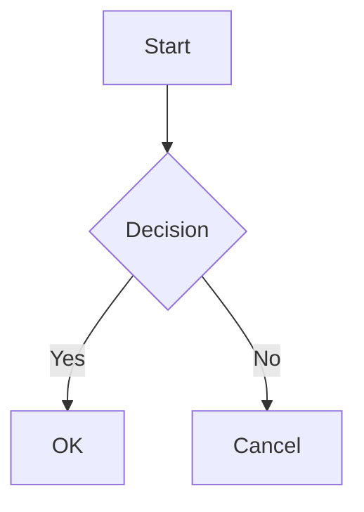

<p align="center">
  <a href="#/">English</a> | <a href="#/zh-cn/">简体中文</a> | <a href="#/zh-tw/">繁體中文</a> | <a href="#/ko/">한국어</a> | <strong>日本語</strong> | <a href="#/es/">Español</a> | <a href="#/pt-br/">Português</a>
</p>

<p align="center">
  
</p>

<h1 align="center">PlantUML Markdown Preview</h1>

<p align="center">
  <strong>3つのモードでワークフローに最適化。PlantUML、Mermaid、D2 をインラインでレンダリング — 高速・安全・セットアップ不要。</strong>
</p>

<p align="center">
  <a href="https://marketplace.visualstudio.com/items?itemName=yss-tazawa.plantuml-markdown-preview"></a>
  <a href="https://marketplace.visualstudio.com/items?itemName=yss-tazawa.plantuml-markdown-preview"></a>
  <a href="https://github.com/yss-tazawa/plantuml-markdown-preview/blob/main/LICENSE"></a>
</p>

<p align="center">
  
</p>

## モードを選ぶ

| | **Fast**（デフォルト） | **Secure** | **Easy** |
|---|---|---|---|
| | 即座に再レンダリング | 最高のプライバシー | セットアップ不要 |
| | localhost で PlantUML サーバーを実行 — JVM 起動コストなし、即座に更新 | ネットワーク不要、バックグラウンドプロセスなし — すべてローカルで完結 | Java 不要 — PlantUML サーバーですぐに動作 |
| **Java** | 11 以上が必要 | 11 以上が必要 | 不要 |
| **ネットワーク** | なし | なし | 必要 |
| **プライバシー** | ローカルのみ | ローカルのみ | ダイアグラムソースを PlantUML サーバーに送信 |
| **セットアップ** | [Java をインストール →](#前提条件) | [Java をインストール →](#前提条件) | セットアップ不要 |

設定1つでいつでもモード切替 — 移行もリスタートも不要。

> 詳細は[レンダリングモード](#レンダリングモード)、セットアップ手順は[クイックスタート](#クイックスタート)を参照。

## ハイライト

- **PlantUML、Mermaid、D2 のインラインレンダリング** — ダイアグラムが Markdown プレビュー内に直接表示（別パネルではなく）
- **セキュアな設計** — CSP nonce ベースのポリシーにより、Markdown コンテンツからのコード実行をすべてブロック
- **ダイアグラムスケール調整** — PlantUML、Mermaid、D2 のサイズを個別に調整可能
- **自己完結型 HTML エクスポート** — SVG ダイアグラムをインライン埋め込み、レイアウト幅と配置を設定可能
- **PDF エクスポート** — ヘッドレス Chromium でワンクリックエクスポート、ダイアグラムはページ幅に自動スケール
- **双方向スクロール同期** — エディタとプレビューが連動してスクロール
- **ナビゲーション & 目次** — トップ/ボトムへ移動ボタンとプレビューパネルの目次サイドバー
- **ダイアグラムビューア** — ダイアグラムを右クリックでパン＆ズームパネルを開き、リアルタイム同期とテーマ適用背景を表示
- **スタンドアロンダイアグラムプレビュー** — `.puml`、`.mmd`、`.d2` ファイルをパン＆ズーム、ライブ更新、テーマ対応で直接プレビュー — Markdown ラッパー不要
- **PNG / SVG としてダイアグラムを保存・コピー** — プレビューまたはダイアグラムビューアでダイアグラムを右クリックして保存またはクリップボードにコピー
- **14 のプレビューテーマ** — ライト 8 + ダーク 6 テーマ（GitHub、Atom、Solarized、Dracula、Monokai など）
- **エディタ支援** — PlantUML、Mermaid、D2 のキーワード補完、カラーピッカー、コードスニペット
- **国際化対応** — 英語、中国語（簡体字 / 繁体字）、日本語、韓国語、スペイン語、ブラジルポルトガル語の UI
- **数式サポート** — `$...$` インライン・`$$...$$` ブロック数式を [KaTeX](https://katex.org/) でレンダリング

## 目次

- [モードを選ぶ](#モードを選ぶ)
- [ハイライト](#ハイライト)
- [機能](#機能)
- [クイックスタート](#クイックスタート)
- [使い方](#使い方)
- [設定](#設定)
- [スニペット](#スニペット)
- [キーワード補完](#キーワード補完)
- [キーボードショートカット](#キーボードショートカット)
- [FAQ](#faq)
- [コントリビューション](#コントリビューション)
- [サードパーティライセンス](#サードパーティライセンス)
- [ライセンス](#ライセンス)

## 機能

### インラインダイアグラムプレビュー

```` ```plantuml ````、```` ```mermaid ````、```` ```d2 ```` コードブロックが通常の Markdown コンテンツと一緒にインライン SVG ダイアグラムとしてレンダリングされます。

- 入力に応じてリアルタイムでプレビュー更新（2段階デバウンス）
- ファイル保存時に自動更新
- エディタタブ切替時に自動追従
- ダイアグラムレンダリング中のローディングインジケータ
- 構文エラーを行番号とソースコンテキスト付きでインライン表示
- PlantUML: Java（Secure / Fast モード）またはリモート PlantUML サーバー（Easy モード）でレンダリング — [レンダリングモード](#レンダリングモード)を参照
- Mermaid: [mermaid.js](https://mermaid.js.org/) を使用してクライアントサイドでレンダリング — Java や外部ツール不要
- D2: [@terrastruct/d2](https://d2lang.com/)（Wasm）を使用してクライアントサイドでレンダリング — 外部ツール不要

### 数式サポート

[KaTeX](https://katex.org/) を使用して数式をレンダリング。

- **インライン数式** — `$E=mc^2$` がインライン数式として表示
- **ブロック数式** — `$$\int_0^\infty e^{-x}\,dx = 1$$` が中央揃えの数式として表示
- サーバーサイドレンダリング — Webview 内で JavaScript 不要、HTML/CSS のみ
- プレビューと HTML/PDF エクスポートの両方で動作
- `$` 記号が意図しない数式パースを引き起こす場合は `enableMath: false` で無効化

### ダイアグラムスケール

PlantUML、Mermaid、D2 のダイアグラム表示サイズを個別に制御。

- **PlantUML スケール** — `auto`（幅に合わせて縮小）または固定パーセンテージ（70%〜120%、デフォルト 100%）。SVG はどのスケールでも鮮明。
- **Mermaid スケール** — `auto`（コンテナ幅に合わせる）または固定パーセンテージ（50%〜100%、デフォルト 80%）。
- **D2 スケール** — `auto`（コンテナ幅に合わせる）または固定パーセンテージ（50%〜100%、デフォルト 75%）。

### レンダリングモード

PlantUML ダイアグラムのレンダリング方法を制御するプリセットモード：

| | Fast（デフォルト） | Secure | Easy |
|---|---|---|---|
| **Java 必須** | はい | はい | いいえ |
| **ネットワーク** | なし（localhost のみ） | なし | 必要 |
| **プライバシー** | ダイアグラムはローカルに保持 | ダイアグラムはローカルに保持 | ダイアグラムソースを PlantUML サーバーに送信 |
| **速度** | 常駐 PlantUML サーバー — 即座に再レンダリング | レンダリングごとに JVM 起動 | ネットワークに依存 |
| **同時処理数** | 50（並列 HTTP） | 1（バッチ） | 5（並列 HTTP） |

- **Fast モード**（デフォルト） — `localhost` で常駐 PlantUML サーバーを起動。編集ごとの JVM 起動コストを排除し、高い同時処理数で即座に再レンダリング。ダイアグラムはマシン外に送信されません。
- **Secure モード** — Java + PlantUML jar をローカルで使用。ダイアグラムはマシン外に送信されません。ネットワークアクセスなし。最大限のセキュリティのため、ローカル画像はデフォルトでブロック。
- **Easy モード** — PlantUML ソースをサーバーに送信してレンダリング。セットアップ不要。デフォルトでは公開サーバー（`https://www.plantuml.com/plantuml`）を使用。プライバシーのために自前のサーバー URL を設定可能。

Java が見つからない場合、プレビューを開くと Easy モードへの切替を提案する通知が表示されます。

### ステータスバー

- **モードバッジ** — ステータスバーに現在のレンダリングモード（Fast / Secure / Easy）を表示。クリックするとモード切替
- **サーバー状態** — Fast モード時にサーバーの状態（起動中・稼働中・停止中）を表示

### ナビゲーション & 目次

- **トップへ移動 / ボトムへ移動** — プレビューパネル右上のボタン
- **目次サイドバー** — TOC ボタンをクリックしてすべての見出しを一覧表示するサイドバーを開く。見出しをクリックするとその位置にジャンプ

### ダイアグラムビューア

プレビュー内の PlantUML / Mermaid / D2 ダイアグラムを右クリックして **「ダイアグラムビューアで開く」** を選択すると、パン＆ズーム専用パネルが開く。

- マウスホイールズーム（カーソル中心）、ドラッグでパン
- ツールバー：ウィンドウに合わせる、1:1 リセット、ステップズーム（+/−）
- ライブ同期 — エディタの変更がリアルタイムに反映、ズーム位置は保持
- 背景色は現在のプレビューテーマに合わせる
- 別のソースファイルに切り替えると自動で閉じる
- **PNG / SVG として保存・コピー** — プレビューまたはダイアグラムビューア内でダイアグラムを右クリックしてファイル保存またはクリップボードにコピー
- **ビューア内検索** — `Cmd+F` / `Ctrl+F` で検索ウィジェットを開く
- `enableDiagramViewer: false` で無効化可能

### PlantUML `!include` サポート

`!include` ディレクティブを使って、共通スタイル・マクロ・コンポーネント定義をダイアグラム間で共有できる。

- インクルードファイルはワークスペースルート（または `plantumlIncludePath` で設定したディレクトリ）から相対パスで解決
- インクルードファイルを保存すると自動的にプレビューを更新（**リロード** ボタン ↻ で手動更新も可）
- **インクルードファイルへ移動** — `.puml` または Markdown ファイルの `!include` 行を右クリックして参照ファイルを開く（カーソルが `!include` 行にある場合のみメニュー表示）
- **インクルードソースを開く** — プレビュー内の PlantUML ダイアグラムを右クリックして、インクルードファイルを直接開く
- Fast / Secure モードで動作。Easy モードは不可（リモートサーバーがローカルファイルにアクセスできないため）

### スタンドアロンダイアグラムプレビュー

`.puml`、`.plantuml`、`.mmd`、`.mermaid`、`.d2` ファイルを直接開く — Markdown ラッパー不要。

- ダイアグラムビューアと同じパン＆ズーム UI
- 入力に応じてリアルタイムでプレビュー更新（デバウンス）
- 同じ種類のファイル間での切替時に自動追従
- 独立したテーマ選択（プレビューテーマ＋ダイアグラムテーマ）
- 右クリックで PNG / SVG として保存・コピー
- **プレビュー内検索** — `Cmd+F` / `Ctrl+F` で検索ウィジェットを開く
- PlantUML：3つのレンダリングモード（Fast / Secure / Easy）すべてに対応
- Mermaid：mermaid.js でクライアントサイドレンダリング
- D2：@terrastruct/d2（Wasm）でレンダリング、テーマとレイアウトエンジンを設定可能

### 双方向スクロール同期

エディタとプレビューは、どちらをスクロールしても連動する。

- アンカーベースのスクロールマッピング
- 再レンダリング後も位置を安定して復元

### テーマ

**プレビューテーマ**はドキュメント全体の外観を制御：

**ライトテーマ:**

| テーマ | スタイル |
| ------- | ------- |
| GitHub Light | 白背景（デフォルト） |
| Atom Light | ソフトグレーテキスト、Atom エディタ風 |
| One Light | オフホワイト、バランスの取れたパレット |
| Solarized Light | 温かいベージュ、目に優しい |
| Vue | グリーンアクセント、Vue.js ドキュメント風 |
| Pen Paper Coffee | 温かい紙の質感、手書き風 |
| Coy | ほぼ白、クリーンなデザイン |
| VS | クラシックな Visual Studio カラー |

**ダークテーマ:**

| テーマ | スタイル |
| ------- | ------- |
| GitHub Dark | ダーク背景 |
| Atom Dark | Tomorrow Night パレット |
| One Dark | Atom インスパイアのダーク |
| Dracula | 鮮やかなダーク |
| Solarized Dark | 深いティール、目に優しい |
| Monokai | 鮮やかなシンタックス、Sublime Text 風 |

タイトルバーのアイコンからプレビューテーマを即切替 — 再レンダリング不要（CSS のみの切替）。PlantUML テーマ変更時は再レンダリングが走る。

**PlantUML テーマ**はダイアグラムのスタイルを独立して制御。インストール済みの PlantUML からテーマを自動検出し、プレビューテーマと統合した QuickPick に表示。

**Mermaid テーマ**は Mermaid ダイアグラムのスタイルを制御：`default`、`dark`、`forest`、`neutral`、`base`。QuickPick テーマピッカーからも選択可。

**D2 テーマ** — 19 種類の組み込みテーマ（例：`Neutral Default`、`Dark Mauve`、`Terminal`）。設定または QuickPick テーマピッカーから設定可。

### シンタックスハイライト

highlight.js により 190 以上の言語をサポート。コードブロックは選択中のプレビューテーマに合わせてスタイルが適用される。

### セキュリティ

- nonce ベースのスクリプト制限を持つコンテンツセキュリティポリシー（CSP）
- Markdown コンテンツからのコード実行をすべてブロック
- ユーザーが記述した `<script>` タグはブロック
- ローカル画像の読み込みはデフォルトでモードのプリセットに従う（`allowLocalImages: "mode-default"`）。Secure モードでは最大セキュリティのため無効
- HTTP 画像の読み込みはデフォルト無効（`allowHttpImages`）。有効にすると CSP の `img-src` ディレクティブに `http:` が追加され、暗号化なしの画像リクエストが可能になる — 信頼できるネットワーク（イントラネット、ローカル開発サーバー）のみで使用すること

### VS Code 組み込み Markdown プレビューとの統合

PlantUML・Mermaid・D2 ダイアグラムは VS Code 組み込みの Markdown プレビュー（`Markdown: プレビューを横に開く`）でもレンダリングされる。追加設定不要。

> **注意：** 組み込みプレビューはこの拡張機能のプレビューテーマ、双方向スクロール同期、HTML エクスポートには対応していません。フル機能を使うには、拡張機能独自のプレビューパネル（`Cmd+Alt+V` / `Ctrl+Alt+V`）を使用してください。
>
> **注意：** 組み込みプレビューはダイアグラムを同期的にレンダリングします。大きく複雑な PlantUML ダイアグラムの場合、エディタが一時的にフリーズすることがあります。重いダイアグラムには拡張機能独自のプレビューパネルを使用してください。

## クイックスタート

### 前提条件

**Mermaid** — 前提条件なし。すぐに使える。

**D2** — 前提条件なし。組み込みの [D2](https://d2lang.com/) Wasm を使用 — すぐに使える。

**PlantUML（Easy モード）** — 前提条件なし。ダイアグラムソースがレンダリングのために PlantUML サーバーに送信される。

**PlantUML（Fast / Secure モード）** — デフォルト：

| ツール | 用途 | 確認方法 |
| ------ | ---- | -------- |
| Java 11+（JRE または JDK） | PlantUML を実行（バンドル済み PlantUML 1.2026.2 は Java 11+ が必要） | `java -version` |
| [Graphviz](https://graphviz.org/) | オプション — クラス図・コンポーネント図などレイアウト依存ダイアグラムに必要（ダイアグラムサポート参照） | `dot -V` |

> **注意：** PlantUML jar（LGPL、v1.2026.2）は拡張機能に同梱済みです。別途ダウンロード不要。**Java 11 以降が必要です。**
>
> **ヒント：** Java がインストールされていない場合、プレビューを開くと Easy モードへの切替を提案する通知が表示されます。

### ダイアグラムサポート

使用できるダイアグラムはセットアップに依存します：

| ダイアグラム | LGPL（同梱） | Win: GPLv2 jar | Mac/Linux: + Graphviz |
| ------------ | :-: | :-: | :-: |
| シーケンス | ✓ | ✓ | ✓ |
| アクティビティ（新構文） | ✓ | ✓ | ✓ |
| マインドマップ | ✓ | ✓ | ✓ |
| WBS | ✓ | ✓ | ✓ |
| ガント | ✓ | ✓ | ✓ |
| JSON / YAML | ✓ | ✓ | ✓ |
| Salt / ワイヤーフレーム | ✓ | ✓ | ✓ |
| タイミング | ✓ | ✓ | ✓ |
| ネットワーク（nwdiag） | ✓ | ✓ | ✓ |
| クラス | — | ✓ | ✓ |
| ユースケース | — | ✓ | ✓ |
| オブジェクト | — | ✓ | ✓ |
| コンポーネント | — | ✓ | ✓ |
| デプロイメント | — | ✓ | ✓ |
| ステート | — | ✓ | ✓ |
| ER（エンティティ関係） | — | ✓ | ✓ |
| アクティビティ（旧構文） | — | ✓ | ✓ |

- **LGPL（同梱）** — すぐに使える。Graphviz 不要。
- **Win: GPLv2 jar** — [GPLv2 版](https://plantuml.com/download)は Graphviz を内包（Windows のみ、自動展開）。`plantumlJarPath`（設定セクション参照）で指定して使用。
- **Mac/Linux: + Graphviz** — [Graphviz](https://graphviz.org/) を別途インストール。LGPL・GPLv2 jar どちらでも動作。

### インストール

1. VS Code を開く
2. 拡張機能ビュー（`Ctrl+Shift+X` / `Cmd+Shift+X`）で **PlantUML Markdown Preview** を検索
3. **インストール** をクリック

### セットアップ

**Fast モード**（デフォルト）：常駐ローカル PlantUML サーバーを起動して即座に再レンダリング。Java 11+ が必要。

**Secure モードを使う場合**：`mode` を `"secure"` に設定。バックグラウンドサーバーやネットワークアクセスなしで、レンダリングごとに Java 11+ を使用。

**Easy モードを使う場合**（セットアップ不要）：`mode` を `"easy"` に設定。ダイアグラムソースがレンダリングのために PlantUML サーバーに送信される。Java が検出されない場合も拡張機能が切替を促す。

**Fast / Secure モード**：同梱の LGPL jar はシーケンス・アクティビティ・マインドマップなどのダイアグラムを追加セットアップなしで対応（ダイアグラムサポート参照）。クラス・コンポーネント・ユースケースなどレイアウト依存ダイアグラムを有効にするには、以下のプラットフォーム別手順に従う。

#### Windows

1. Java がインストールされていない場合はインストール（PowerShell を開いて実行）：

   ```powershell
   winget install Microsoft.OpenJDK.21
   ```

2. `java` が PATH にない場合、PowerShell でフルパスを確認：

   ```powershell
   Get-Command java
   # 例: C:\Program Files\Microsoft\jdk-21.0.6.7-hotspot\bin\java.exe
   ```

   VS Code 設定（`Ctrl+,`）で `plantumlMarkdownPreview.javaPath` を検索して上記パスを入力
3. [GPLv2 版 PlantUML](https://plantuml.com/download)（`plantuml-gplv2-*.jar`）を任意のフォルダにダウンロード（Graphviz 内包 — 別途インストール不要）
4. VS Code 設定（`Ctrl+,`）で `plantumlMarkdownPreview.plantumlJarPath` を検索してダウンロードした `.jar` のフルパスを入力（例：`C:\tools\plantuml-gplv2-1.2026.2.jar`）

#### Mac

1. Homebrew で Java と Graphviz をインストール：

   ```sh
   brew install openjdk graphviz
   ```

2. `dot` が PATH にない場合、フルパスを確認して VS Code に設定：

   ```sh
   which dot
   # 例: /opt/homebrew/bin/dot
   ```

   VS Code 設定（`Cmd+,`）で `plantumlMarkdownPreview.dotPath` を検索して上記パスを入力

#### Linux

1. Java と Graphviz をインストール：

   ```sh
   # Debian / Ubuntu
   sudo apt install default-jdk graphviz

   # Fedora
   sudo dnf install java-21-openjdk graphviz
   ```

2. `dot` が PATH にない場合、フルパスを確認して VS Code に設定：

   ```sh
   which dot
   # 例: /usr/bin/dot
   ```

   VS Code 設定（`Ctrl+,`）で `plantumlMarkdownPreview.dotPath` を検索して上記パスを入力

> **注意：** `javaPath` のデフォルトは `"java"`。デフォルトのままの場合、`JAVA_HOME/bin/java` を最初に試し、次に PATH 上の `java` を使用。`dotPath` と `plantumlJarPath` のデフォルトはそれぞれ `"dot"` と同梱 jar。これらのコマンドが PATH にない場合や別の jar を使いたい場合のみ設定する。

## 使い方

### プレビューを開く

- **キーボードショートカット：** `Cmd+Alt+V`（Mac）/ `Ctrl+Alt+V`（Windows / Linux）
- **コンテキストメニュー：** エクスプローラーまたはエディタ内で `.md` ファイルを右クリック → **PlantUML Markdown Preview** → **プレビューを横に開く**
- **コマンドパレット：** `PlantUML Markdown Preview: Open Preview to Side`

プレビューは VS Code とは独立した独自テーマを使用 — デフォルトは白背景（GitHub Light）。

### ダイアグラムプレビューを開く

`.puml` / `.plantuml`、`.mmd` / `.mermaid`、`.d2` ファイルをパン＆ズームプレビューで直接開く — Markdown ラッパー不要。

- **キーボードショートカット：** `Cmd+Alt+V`（Mac）/ `Ctrl+Alt+V`（Windows / Linux）— 同じショートカット、ファイル種別に応じて自動選択
- **コンテキストメニュー：** エクスプローラーまたはエディタで `.puml` / `.plantuml`、`.mmd` / `.mermaid`、`.d2` ファイルを右クリック → **PlantUML ファイルをプレビュー** / **Mermaid ファイルをプレビュー** / **D2 ファイルをプレビュー**
- **コマンドパレット：** `PlantUML Markdown Preview: Preview PlantUML File`、`Preview Mermaid File`、または `Preview D2 File`

### HTML にエクスポート

- **コンテキストメニュー：** `.md` ファイルを右クリック → **PlantUML Markdown Preview** → **HTML としてエクスポート**
- **プレビューパネル：** プレビュー内を右クリック → **HTML としてエクスポート** または **HTML としてエクスポートしてブラウザで開く**
- **コマンドパレット：** `PlantUML Markdown Preview: Export as HTML`
- **コマンドパレット：** `PlantUML Markdown Preview: Export as HTML & Open in Browser`
- **コマンドパレット：** `PlantUML Markdown Preview: Export as HTML (Fit to Width)`
- **コマンドパレット：** `PlantUML Markdown Preview: Export as HTML & Open in Browser (Fit to Width)`

HTML ファイルはソースの `.md` ファイルと同じ場所に保存される。エクスポートとブラウザで開く操作を一度に行うには **HTML としてエクスポートしてブラウザで開く** を選択。

### PDF にエクスポート

- **コンテキストメニュー：** `.md` ファイルを右クリック → **PlantUML Markdown Preview** → **PDF としてエクスポート**
- **プレビューパネル：** プレビュー内を右クリック → **PDF としてエクスポート** または **PDF としてエクスポートして開く**
- **コマンドパレット：** `PlantUML Markdown Preview: Export as PDF`
- **コマンドパレット：** `PlantUML Markdown Preview: Export as PDF & Open`

PDF ファイルはソースの `.md` ファイルと同じ場所に保存される。Chrome、Edge、または Chromium が必要。

### ダイアグラムを PNG / SVG として保存・コピー

- **プレビューパネル：** ダイアグラムを右クリック → **PNG としてコピー**、**PNG として保存**、または **SVG として保存**
- **ダイアグラムビューア：** ビューア内を右クリック → **PNG としてコピー**、**PNG として保存**、または **SVG として保存**
- **スタンドアロンダイアグラムプレビュー：** プレビュー内を右クリック → **PNG としてコピー**、**PNG として保存**、または **SVG として保存**

### ナビゲーション

- **トップへ移動 / ボトムへ移動：** プレビューパネル右上のボタン
- **リロード：** ↻ ボタンをクリックしてプレビューを手動更新しキャッシュをクリア（インクルードファイルも保存時に自動更新）
- **目次：** プレビューパネル右上の TOC ボタンをクリックしてすべての見出しを一覧表示するサイドバーを開く。見出しをクリックするとその位置にジャンプ

### テーマを変更する

プレビューパネルのタイトルバーにあるテーマアイコンをクリック、またはコマンドパレットを使用：

- **コマンドパレット：** `PlantUML Markdown Preview: Change Preview Theme`

テーマピッカーは4つのカテゴリー（プレビューテーマ・PlantUML テーマ・Mermaid テーマ・D2 テーマ）を1つのリストに表示 — 一か所からすべてを切り替え可能。

### PlantUML 構文

````markdown
```plantuml
Alice -> Bob: Hello
Bob --> Alice: Hi!
```
````

`@startuml` / `@enduml` ラッパーは省略すると自動で追加される。

### Mermaid 構文

````markdown

````

### D2 構文

````markdown
```d2
server -> db: query
db -> server: result
```
````

構文の詳細は [D2 ドキュメント](https://d2lang.com/) を参照。

### 数式構文

インライン数式はシングルドル記号、ブロック数式はダブルドル記号を使用：

````markdown
アインシュタインの有名な方程式 $E=mc^2$ は質量とエネルギーの等価性を示す。

$$\int_0^\infty e^{-x}\,dx = 1$$
````

> `$` 記号が意図しない数式パースを引き起こす場合（例：`$100`）は `enableMath: false` で無効化。

## スニペット

スニペットプレフィックスを入力して `Tab` キーを押すと展開される。2種類のスニペットが用意されている：

- **Markdown スニペット**（フェンスブロック外）— `plantuml-`、`mermaid-`、または `d2-` プレフィックス。完全なフェンスブロックに展開
- **テンプレートスニペット**（フェンスブロック内）— `tmpl-` プレフィックス。ダイアグラム本体のみに展開。`tmpl` と入力するとすべてのテンプレートを確認可能

### Markdown スニペット（フェンスブロック外）

フェンスを含む完全な `` ```plantuml ... ``` `` ブロックに展開：

| プレフィックス | ダイアグラム |
| --- | --- |
| `plantuml` | 空の PlantUML ブロック |
| `plantuml-sequence` | シーケンス図 |
| `plantuml-class` | クラス図 |
| `plantuml-activity` | アクティビティ図 |
| `plantuml-usecase` | ユースケース図 |
| `plantuml-component` | コンポーネント図 |
| `plantuml-state` | ステート図 |
| `plantuml-er` | ER 図 |
| `plantuml-object` | オブジェクト図 |
| `plantuml-deployment` | デプロイメント図 |
| `plantuml-mindmap` | マインドマップ |
| `plantuml-gantt` | ガントチャート |

### PlantUML スニペット（フェンスブロック内）

ダイアグラムテンプレート（`tmpl` と入力して一覧表示）：

| プレフィックス | 内容 |
| --- | --- |
| `tmpl-seq` | シーケンス図 |
| `tmpl-cls` | クラス定義 |
| `tmpl-act` | アクティビティ図 |
| `tmpl-uc` | ユースケース図 |
| `tmpl-comp` | コンポーネント図 |
| `tmpl-state` | ステート図 |
| `tmpl-er` | エンティティ定義 |
| `tmpl-obj` | オブジェクト図 |
| `tmpl-deploy` | デプロイメント図 |
| `tmpl-mind` | マインドマップ |
| `tmpl-gantt` | ガントチャート |

短縮スニペット：

| プレフィックス | 内容 |
| --- | --- |
| `part` | participant 宣言 |
| `actor` | actor 宣言 |
| `note` | ノートブロック |
| `intf` | interface 定義 |
| `pkg` | package 定義 |

### Mermaid Markdown スニペット（フェンスブロック外）

フェンスを含む完全な `` ```mermaid ... ``` `` ブロックに展開：

| プレフィックス | ダイアグラム |
| --- | --- |
| `mermaid` | 空の Mermaid ブロック |
| `mermaid-flow` | フローチャート |
| `mermaid-sequence` | シーケンス図 |
| `mermaid-class` | クラス図 |
| `mermaid-state` | ステート図 |
| `mermaid-er` | ER 図 |
| `mermaid-gantt` | ガントチャート |
| `mermaid-pie` | 円グラフ |
| `mermaid-mindmap` | マインドマップ |
| `mermaid-timeline` | タイムライン |
| `mermaid-git` | Git グラフ |

### Mermaid スニペット（フェンスブロック内）

ダイアグラムテンプレート（`tmpl` と入力して一覧表示）：

| プレフィックス | 内容 |
| --- | --- |
| `tmpl-flow` | フローチャート |
| `tmpl-seq` | シーケンス図 |
| `tmpl-cls` | クラス図 |
| `tmpl-state` | ステート図 |
| `tmpl-er` | ER 図 |
| `tmpl-gantt` | ガントチャート |
| `tmpl-pie` | 円グラフ |
| `tmpl-mind` | マインドマップ |
| `tmpl-timeline` | タイムライン |
| `tmpl-git` | Git グラフ |

### D2 Markdown スニペット（フェンスブロック外）

フェンスを含む完全な `` ```d2 ... ``` `` ブロックに展開：

| プレフィックス | ダイアグラム |
| --- | --- |
| `d2` | 空の D2 ブロック |
| `d2-basic` | 基本接続 |
| `d2-sequence` | シーケンス図 |
| `d2-class` | クラス図 |
| `d2-comp` | コンポーネント図 |
| `d2-grid` | グリッドレイアウト |
| `d2-er` | ER 図 |
| `d2-flow` | フローチャート |
| `d2-icon` | アイコンノード |
| `d2-markdown` | Markdown テキストノード |
| `d2-tooltip` | ツールチップとリンク |
| `d2-layers` | レイヤー/ステップ |
| `d2-style` | カスタムスタイル |

### D2 スニペット（フェンスブロック内）

ダイアグラムテンプレート（`tmpl` と入力して一覧表示）：

| プレフィックス | 内容 |
| --- | --- |
| `tmpl-seq` | シーケンス図 |
| `tmpl-cls` | クラス図 |
| `tmpl-comp` | コンポーネント図 |
| `tmpl-er` | ER 図 |
| `tmpl-flow` | フローチャート |
| `tmpl-grid` | グリッドレイアウト |

短縮スニペット：

| プレフィックス | 内容 |
| --- | --- |
| `conn` | 接続 |
| `icon` | アイコンノード |
| `md` | Markdown ノード |
| `tooltip` | ツールチップとリンク |
| `layers` | レイヤー/ステップ |
| `style` | カスタムスタイル |
| `direction` | レイアウト方向 |

## カラーピッカー

PlantUML、Mermaid、D2 のカラースウォッチとインラインカラーピッカー。スタンドアロンファイル（`.puml`、`.mmd`、`.d2`）と Markdown フェンスブロックの両方で動作。

- **6桁 hex** — `#FF0000`、`#1565C0` など
- **3桁 hex** — `#F00`、`#ABC` など
- **色名**（PlantUML のみ）— `#Red`、`#LightBlue`、`#Salmon` など（20色）
- 新しい色を選択すると値が `#RRGGBB` 形式に置換される
- コメント行は除外（PlantUML は `'`、Mermaid は `%%`、D2 は `#`）

## キーワード補完

PlantUML、Mermaid、D2 のコンテキスト対応キーワード補完。スタンドアロンファイルと Markdown フェンスブロックの両方で動作。

### PlantUML

- **行頭キーワード** — `@startuml`、`participant`、`class`、`skinparam`、`!include` など
- **`skinparam` パラメータ** — `skinparam` に続いてスペースを入力すると `backgroundColor`、`defaultFontName`、`arrowColor` などの補完候補を表示
- **色名** — `#` を入力すると色の補完候補を表示（`Red`、`Blue`、`LightGreen` など）
- **トリガー文字**：`@`、`!`、`#`

### Mermaid

- **ダイアグラム種別宣言** — 1行目の `flowchart`、`sequenceDiagram`、`classDiagram`、`gantt` など
- **ダイアグラム固有キーワード** — 宣言されたダイアグラム種別に応じて補完候補が変わる（例：フローチャートは `subgraph`、シーケンスは `participant`）
- **方向値** — `direction` に続いてスペースを入力すると `TB`、`LR` などを表示

### D2

- **シェイプ種別** — `shape:` を入力すると `rectangle`、`cylinder`、`person` などの補完候補を表示
- **スタイルプロパティ** — `style.` を入力すると `fill`、`stroke`、`font-size` などを表示
- **方向値** — `direction:` を入力すると `right`、`down`、`left`、`up` を表示
- **制約値** — `constraint:` を入力すると `primary_key`、`foreign_key`、`unique` を表示
- **トリガー文字**：`:`、`.`

## 設定

すべての設定は `plantumlMarkdownPreview.` プレフィックスを使用。

| 設定 | デフォルト | 説明 |
| ------- | ------- | ----------- |
| `mode` | `"fast"` | プリセットモード。`"fast"`（デフォルト）— ローカルサーバー、即座に再レンダリング。`"secure"` — ネットワークなし、最高セキュリティ。`"easy"` — セットアップ不要（ダイアグラムソースを PlantUML サーバーに送信）。 |
| `javaPath` | `"java"` | Java 実行ファイルのパス。設定した場合はそのパスを使用。未設定の場合は `JAVA_HOME/bin/java`、次に PATH 上の `java` にフォールバック。（Fast / Secure モード） |
| `plantumlJarPath` | `""` | `plantuml.jar` へのパス。空のままにすると同梱 jar（LGPL）を使用。（Fast / Secure モード） |
| `dotPath` | `"dot"` | Graphviz `dot` 実行ファイルのパス（Fast / Secure モード） |
| `plantumlIncludePath` | `""` | PlantUML `!include` ディレクティブのベースディレクトリ。空のままにするとワークスペースルートを使用。Easy モードでは利用不可。 |
| `allowLocalImages` | `"mode-default"` | プレビューで相対画像パス（例：``）を解決。`"mode-default"` はモードのプリセットを使用（Fast: オン、Secure: オフ、Easy: オン）。`"on"` / `"off"` で上書き可。 |
| `allowHttpImages` | `false` | プレビューで HTTP（非暗号化）による画像読み込みを許可。イントラネットやローカル開発サーバーで有用。 |
| `previewTheme` | `"github-light"` | プレビューテーマ（テーマを参照） |
| `plantumlTheme` | `"default"` | PlantUML ダイアグラムテーマ。`"default"` はテーマなし。それ以外の値（例：`"cyborg"`、`"mars"`）は PlantUML CLI の `-theme` として渡すか、Easy モードでは `!theme` ディレクティブとして注入。 |
| `mermaidTheme` | `"default"` | Mermaid ダイアグラムテーマ：`"default"`、`"dark"`、`"forest"`、`"neutral"`、または `"base"`。 |
| `plantumlScale` | `"100%"` | PlantUML ダイアグラムスケール。`"auto"` はコンテナ幅を超えるダイアグラムを縮小。パーセンテージ（70%〜120%）は自然サイズのその割合でレンダリング。 |
| `mermaidScale` | `"80%"` | Mermaid ダイアグラムスケール。`"auto"` はコンテナ幅に合わせてスケール。パーセンテージ（50%〜100%）は自然サイズのその割合でレンダリング。 |
| `d2Theme` | `"Neutral Default"` | D2 ダイアグラムテーマ。19 種類の組み込みテーマが利用可能（例：`"Neutral Default"`、`"Dark Mauve"`、`"Terminal"`）。 |
| `d2Layout` | `"dagre"` | D2 レイアウトエンジン：`"dagre"`（デフォルト、高速）または `"elk"`（ノードが多い複雑なグラフに適切）。 |
| `d2Scale` | `"75%"` | D2 ダイアグラムスケール。`"auto"` はコンテナ幅に合わせてスケール。パーセンテージ（50%〜100%）は自然サイズのその割合でレンダリング。 |
| `htmlMaxWidth` | `"960px"` | エクスポートした HTML ボディの最大幅。`"640px"` 〜 `"1440px"`、または制限なしの `"none"`。 |
| `htmlAlignment` | `"center"` | HTML ボディの配置。`"center"`（デフォルト）または `"left"`。 |
| `enableMath` | `true` | KaTeX 数式レンダリングを有効化。`$...$`（インライン）と `$$...$$`（ブロック）をサポート。`$` 記号が意図しない数式パースを引き起こす場合は `false` に設定。 |
| `debounceNoDiagramChangeMs` | _（空）_ | ダイアグラム以外のテキスト変更のデバウンス遅延（ms）（ダイアグラムはキャッシュから配信）。空のままにするとモードのデフォルトを使用（Fast: 100、Secure: 100、Easy: 100）。 |
| `debounceDiagramChangeMs` | _（空）_ | ダイアグラムコンテンツ変更のデバウンス遅延（ms）。空のままにするとモードのデフォルトを使用（Fast: 100、Secure: 300、Easy: 300）。 |
| `plantumlLocalServerPort` | `0` | ローカル PlantUML サーバーのポート（Fast モードのみ）。`0` = 空きポートを自動割り当て。 |
| `plantumlServerUrl` | `"https://www.plantuml.com/plantuml"` | Easy モードの PlantUML サーバー URL。プライバシーのためにセルフホストサーバー URL に設定可能。 |
| `enableDiagramViewer` | `true` | ダイアグラムを右クリックしたときの「ダイアグラムビューアで開く」コンテキストメニュー項目を有効化。有効にするにはプレビューの再起動が必要。 |
| `retainPreviewContext` | `true` | タブが非表示のときにプレビューコンテンツを保持。タブ切替時の再レンダリングを防ぐがメモリ使用量が増加。有効にするにはプレビューの再起動が必要。 |

> **注意：** `allowLocalImages` と `allowHttpImages` はプレビューパネルにのみ適用される。HTML エクスポートは CSP 制限なしに元の画像パスをそのまま出力する。

<details>
<summary><strong>プレビューテーマのオプション</strong></summary>

| 値 | 説明 |
| ------- | ----------- |
| `github-light` | GitHub Light — 白背景（デフォルト） |
| `atom-light` | Atom Light — ソフトグレーテキスト、Atom インスパイア |
| `one-light` | One Light — オフホワイト、バランスの取れたパレット |
| `solarized-light` | Solarized Light — 温かいベージュ、目に優しい |
| `vue` | Vue — グリーンアクセント、Vue.js ドキュメント風 |
| `pen-paper-coffee` | Pen Paper Coffee — 温かい紙の質感、手書き風 |
| `coy` | Coy — ほぼ白、クリーンなデザイン |
| `vs` | VS — クラシックな Visual Studio カラー |
| `github-dark` | GitHub Dark — ダーク背景 |
| `atom-dark` | Atom Dark — Tomorrow Night パレット |
| `one-dark` | One Dark — Atom インスパイアのダーク |
| `dracula` | Dracula — 鮮やかなダークパレット |
| `solarized-dark` | Solarized Dark — 深いティール、目に優しい |
| `monokai` | Monokai — 鮮やかなシンタックス、Sublime Text 風 |

</details>

## キーボードショートカット

| コマンド | Mac | Windows / Linux |
| ------- | --- | --------------- |
| プレビューを横に開く（Markdown） | `Cmd+Alt+V` | `Ctrl+Alt+V` |
| PlantUML ファイルをプレビュー | `Cmd+Alt+V` | `Ctrl+Alt+V` |
| Mermaid ファイルをプレビュー | `Cmd+Alt+V` | `Ctrl+Alt+V` |
| D2 ファイルをプレビュー | `Cmd+Alt+V` | `Ctrl+Alt+V` |
| レンダリングモードを選択 | — | — |

## FAQ

<details>
<summary><strong>PlantUML ダイアグラムがレンダリングされない</strong></summary>

**Fast / Secure モード：**

1. `java -version` を実行して Java 11 以降がインストールされていることを確認
2. クラス図・コンポーネント図などレイアウト依存ダイアグラムを使う場合は `dot -V` を実行して Graphviz がインストールされていることを確認
3. カスタムの `plantumlJarPath` を設定した場合は、有効な `plantuml.jar` を指していることを確認。パスが存在しない場合は警告とともに同梱 jar にフォールバック。`plantumlJarPath` が空（デフォルト）の場合は同梱 LGPL jar が自動使用される
4. VS Code の出力パネルでエラーメッセージを確認

**Easy モード：**

1. サーバー URL が正しいことを確認（デフォルト：`https://www.plantuml.com/plantuml`）
2. ネットワーク接続を確認 — PlantUML サーバーに到達できる必要がある
3. セルフホストサーバーを使う場合はサーバーが稼働・アクセス可能であることを確認
4. サーバーへのリクエストは 15 秒でタイムアウト（Fast / Secure モードも 1 ダイアグラムあたり 15 秒のタイムアウト）

</details>

<details>
<summary><strong>D2 ダイアグラムがレンダリングされない</strong></summary>

D2 は組み込みの Wasm モジュールでレンダリングされる — 外部 CLI は不要。

1. VS Code ウィンドウをリロード（`Developer: Reload Window`）
2. VS Code の出力パネルでエラーメッセージを確認
3. D2 ソースの構文が有効であることを確認

</details>

<details>
<summary><strong>Java をインストールせずに PlantUML を使えますか？</strong></summary>

はい。拡張機能の設定で `mode` を `"easy"` に設定してください。Easy モードは PlantUML テキストをレンダリングのために PlantUML サーバーに送信し、Java を必要としません。デフォルトでは `https://www.plantuml.com/plantuml` の公開サーバーを使用します。プライバシーのために自前の PlantUML サーバーを運用して `plantumlServerUrl` にその URL を設定することもできます。

</details>

<details>
<summary><strong>ダイアグラムが多いと Secure モードが遅い。速くするには？</strong></summary>

**Fast モード**（`mode: "fast"`）に切り替えてください。localhost で常駐 PlantUML サーバーを起動するため、再レンダリングが即座に行われ、編集ごとの JVM 起動コストがかかりません。同時処理数も大幅に高くなります（Secure モードの 1 に対して 50 並列リクエスト）。

</details>

<details>
<summary><strong>Easy モードでダイアグラムデータは安全ですか？</strong></summary>

Easy モードでは、PlantUML ソーステキストが設定されたサーバーに送信されます。デフォルトの公開サーバー（`https://www.plantuml.com/plantuml`）は PlantUML プロジェクトが運営しています。ダイアグラムに機密情報が含まれる場合は、[セルフホスト PlantUML サーバー](https://plantuml.com/server)を運用して `plantumlServerUrl` にその URL を設定するか、ダイアグラムがマシン外に送信されない Fast または Secure モードを使用することを検討してください。

</details>

<details>
<summary><strong>ダークテーマでダイアグラムの表示がおかしい</strong></summary>

プレビューテーマに合わせてダイアグラムテーマを設定してください。タイトルバーアイコンからテーマピッカーを開き、ダーク系 PlantUML テーマ（例：`cyborg`、`mars`）を選択するか、Mermaid テーマを `dark` に設定してください。

</details>

<details>
<summary><strong><code>!include</code> が動作しない</strong></summary>

`!include` は Fast または Secure モードが必要です。リモートサーバーがローカルファイルにアクセスできないため、Easy モードでは動作しません。

- パスはデフォルトでワークスペースルートからの相対パスで解決されます。別のベースディレクトリを使う場合は `plantumlIncludePath` を設定してください。
- インクルードファイルを保存すると自動的にプレビューが更新されます。**リロード** ボタン（↻）をクリックして手動更新することもできます。

</details>

<details>
<summary><strong>PlantUML コード内で <code>!theme</code> を使えますか？</strong></summary>

はい。インラインの `!theme` ディレクティブは拡張機能の設定より優先されます。

</details>

## コントリビューション

開発環境のセットアップ、ビルド手順、プルリクエストのガイドラインは [CONTRIBUTING.md](CONTRIBUTING.md) を参照してください。

## サードパーティライセンス

この拡張機能には以下のサードパーティソフトウェアが含まれています：

- [PlantUML](https://plantuml.com/)（LGPL 版）— [GNU Lesser General Public License v3 (LGPL-3.0)](https://www.gnu.org/licenses/lgpl-3.0.html)。詳細は [PlantUML ライセンスページ](https://plantuml.com/license)を参照。
- [mermaid.js](https://mermaid.js.org/) — [MIT License](https://github.com/mermaid-js/mermaid/blob/develop/LICENSE)
- [KaTeX](https://katex.org/) — [MIT License](https://github.com/KaTeX/KaTeX/blob/main/LICENSE)
- [@terrastruct/d2](https://d2lang.com/)（Wasm ビルド）— [Mozilla Public License 2.0 (MPL-2.0)](https://github.com/terrastruct/d2/blob/master/LICENSE.txt)

## ライセンス

[MIT](LICENSE)
