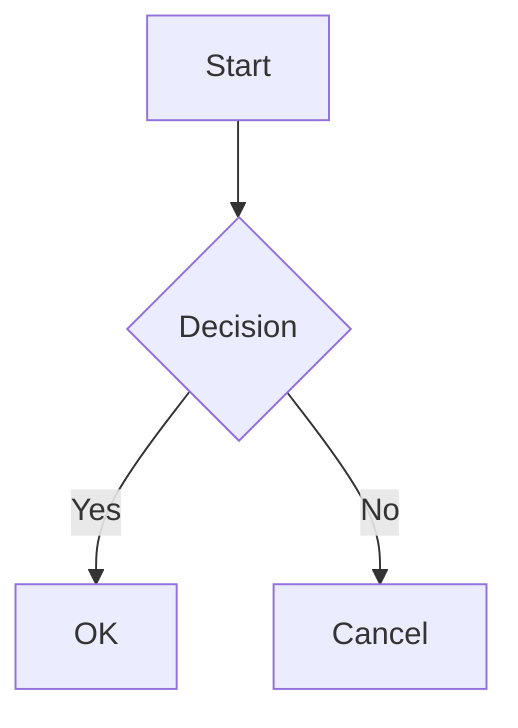

<p align="center">
  <a href="#/">English</a> | <a href="#/zh-cn/">简体中文</a> | <a href="#/zh-tw/">繁體中文</a> | <a href="#/es/">Español</a> | <a href="#/pt-br/">Português</a> | <a href="#/ja/">日本語</a> | <strong>한국어</strong>
</p>

<p align="center">
  
</p>

<h1 align="center">PlantUML Markdown Preview</h1>

<p align="center">
  <strong>워크플로우에 맞는 3가지 모드. PlantUML, Mermaid 및 D2를 인라인으로 렌더링합니다 — 빠르고 안전하며 설정이 필요 없습니다.</strong>
</p>

<p align="center">
  <a href="https://marketplace.visualstudio.com/items?itemName=yss-tazawa.plantuml-markdown-preview"></a>
  <a href="https://marketplace.visualstudio.com/items?itemName=yss-tazawa.plantuml-markdown-preview"></a>
  <a href="https://github.com/yss-tazawa/plantuml-markdown-preview/blob/main/LICENSE"></a>
</p>

<p align="center">
  
</p>

## 모드 선택

| | **Fast** (기본값) | **Secure** | **Easy** |
|---|---|---|---|
| | 즉각적인 재렌더링 | 최대의 개인정보 보호 | 설정 필요 없음 |
| | localhost에서 PlantUML 서버 실행 — JVM 시작 비용 없음, 즉각적인 업데이트 | 네트워크 없음, 백그라운드 프로세스 없음 — 모든 것이 로컬에 유지됨 | Java 필요 없음 — PlantUML 서버를 통해 즉시 작동 |
| **Java** | 11+ 필요 | 11+ 필요 | 필요 없음 |
| **네트워크** | 없음 | 없음 | 필요함 |
| **개인정보** | 로컬 전용 | 로컬 전용 | 다이어그램 소스가 PlantUML 서버로 전송됨 |
| **설정** | [Java 설치 →](#필수-요구-사항) | [Java 설치 →](#필수-요구-사항) | 설정 불필요 |

설정 하나로 언제든지 모드를 전환할 수 있습니다 — 마이그레이션이나 재시작이 필요 없습니다.

> 자세한 내용은 [렌더링 모드](#렌더링-모드)를, 전체 설정 지침은 [빠른 시작](#빠른-시작)을 참조하세요.

## 주요 특징

- **인라인 PlantUML, Mermaid 및 D2 렌더링** — 별도의 패널이 아닌 Markdown 미리보기에 다이어그램이 직접 나타납니다.
- **설계부터 안전함** — CSP nonce 기반 정책으로 Markdown 콘텐츠의 모든 코드 실행을 차단합니다.
- **다이어그램 배율 제어** — PlantUML, Mermaid 및 D2 다이어그램 크기를 독립적으로 조정할 수 있습니다.
- **독립 실행형 HTML 내보내기** — SVG 다이어그램이 인라인으로 포함되며, 레이아웃 너비와 정렬을 설정할 수 있습니다.
- **PDF 내보내기** — 헤드리스 Chromium을 통한 원클릭 내보내기; 다이어그램이 페이지에 맞게 자동으로 조정됩니다.
- **양방향 스크롤 동기화** — 에디터와 미리보기가 양방향으로 함께 스크롤됩니다.
- **탐색 및 TOC** — 맨 위로/맨 아래로 가기 버튼과 미리보기 패널의 목차(TOC) 사이드바를 제공합니다.
- **다이어그램 뷰어** — 다이어그램을 우클릭하여 실시간 동기화 및 테마 맞춤 배경을 지원하는 이동 및 확대/축소 패널을 엽니다.
- **단독 다이어그램 미리보기** — Markdown 래퍼 없이 `.puml`, `.plantuml`, `.mmd`, `.mermaid`, `.d2` 파일을 직접 열어 이동 및 확대/축소, 실시간 업데이트, 테마 지원을 제공합니다.
- **다이어그램을 PNG / SVG로 저장 또는 복사** — 미리보기 또는 다이어그램 뷰어에서 다이어그램을 우클릭하여 파일로 저장하거나 클립보드에 복사합니다.
- **14가지 미리보기 테마** — GitHub, Atom, Solarized, Dracula, Monokai 등을 포함한 8가지 밝은 테마 + 6가지 어두운 테마를 제공합니다.
- **에디터 지원** — PlantUML, Mermaid 및 D2를 위한 키워드 완성, 컬러 피커 및 코드 스니펫을 제공합니다.
- **국제화** — 영어, 중국어(간체/번체), 스페인어, 브라질 포르투갈어, 일본어 및 한국어 UI를 지원합니다.
- **수학 공식 지원** — [KaTeX](https://katex.org/)를 사용하여 `$ ... $` 인라인 및 `$$ ... $$` 블록 수학 공식을 렌더링합니다.

## 목차

- [모드 선택](#모드-선택)
- [주요 특징](#주요-특징)
- [기능](#기능)
- [빠른 시작](#빠른-시작)
- [사용법](#사용법)
- [설정](#설정)
- [스니펫](#스니펫)
- [컬러 피커](#컬러-피커)
- [키워드 완성](#키워드-완성)
- [키보드 단축키](#키보드-단축키)
- [자주 묻는 질문(FAQ)](#자주-묻는-질문faq)
- [기여하기](#기여하기)
- [타사 라이선스](#타사-라이선스)
- [라이선스](#라이선스)

## 기능

### 인라인 다이어그램 미리보기

```` ```plantuml ````, ```` ```mermaid ````, 및 ```` ```d2 ```` 코드 블록은 일반 Markdown 콘텐츠와 함께 인라인 SVG 다이어그램으로 렌더링됩니다.

- 입력 시 실시간 미리보기 업데이트 (2단계 디바운싱)
- 파일 저장 시 자동 새로고침
- 에디터 탭 전환 시 자동 팔로우
- 다이어그램 렌더링 중 로딩 표시기 제공
- 구문 오류를 행 번호 및 소스 컨텍스트와 함께 인라인으로 표시
- PlantUML: Java (Secure / Fast 모드) 또는 원격 PlantUML 서버 (Easy 모드)를 통해 렌더링 — [렌더링 모드](#렌더링-모드) 참조
- Mermaid: [mermaid.js](https://mermaid.js.org/)를 사용하여 클라이언트 측에서 렌더링 — Java나 외부 도구 필요 없음
- D2: [@terrastruct/d2](https://d2lang.com/) (Wasm)를 사용하여 클라이언트 측에서 렌더링 — 외부 도구 필요 없음

### 수학 공식 지원

[KaTeX](https://katex.org/)를 사용하여 수학 표현식을 렌더링합니다.

- **인라인 수학** — `$E=mc^2$`는 인라인 공식으로 렌더링됩니다.
- **블록 수학** — `$$\int_0^\infty e^{-x}\,dx = 1$$`은 중앙 정렬된 수식으로 렌더링됩니다.
- 서버 측 렌더링 — Webview에서 JavaScript 없이 HTML/CSS만 사용합니다.
- 미리보기와 HTML/PDF 내보내기 모두에서 작동합니다.
- `$` 기호로 인해 원치 않는 수학 파싱이 발생하는 경우 `enableMath: false`로 비활성화하십시오.

### 다이어그램 배율

PlantUML, Mermaid 및 D2 다이어그램의 표시 크기를 독립적으로 제어합니다.

- **PlantUML 배율** — `auto` (너비에 맞게 축소) 또는 고정 비율 (70%–120%, 기본값 100%). SVG는 어떤 배율에서도 선명하게 유지됩니다.
- **Mermaid 배율** — `auto` (컨테이너에 맞춤) 또는 고정 비율 (50%–100%, 기본값 80%).
- **D2 배율** — `auto` (컨테이너에 맞춤) 또는 고정 비율 (50%–100%, 기본값 75%).

### 렌더링 모드

PlantUML 다이어그램이 렌더링되는 방식을 제어하는 프리셋 모드를 선택하십시오.

| | Fast (기본값) | Secure | Easy |
|---|---|---|---|
| **Java 필요** | 예 | 예 | 아니요 |
| **네트워크** | 없음 (localhost 전용) | 없음 | 필요함 |
| **개인정보** | 다이어그램이 로컬에 유지됨 | 다이어그램이 로컬에 유지됨 | 다이어그램 소스가 PlantUML 서버로 전송됨 |
| **속도** | 상주 PlantUML 서버 — 즉각적인 재렌더링 | 렌더링당 JVM 시작 | 네트워크 상태에 따라 다름 |
| **동시성** | 50 (병렬 HTTP) | 1 (일괄 처리) | 5 (병렬 HTTP) |

- **Fast 모드** (기본값) — `localhost`에서 상주 PlantUML 서버를 시작합니다. 편집할 때마다 발생하는 JVM 시작 비용을 제거하여 높은 동시성으로 즉각적인 재렌더링이 가능합니다. 다이어그램은 사용자의 컴퓨터를 벗어나지 않습니다.
- **Secure 모드** — 로컬의 Java + PlantUML jar를 사용합니다. 다이어그램은 사용자의 컴퓨터를 벗어나지 않습니다. 네트워크 액세스가 없습니다. 보안을 위해 로컬 이미지는 기본적으로 차단됩니다.
- **Easy 모드** — PlantUML 소스를 PlantUML 서버로 전송하여 렌더링합니다. 설정이 필요 없습니다. 기본적으로 공용 서버(`https://www.plantuml.com/plantuml`)를 사용하거나, 개인정보 보호를 위해 직접 호스팅한 서버 URL을 설정할 수 있습니다.

미리보기를 열 때 Java를 찾을 수 없으면 Easy 모드로 전환하라는 알림이 표시됩니다.

### 상태 표시줄

상태 표시줄에는 현재 렌더링 모드 (Fast / Secure / Easy)가 표시되며, Fast 모드에서는 로컬 서버 상태 (실행 중, 시작 중, 오류, 중지됨)가 표시됩니다.

- 상태 표시줄 항목을 클릭하여 Quick Pick을 통해 모드를 전환할 수 있습니다 — 설정창을 열 필요가 없습니다.
- 커맨드 팔레트의 **Select Rendering Mode** 명령과 동일합니다.

### HTML 내보내기

Markdown 문서를 독립 실행형 HTML 파일로 내보냅니다.

- PlantUML, Mermaid 및 D2 다이어그램이 인라인 SVG로 포함됩니다.
- 구문 강조 CSS가 포함됩니다 — 외부 종속성이 없습니다.
- 한 번의 명령으로 내보내고 브라우저에서 열 수 있습니다.
- 레이아웃 너비 (640px–1440px 또는 제한 없음) 및 정렬 (가운데 또는 왼쪽)을 설정할 수 있습니다.
- **Fit-to-width** 옵션은 다이어그램과 이미지를 페이지 너비에 맞게 조절합니다.

### PDF 내보내기

헤드리스 Chromium 기반 브라우저를 사용하여 Markdown 문서를 PDF로 내보냅니다.

- 시스템에 Chrome, Edge 또는 Chromium이 설치되어 있어야 합니다.
- 다이어그램은 페이지 너비에 맞게 자동으로 조정됩니다.
- 깔끔한 레이아웃을 위해 인쇄 여백이 적용됩니다.

### 탐색

- **맨 위로 / 맨 아래로 가기** — 미리보기 패널의 오른쪽 상단에 있는 버튼입니다.
- **목차(TOC) 사이드바** — TOC 버튼을 클릭하여 모든 제목이 나열된 사이드바를 엽니다. 제목을 클릭하면 해당 위치로 이동합니다.

### 다이어그램 뷰어

미리보기에서 PlantUML, Mermaid 또는 D2 다이어그램을 우클릭하고 **Open in Diagram Viewer**를 선택하면 별도의 이동 및 확대/축소 패널에서 다이어그램을 열 수 있습니다.

- 마우스 휠 확대/축소 (커서 중심) 및 드래그 이동을 지원합니다.
- 툴바: 창에 맞춤, 1:1 초기화, 단계별 확대/축소 (+/-)를 제공합니다.
- 실시간 동기화 — 에디터 변경 사항이 확대/축소 위치를 유지하면서 실시간으로 반영됩니다.
- 배경색이 현재 미리보기 테마와 일치합니다.
- 다른 소스 파일로 전환하면 자동으로 닫힙니다.
- **PNG / SVG로 저장 또는 복사** — 미리보기 또는 다이어그램 뷰어에서 다이어그램을 우클릭하여 파일로 저장하거나 PNG를 클립보드에 복사할 수 있습니다.
- **뷰어에서 찾기** — `Cmd+F` / `Ctrl+F`를 눌러 찾기 위젯을 엽니다.
- `enableDiagramViewer: false`로 비활성화할 수 있습니다.

### PlantUML `!include` 지원

`!include` 지시문을 사용하여 여러 다이어그램에서 공통 스타일, 매크로 및 구성 요소 정의를 공유할 수 있습니다.

- 포함된 파일은 워크스페이스 루트(또는 `plantumlIncludePath`에 설정된 디렉토리)를 기준으로 해석됩니다.
- 포함된 파일을 저장하면 미리보기가 자동으로 새로고침됩니다 (**Reload** 버튼 ↻을 클릭하여 수동으로 강제 새로고침할 수도 있습니다).
- **Go to Include File** — `.puml` 또는 Markdown 파일의 `!include` 행에서 우클릭하여 참조된 파일을 엽니다 (메뉴 항목은 커서가 `!include` 행에 있을 때만 나타납니다).
- **Open Include Source** — 미리보기에서 PlantUML 다이어그램을 우클릭하여 포함된 파일을 직접 엽니다.
- Fast 및 Secure 모드에서 작동합니다. Easy 모드에서는 사용할 수 없습니다 (원격 서버가 로컬 파일에 액세스할 수 없음).

### 단독 다이어그램 미리보기

`.puml`, `.plantuml`, `.mmd`, `.mermaid`, 또는 `.d2` 파일을 직접 엽니다 — Markdown 래퍼가 필요 없습니다.

- 다이어그램 뷰어와 동일한 이동 및 확대/축소 UI를 제공합니다.
- 입력 시 실시간 미리보기 업데이트 (디바운스 적용)를 제공합니다.
- 동일한 유형의 파일 간 전환 시 자동 팔로우를 지원합니다.
- 독립적인 테마 선택 (미리보기 테마 + 다이어그램 테마)이 가능합니다.
- 우클릭을 통해 PNG / SVG로 저장 또는 복사할 수 있습니다.
- **미리보기에서 찾기** — `Cmd+F` / `Ctrl+F`를 눌러 찾기 위젯을 엽니다.
- PlantUML: 세 가지 렌더링 모드 (Fast / Secure / Easy)를 모두 지원합니다.
- Mermaid: mermaid.js를 사용하여 클라이언트 측에서 렌더링됩니다.
- D2: 설정 가능한 테마 및 레이아웃 엔진과 함께 @terrastruct/d2 (Wasm)를 사용하여 렌더링됩니다.

### 양방향 스크롤 동기화

어느 한 쪽을 스크롤하면 에디터와 미리보기가 동기화 상태를 유지합니다.

- 에디터와 미리보기 사이의 앵커 기반 스크롤 매핑을 제공합니다.
- 재렌더링 후에도 안정적인 위치 복원이 가능합니다.

### 테마

**미리보기 테마**는 문서의 전체적인 외관을 제어합니다.

**밝은 테마:**

| 테마 | 스타일 |
|-------|-------|
| GitHub Light | 흰색 배경 (기본값) |
| Atom Light | 부드러운 회색 텍스트, Atom 에디터 영감 |
| One Light | 미색(Off-white), 균형 잡힌 팔레트 |
| Solarized Light | 따뜻한 베이지색, 눈이 편안함 |
| Vue | 녹색 강조, Vue.js 문서 영감 |
| Pen Paper Coffee | 따뜻한 종이, 손글씨 감성 |
| Coy | 흰색에 가까움, 깔끔한 디자인 |
| VS | 클래식 Visual Studio 색상 |

**어두운 테마:**

| 테마 | 스타일 |
|-------|-------|
| GitHub Dark | 어두운 배경 |
| Atom Dark | Tomorrow Night 팔레트 |
| One Dark | Atom 영감 다크 |
| Dracula | 활기찬 다크 |
| Solarized Dark | 짙은 청록색, 눈이 편안함 |
| Monokai | 선명한 구문, Sublime Text 영감 |

제목 표시줄 아이콘에서 미리보기 테마를 즉시 전환할 수 있습니다 — 재렌더링 없이 CSS만 교체됩니다. PlantUML 테마 변경 시에는 재렌더링이 트리거됩니다.

**PlantUML 테마**는 다이어그램 스타일을 독립적으로 제어합니다. 확장 프로그램은 PlantUML 설치에서 사용 가능한 테마를 검색하여 미리보기 테마와 함께 통합된 QuickPick에 표시합니다.

**Mermaid 테마**는 Mermaid 다이어그램 스타일을 제어합니다: `default`, `dark`, `forest`, `neutral`, `base`. QuickPick 테마 선택기에서도 사용할 수 있습니다.

**D2 테마** — 19가지 내장 테마 (예: `Neutral Default`, `Dark Mauve`, `Terminal`). 설정 또는 QuickPick 테마 선택기를 통해 구성할 수 있습니다.

### 구문 강조

highlight.js를 통해 190개 이상의 언어를 지원합니다. 코드 블록은 선택한 미리보기 테마와 일치하도록 스타일이 지정됩니다.

### 보안

- nonce 기반 스크립트 제한을 포함한 콘텐츠 보안 정책(CSP)을 적용합니다.
- Markdown 콘텐츠의 코드 실행을 금지합니다.
- 사용자가 작성한 `<script>` 태그는 차단됩니다.
- 로컬 이미지 로딩은 기본적으로 모드 프리셋(`allowLocalImages: "mode-default"`)을 따릅니다. Secure 모드는 최대 보안을 위해 이를 비활성화합니다.
- HTTP 이미지 로딩은 기본적으로 꺼져 있습니다 (`allowHttpImages`). 이를 활성화하면 CSP `img-src` 지시문에 `http:`가 추가되어 암호화되지 않은 이미지 요청을 허용합니다 — 신뢰할 수 있는 네트워크(인트라넷, 로컬 개발 서버)에서만 사용하십시오.

### VS Code 내장 Markdown 미리보기 통합

PlantUML, Mermaid 및 D2 다이어그램은 VS Code의 내장 Markdown 미리보기(`Markdown: Open Preview to the Side`)에서도 렌더링됩니다. 추가 설정이 필요 없습니다.

> **참고:** 내장 미리보기는 이 확장 프로그램의 미리보기 테마, 양방향 스크롤 동기화 또는 HTML 내보내기를 지원하지 않습니다. 모든 기능을 사용하려면 확장 프로그램 자체의 미리보기 패널(`Cmd+Alt+V` / `Ctrl+Alt+V`)을 사용하십시오.
>
> **참고:** 내장 미리보기는 다이어그램을 동기적으로 렌더링합니다. 크거나 복잡한 PlantUML 다이어그램은 에디터를 일시적으로 멈추게 할 수 있습니다. 무거운 다이어그램의 경우 확장 프로그램 자체의 미리보기 패널을 사용하십시오.

## 빠른 시작

### 필수 요구 사항

**Mermaid** — 요구 사항 없음. 즉시 작동합니다.

**D2** — 요구 사항 없음. 내장된 [D2](https://d2lang.com/) Wasm을 사용하여 렌더링되므로 즉시 작동합니다.

**PlantUML (Easy 모드)** — 요구 사항 없음. 다이어그램 소스가 렌더링을 위해 PlantUML 서버로 전송됩니다.

**PlantUML (Fast / Secure 모드)** — 기본값:

| 도구 | 용도 | 확인 |
|------|---------|--------|
| [Java 11+ (JRE 또는 JDK)](#설정) | PlantUML 실행 (포함된 PlantUML 1.2026.2는 Java 11+ 필요) | `java -version` |
| [Graphviz](https://graphviz.org/) | 선택 사항 — 클래스, 구성 요소 및 기타 레이아웃 의존적 다이어그램에 필요 ([다이어그램 지원](#다이어그램-지원) 참조) | `dot -V` |

> **참고:** PlantUML jar (LGPL, v1.2026.2)가 확장 프로그램에 포함되어 있습니다. 별도의 다운로드가 필요하지 않습니다. **Java 11 이상이 필요합니다.**
>
> **팁:** Java가 설치되어 있지 않은 경우, 미리보기를 열 때 Easy 모드로 전환하라는 제안이 표시됩니다.

### 다이어그램 지원

설정에 따라 작동하는 항목이 다릅니다.

| 다이어그램 | LGPL (포함됨) | Win: GPLv2 jar | Mac/Linux: + Graphviz |
|---------|:-:|:-:|:-:|
| Sequence | ✓ | ✓ | ✓ |
| Activity (새 구문) | ✓ | ✓ | ✓ |
| Mind Map | ✓ | ✓ | ✓ |
| WBS | ✓ | ✓ | ✓ |
| Gantt | ✓ | ✓ | ✓ |
| JSON / YAML | ✓ | ✓ | ✓ |
| Salt / Wireframe | ✓ | ✓ | ✓ |
| Timing | ✓ | ✓ | ✓ |
| Network (nwdiag) | ✓ | ✓ | ✓ |
| Class | — | ✓ | ✓ |
| Use Case | — | ✓ | ✓ |
| Object | — | ✓ | ✓ |
| Component | — | ✓ | ✓ |
| Deployment | — | ✓ | ✓ |
| State | — | ✓ | ✓ |
| ER (Entity Relationship) | — | ✓ | ✓ |
| Activity (레거시) | — | ✓ | ✓ |

- **LGPL (포함됨)** — 즉시 작동합니다. Graphviz가 필요하지 않습니다.
- **Win: GPLv2 jar** — [GPLv2 버전](https://plantuml.com/download)은 Graphviz를 포함합니다 (Windows 전용, 자동 압축 해제). 이를 사용하려면 [`plantumlJarPath`](#설정)를 설정하십시오.
- **Mac/Linux: + Graphviz** — [Graphviz](https://graphviz.org/)를 별도로 설치하십시오. LGPL 또는 GPLv2 jar와 함께 작동합니다.

### 설치

1. VS Code 열기
2. 확장 뷰(`Ctrl+Shift+X` / `Cmd+Shift+X`)에서 **PlantUML Markdown Preview** 검색
3. **Install** 클릭

### 설정

**Fast 모드** (기본값): 즉각적인 재렌더링을 위해 상주 로컬 PlantUML 서버를 시작합니다. Java 11+이 필요합니다.

**Secure 모드 사용**: `mode`를 `"secure"`로 설정하십시오. 백그라운드 서버나 네트워크 액세스 없이 렌더링당 Java 11+을 사용합니다.

**Easy 모드 사용** (설정 불필요): `mode`를 `"easy"`로 설정하십시오. 다이어그램 소스가 렌더링을 위해 PlantUML 서버로 전송됩니다. Java가 감지되지 않으면 확장 프로그램에서 전환을 제안합니다.

**Fast 및 Secure 모드**: 포함된 LGPL jar는 추가 설정 없이 시퀀스, 액티비티, 마인드맵 및 기타 다이어그램을 지원합니다 ([다이어그램 지원](#다이어그램-지원) 참조).
클래스, 구성 요소, 유스케이스 및 기타 레이아웃 의존적 다이어그램을 활성화하려면 아래 플랫폼별 단계를 따르십시오.

#### Windows

1. Java가 설치되어 있지 않은 경우 설치하십시오 (PowerShell을 열고 실행):
   ```powershell
   winget install Microsoft.OpenJDK.21
   ```
2. `java`가 PATH에 없는 경우 PowerShell에서 전체 경로를 찾으십시오:
   ```powershell
   Get-Command java
   # 예: C:\Program Files\Microsoft\jdk-21.0.6.7-hotspot\bin\java.exe
   ```
   VS Code 설정(`Ctrl+,`)을 열고 `plantumlMarkdownPreview.javaPath`를 검색한 후 위에서 확인한 경로를 입력하십시오.
3. 원하는 폴더에 [GPLv2 버전 PlantUML](https://plantuml.com/download) (`plantuml-gplv2-*.jar`)을 다운로드하십시오 (Graphviz 포함 — 별도 설치 불필요).
4. VS Code 설정(`Ctrl+,`)을 열고 `plantumlMarkdownPreview.plantumlJarPath`를 검색한 후 다운로드한 `.jar` 파일의 전체 경로를 입력하십시오 (예: `C:\tools\plantuml-gplv2-1.2026.2.jar`).

#### Mac

1. Homebrew를 통해 Java와 Graphviz를 설치하십시오:
   ```sh
   brew install openjdk graphviz
   ```
2. `dot`이 PATH에 없는 경우 전체 경로를 찾아 VS Code에서 설정하십시오:
   ```sh
   which dot
   # 예: /opt/homebrew/bin/dot
   ```
   VS Code 설정(`Cmd+,`)을 열고 `plantumlMarkdownPreview.dotPath`를 검색한 후 위에서 확인한 경로를 입력하십시오.

#### Linux

1. Java와 Graphviz를 설치하십시오:
   ```sh
   # Debian / Ubuntu
   sudo apt install default-jdk graphviz

   # Fedora
   sudo dnf install java-21-openjdk graphviz
   ```
2. `dot`이 PATH에 없는 경우 전체 경로를 찾아 VS Code에서 설정하십시오:
   ```sh
   which dot
   # 예: /usr/bin/dot
   ```
   VS Code 설정(`Ctrl+,`)을 열고 `plantumlMarkdownPreview.dotPath`를 검색한 후 위에서 확인한 경로를 입력하십시오.

> **참고:** `javaPath` 기본값은 `"java"`입니다. 기본값 그대로 두면 `JAVA_HOME/bin/java`를 먼저 시도하고, 그다음 PATH의 `java`를 시도합니다.
> `dotPath`와 `plantumlJarPath`는 각각 `"dot"`과 포함된 jar가 기본값입니다.
> 해당 명령어가 PATH에 없거나 다른 jar를 사용하려는 경우에만 설정하십시오.

## 사용법

### 미리보기 열기

- **키보드 단축키:** `Cmd+Alt+V` (Mac) / `Ctrl+Alt+V` (Windows / Linux)
- **컨텍스트 메뉴:** 탐색기 또는 에디터 내부에서 `.md` 파일 우클릭 → **PlantUML Markdown Preview** → **Open Preview to Side**
- **커맨드 팔레트:** `PlantUML Markdown Preview: Open Preview to Side`

미리보기는 VS Code와 독립적인 고유 테마를 사용합니다 — 기본값은 흰색 배경(GitHub Light)입니다.

### 다이어그램 미리보기 열기

Markdown 래퍼 없이 `.puml` / `.plantuml`, `.mmd` / `.mermaid`, 또는 `.d2` 파일을 이동 및 확대/축소 미리보기로 직접 엽니다.

- **키보드 단축키:** `Cmd+Alt+V` (Mac) / `Ctrl+Alt+V` (Windows / Linux) — 동일한 단축키이며 파일 유형에 따라 자동 선택됩니다.
- **컨텍스트 메뉴:** 탐색기 또는 에디터에서 `.puml` / `.plantuml`, `.mmd` / `.mermaid`, 또는 `.d2` 파일 우클릭 → **Preview PlantUML File** / **Preview Mermaid File** / **Preview D2 File**
- **커맨드 팔레트:** `PlantUML Markdown Preview: Preview PlantUML File`, `Preview Mermaid File`, 또는 `Preview D2 File`

### HTML로 내보내기

- **컨텍스트 메뉴:** `.md` 파일 우클릭 → **PlantUML Markdown Preview** → **Export as HTML**
- **미리보기 패널:** 미리보기 패널 내부 우클릭 → **Export as HTML** 또는 **Export as HTML & Open in Browser**
- **커맨드 팔레트:** `PlantUML Markdown Preview: Export as HTML`
- **커맨드 팔레트:** `PlantUML Markdown Preview: Export as HTML & Open in Browser`
- **커맨드 팔레트:** `PlantUML Markdown Preview: Export as HTML (Fit to Width)`
- **커맨드 팔레트:** `PlantUML Markdown Preview: Export as HTML & Open in Browser (Fit to Width)`

HTML 파일은 소스 `.md` 파일과 같은 위치에 저장됩니다. 한 번에 내보내고 브라우저에서 열려면 **Export as HTML & Open in Browser**를 선택하십시오.

### PDF로 내보내기

- **컨텍스트 메뉴:** `.md` 파일 우클릭 → **PlantUML Markdown Preview** → **Export as PDF**
- **미리보기 패널:** 미리보기 패널 내부 우클릭 → **Export as PDF** 또는 **Export as PDF & Open**
- **커맨드 팔레트:** `PlantUML Markdown Preview: Export as PDF`
- **커맨드 팔레트:** `PlantUML Markdown Preview: Export as PDF & Open`

PDF 파일은 소스 `.md` 파일과 같은 위치에 저장됩니다. Chrome, Edge 또는 Chromium이 필요합니다.

### 다이어그램을 PNG / SVG로 저장 또는 복사

- **미리보기 패널:** 다이어그램 우클릭 → **Copy Diagram as PNG**, **Save Diagram as PNG**, 또는 **Save Diagram as SVG**
- **다이어그램 뷰어:** 뷰어 내부 우클릭 → **Copy Diagram as PNG**, **Save Diagram as PNG**, 또는 **Save Diagram as SVG**
- **단독 다이어그램 미리보기:** 미리보기 내부 우클릭 → **Copy Diagram as PNG**, **Save Diagram as PNG**, 또는 **Save Diagram as SVG**

### 탐색

- **맨 위로 / 맨 아래로 가기:** 미리보기 패널 오른쪽 상단의 버튼입니다.
- **새로고침:** ↻ 버튼을 클릭하여 수동으로 미리보기를 새로고침하고 캐시를 삭제합니다 (포함된 파일은 저장 시 자동으로 새로고침됩니다).
- **목차(TOC):** 미리보기 패널 오른쪽 상단의 TOC 버튼을 클릭하여 모든 제목이 나열된 사이드바를 엽니다. 제목을 클릭하면 해당 위치로 이동합니다.

### 테마 변경

미리보기 패널 제목 표시줄의 테마 아이콘을 클릭하거나 커맨드 팔레트를 사용하십시오.

- **커맨드 팔레트:** `PlantUML Markdown Preview: Change Preview Theme`

테마 선택기는 미리보기 테마, PlantUML 테마, Mermaid 테마, D2 테마의 네 가지 범주를 모두 하나의 목록에 표시하므로 한곳에서 모든 테마를 전환할 수 있습니다.

### PlantUML 구문

````markdown
```plantuml
Alice -> Bob: Hello
Bob --> Alice: Hi!
```
````

`@startuml` / `@enduml` 래퍼는 생략할 경우 자동으로 추가됩니다.

### Mermaid 구문

````markdown

````

### D2 구문

````markdown
```d2
server -> db: query
db -> server: result
```
````

구문 세부 정보는 [D2 문서](https://d2lang.com/)를 참조하십시오.

### 수학 구문

인라인 수학은 단일 달러 기호를 사용하고, 블록 수학은 이중 달러 기호를 사용합니다.

````markdown
아인슈타인의 유명한 방정식 $E=mc^2$은 질량-에너지 등가를 보여줍니다.

$$\int_0^\infty e^{-x}\,dx = 1$$
````

> `$` 기호로 인해 원치 않는 수학 파싱(예: `$100`)이 발생하는 경우 `enableMath: false`로 비활성화하십시오.

## 스니펫

스니펫 접두사를 입력하고 `Tab`을 눌러 확장하십시오. 두 종류의 스니펫 세트가 제공됩니다.

- **Markdown 스니펫** (코드 블록 밖에서) — `plantuml-`, `mermaid-`, 또는 `d2-`로 시작하며 전체 코드 블록을 생성합니다.
- **템플릿 스니펫** (코드 블록 안에서) — `tmpl-`로 시작하며 다이어그램 본문만 생성합니다. `tmpl`을 입력하여 사용 가능한 모든 템플릿을 확인하십시오.

### Markdown 스니펫 (코드 블록 밖에서)

울타리(fence)를 포함한 완전한 `` ```plantuml ... ``` `` 블록을 확장합니다.

| 접두사 | 다이어그램 |
| --- | --- |
| `plantuml` | 빈 PlantUML 블록 |
| `plantuml-sequence` | 시퀀스 다이어그램 |
| `plantuml-class` | 클래스 다이어그램 |
| `plantuml-activity` | 액티비티 다이어그램 |
| `plantuml-usecase` | 유스케이스 다이어그램 |
| `plantuml-component` | 구성 요소 다이어그램 |
| `plantuml-state` | 상태 다이어그램 |
| `plantuml-er` | ER 다이어그램 |
| `plantuml-object` | 객체 다이어그램 |
| `plantuml-deployment` | 배포 다이어그램 |
| `plantuml-mindmap` | 마인드맵 |
| `plantuml-gantt` | 간트 차트 |

### PlantUML 스니펫 (코드 블록 안에서)

다이어그램 템플릿 (`tmpl`을 입력하여 모두 확인):

| 접두사 | 내용 |
| --- | --- |
| `tmpl-seq` | 시퀀스 다이어그램 |
| `tmpl-cls` | 클래스 정의 |
| `tmpl-act` | 액티비티 다이어그램 |
| `tmpl-uc` | 유스케이스 다이어그램 |
| `tmpl-comp` | 구성 요소 다이어그램 |
| `tmpl-state` | 상태 다이어그램 |
| `tmpl-er` | 엔티티 정의 |
| `tmpl-obj` | 객체 다이어그램 |
| `tmpl-deploy` | 배포 다이어그램 |
| `tmpl-mind` | 마인드맵 |
| `tmpl-gantt` | 간트 차트 |

짧은 스니펫:

| 접두사 | 내용 |
| --- | --- |
| `part` | participant 선언 |
| `actor` | actor 선언 |
| `note` | Note 블록 |
| `intf` | interface 정의 |
| `pkg` | package 정의 |

### Mermaid Markdown 스니펫 (코드 블록 밖에서)

울타리를 포함한 완전한 `` ```mermaid ... ``` `` 블록을 확장합니다.

| 접두사 | 다이어그램 |
| --- | --- |
| `mermaid` | 빈 Mermaid 블록 |
| `mermaid-flow` | 플로우차트 |
| `mermaid-sequence` | 시퀀스 다이어그램 |
| `mermaid-class` | 클래스 다이어그램 |
| `mermaid-state` | 상태 다이어그램 |
| `mermaid-er` | ER 다이어그램 |
| `mermaid-gantt` | 간트 차트 |
| `mermaid-pie` | 파이 차트 |
| `mermaid-mindmap` | 마인드맵 |
| `mermaid-timeline` | 타임라인 |
| `mermaid-git` | Git 그래프 |

### Mermaid 스니펫 (코드 블록 안에서)

다이어그램 템플릿 (`tmpl`을 입력하여 모두 확인):

| 접두사 | 내용 |
| --- | --- |
| `tmpl-flow` | 플로우차트 |
| `tmpl-seq` | 시퀀스 다이어그램 |
| `tmpl-cls` | 클래스 다이어그램 |
| `tmpl-state` | 상태 다이어그램 |
| `tmpl-er` | ER 다이어그램 |
| `tmpl-gantt` | 간트 차트 |
| `tmpl-pie` | 파이 차트 |
| `tmpl-mind` | 마인드맵 |
| `tmpl-timeline` | 타임라인 |
| `tmpl-git` | Git 그래프 |

### D2 Markdown 스니펫 (코드 블록 밖에서)

울타리를 포함한 완전한 `` ```d2 ... ``` `` 블록을 확장합니다.

| 접두사 | 다이어그램 |
| --- | --- |
| `d2` | 빈 D2 블록 |
| `d2-basic` | 기본 연결 |
| `d2-sequence` | 시퀀스 다이어그램 |
| `d2-class` | 클래스 다이어그램 |
| `d2-comp` | 구성 요소 다이어그램 |
| `d2-grid` | 그리드 레이아웃 |
| `d2-er` | ER 다이어그램 |
| `d2-flow` | 플로우차트 |
| `d2-icon` | 아이콘 노드 |
| `d2-markdown` | Markdown 텍스트 노드 |
| `d2-tooltip` | 툴팁 및 링크 |
| `d2-layers` | 레이어/단계 |
| `d2-style` | 커스텀 스타일 |

### D2 스니펫 (코드 블록 안에서)

다이어그램 템플릿 (`tmpl`을 입력하여 모두 확인):

| 접두사 | 내용 |
| --- | --- |
| `tmpl-seq` | 시퀀스 다이어그램 |
| `tmpl-cls` | 클래스 다이어그램 |
| `tmpl-comp` | 구성 요소 다이어그램 |
| `tmpl-er` | ER 다이어그램 |
| `tmpl-flow` | 플로우차트 |
| `tmpl-grid` | 그리드 레이아웃 |

짧은 스니펫:

| 접두사 | 내용 |
| --- | --- |
| `conn` | 연결 |
| `icon` | 아이콘 노드 |
| `md` | Markdown 노드 |
| `tooltip` | 툴팁 및 링크 |
| `layers` | 레이어/단계 |
| `style` | 커스텀 스타일 |
| `direction` | 레이아웃 방향 |

## 컬러 피커

PlantUML, Mermaid 및 D2를 위한 색상 견본 및 인라인 컬러 피커를 제공합니다. 단독 파일(`.puml`, `.mmd`, `.d2`) 및 Markdown 코드 블록에서 작동합니다.

- **6자리 hex** — `#FF0000`, `#1565C0` 등
- **3자리 hex** — `#F00`, `#ABC` 등
- **이름이 지정된 색상** (PlantUML 전용) — `#Red`, `#LightBlue`, `#Salmon` 등 (20가지 색상)
- 새 색상을 선택하면 값이 `#RRGGBB` 형식으로 대체됩니다.
- 주석 행은 제외됩니다 (PlantUML의 `'`, Mermaid의 `%%`, D2의 `#`).

## 키워드 완성

PlantUML, Mermaid 및 D2를 위한 컨텍스트 인식 키워드 제안을 제공합니다. 단독 파일과 Markdown 코드 블록 모두에서 작동합니다.

### PlantUML

- **행 시작 키워드** — `@startuml`, `participant`, `class`, `skinparam`, `!include` 등
- **`skinparam` 매개변수** — `skinparam` 뒤에 공백을 입력하면 `backgroundColor`, `defaultFontName`, `arrowColor` 등에 대한 제안을 표시합니다.
- **색상 이름** — `#`을 입력하면 색상 제안(`Red`, `Blue`, `LightGreen` 등)을 표시합니다.
- **트리거 문자**: `@`, `!`, `#`

### Mermaid

- **다이어그램 유형 선언** — 첫 번째 행에서 `flowchart`, `sequenceDiagram`, `classDiagram`, `gantt` 등 제안
- **다이어그램 전용 키워드** — 선언된 다이어그램 유형에 따라 제안이 변경됩니다 (예: flowchart에서는 `subgraph`, sequence에서는 `participant`).
- **방향 값** — `direction` 뒤에 공백을 입력하면 `TB`, `LR` 등을 제안합니다.

### D2

- **도형 유형** — `shape:` 입력 시 `rectangle`, `cylinder`, `person` 등 제안
- **스타일 속성** — `style.` 입력 시 `fill`, `stroke`, `font-size` 등 제안
- **방향 값** — `direction:` 입력 시 `right`, `down`, `left`, `up` 제안
- **제약 조건 값** — `constraint:` 입력 시 `primary_key`, `foreign_key`, `unique` 제안
- **트리거 문자**: `:`, `.`

## 설정

모든 설정은 `plantumlMarkdownPreview.` 접두사를 사용합니다.

| 설정 | 기본값 | 설명 |
|---------|---------|-------------|
| `mode` | `"fast"` | 프리셋 모드. `"fast"` (기본값) — 로컬 서버, 즉각적인 재렌더링. `"secure"` — 네트워크 없음, 최고 보안. `"easy"` — 설정 불필요 (다이어그램 소스를 PlantUML 서버로 전송). |
| `javaPath` | `"java"` | Java 실행 파일 경로. 설정된 경우 그대로 사용하며, 그렇지 않으면 `JAVA_HOME/bin/java`를 시도한 후 PATH의 `java`를 시도합니다. (Fast 및 Secure 모드) |
| `plantumlJarPath` | `""` | `plantuml.jar` 경로. 비워두면 포함된 jar (LGPL)를 사용합니다. (Fast 및 Secure 모드) |
| `dotPath` | `"dot"` | Graphviz `dot` 실행 파일 경로 (Fast 및 Secure 모드) |
| `plantumlIncludePath` | `""` | PlantUML `!include` 지시문의 기준 디렉토리. 비워두면 워크스페이스 루트를 사용합니다. Easy 모드에서는 사용할 수 없습니다. |
| `allowLocalImages` | `"mode-default"` | 미리보기에서 상대 이미지 경로(예: ``)를 해석합니다. `"mode-default"`는 모드 프리셋을 따릅니다 (Fast: 사용, Secure: 미사용, Easy: 사용). `"on"` / `"off"`로 덮어쓸 수 있습니다. |
| `allowHttpImages` | `false` | 미리보기에서 HTTP(암호화되지 않음)를 통한 이미지 로딩을 허용합니다. 인트라넷이나 로컬 개발 서버에 유용합니다. |
| `previewTheme` | `"github-light"` | 미리보기 테마 ([테마](#테마) 참조) |
| `plantumlTheme` | `"default"` | PlantUML 다이어그램 테마. `"default"`는 테마를 적용하지 않습니다. 다른 값(예: `"cyborg"`, `"mars"`)은 PlantUML CLI에 `-theme`으로 전달되거나 Easy 모드에서 `!theme` 지시문으로 주입됩니다. |
| `mermaidTheme` | `"default"` | Mermaid 다이어그램 테마: `"default"`, `"dark"`, `"forest"`, `"neutral"`, 또는 `"base"`. |
| `plantumlScale` | `"100%"` | PlantUML 다이어그램 배율. `"auto"`는 컨테이너 너비를 초과하는 다이어그램을 축소합니다. 백분율(70%–120%)은 원래 크기의 해당 비율로 렌더링합니다. |
| `mermaidScale` | `"80%"` | Mermaid 다이어그램 배율. `"auto"`는 컨테이너 너비에 맞게 조정합니다. 백분율(50%–100%)은 원래 크기의 해당 비율로 렌더링합니다. |
| `d2Theme` | `"Neutral Default"` | D2 다이어그램 테마. 19가지 내장 테마(예: `"Neutral Default"`, `"Dark Mauve"`, `"Terminal"`)를 사용할 수 있습니다. |
| `d2Layout` | `"dagre"` | D2 레이아웃 엔진: `"dagre"` (기본값, 빠름) 또는 `"elk"` (노드가 많은 복잡한 그래프에 적합). |
| `d2Scale` | `"75%"` | D2 다이어그램 배율. `"auto"`는 컨테이너 너비에 맞게 조정합니다. 백분율(50%–100%)은 원래 크기의 해당 비율로 렌더링합니다. |
| `htmlMaxWidth` | `"960px"` | 내보낸 HTML 본문의 최대 너비. 옵션: `"640px"` – `"1440px"`, 또는 제한 없음을 위한 `"none"`. |
| `htmlAlignment` | `"center"` | HTML 본문 정렬. `"center"` (기본값) 또는 `"left"`. |
| `enableMath` | `true` | KaTeX 수학 렌더링을 활성화합니다. `$ ... $` (인라인) 및 `$$ ... $$` (블록)을 지원합니다. `$` 기호로 인해 원치 않는 수학 파싱이 발생하는 경우 `false`로 설정하십시오. |
| `debounceNoDiagramChangeMs` | _(비어있음)_ | 다이어그램 이외의 텍스트 변경 시 디바운스 지연 시간(ms) (다이어그램은 캐시에서 제공됨). 비워두면 모드 기본값(Fast: 100, Secure: 100, Easy: 100)을 사용합니다. |
| `debounceDiagramChangeMs` | _(비어있음)_ | 다이어그램 내용 변경 시 디바운스 지연 시간(ms). 비워두면 모드 기본값(Fast: 100, Secure: 300, Easy: 300)을 사용합니다. |
| `plantumlLocalServerPort` | `0` | 로컬 PlantUML 서버의 포트 (Fast 모드 전용). `0` = 사용 가능한 포트를 자동으로 할당합니다. |
| `plantumlServerUrl` | `"https://www.plantuml.com/plantuml"` | Easy 모드용 PlantUML 서버 URL. 개인정보 보호를 위해 직접 호스팅한 서버 URL로 설정하십시오. |
| `enableDiagramViewer` | `true` | 다이어그램 우클릭 시 "Open in Diagram Viewer" 컨텍스트 메뉴 항목을 활성화합니다. 적용하려면 미리보기를 다시 열어야 합니다. |
| `retainPreviewContext` | `true` | 탭이 숨겨졌을 때 미리보기 콘텐츠를 유지합니다. 탭 전환 시 재렌더링을 방지하지만 메모리를 더 사용합니다. 적용하려면 미리보기를 다시 열어야 합니다. |

> **참고:** `allowLocalImages` 및 `allowHttpImages`는 미리보기 패널에만 적용됩니다. HTML 내보내기는 항상 CSP 제한 없이 원본 이미지 경로를 출력합니다.

<details>
<summary><strong>미리보기 테마 옵션</strong></summary>

| 값 | 설명 |
|-------|-------------|
| `github-light` | GitHub Light — 흰색 배경 (기본값) |
| `atom-light` | Atom Light — 부드러운 회색 텍스트, Atom 영감 |
| `one-light` | One Light — 미색, 균형 잡힌 팔레트 |
| `solarized-light` | Solarized Light — 따뜻한 베이지색, 눈이 편안함 |
| `vue` | Vue — 녹색 강조, Vue.js 문서 영감 |
| `pen-paper-coffee` | Pen Paper Coffee — 따뜻한 종이, 손글씨 감성 |
| `coy` | Coy — 흰색에 가까움, 깔끔한 디자인 |
| `vs` | VS — 클래식 Visual Studio 색상 |
| `github-dark` | GitHub Dark — 어두운 배경 |
| `atom-dark` | Atom Dark — Tomorrow Night 팔레트 |
| `one-dark` | One Dark — Atom 영감 다크 |
| `dracula` | Dracula — 활기찬 다크 팔레트 |
| `solarized-dark` | Solarized Dark — 짙은 청록색, 눈이 편안함 |
| `monokai` | Monokai — 선명한 구문, Sublime Text 영감 |

</details>

## 키보드 단축키

| 명령 | Mac | Windows / Linux |
|---------|-----|-----------------|
| Open Preview to Side (Markdown) | `Cmd+Alt+V` | `Ctrl+Alt+V` |
| Preview PlantUML File | `Cmd+Alt+V` | `Ctrl+Alt+V` |
| Preview Mermaid File | `Cmd+Alt+V` | `Ctrl+Alt+V` |
| Preview D2 File | `Cmd+Alt+V` | `Ctrl+Alt+V` |
| Select Rendering Mode | — | — |

## 자주 묻는 질문(FAQ)

<details>
<summary><strong>PlantUML 다이어그램이 렌더링되지 않습니다</strong></summary>

**Fast / Secure 모드:**
1. 터미널에서 `java -version`을 실행하여 Java 11 이상이 설치되어 있는지 확인하십시오.
2. 클래스, 구성 요소 또는 기타 레이아웃 의존적 다이어그램을 사용하는 경우, `dot -V`를 실행하여 Graphviz가 설치되어 있는지 확인하십시오 ([다이어그램 지원](#다이어그램-지원) 참조).
3. 커스텀 `plantumlJarPath`를 설정한 경우, 유효한 `plantuml.jar` 파일을 가리키고 있는지 확인하십시오. 경로가 존재하지 않으면 경고와 함께 포함된 jar로 대체됩니다. `plantumlJarPath`가 비어있으면(기본값) 포함된 LGPL jar가 자동으로 사용됩니다.
4. VS Code의 Output 패널에서 오류 메시지를 확인하십시오.

**Easy 모드:**
1. 서버 URL이 올바른지 확인하십시오 (기본값: `https://www.plantuml.com/plantuml`).
2. 네트워크 연결을 확인하십시오 — 확장 프로그램이 PlantUML 서버에 도달해야 합니다.
3. 직접 호스팅한 서버를 사용하는 경우, 서버가 실행 중이고 액세스 가능한지 확인하십시오.
4. 서버 요청은 15초 후에 타임아웃됩니다 (Fast 및 Secure 모드도 다이어그램당 15초의 타임아웃이 있습니다).

</details>

<details>
<summary><strong>D2 다이어그램이 렌더링되지 않습니다</strong></summary>

D2는 내장된 Wasm 모듈을 사용하여 렌더링되므로 외부 CLI가 필요하지 않습니다.

1. VS Code 창을 다시 로드하십시오 (`Developer: Reload Window`).
2. VS Code의 Output 패널에서 오류 메시지를 확인하십시오.
3. D2 소스 구문이 유효한지 확인하십시오.

</details>

<details>
<summary><strong>Java를 설치하지 않고 PlantUML을 사용할 수 있나요?</strong></summary>

예. 확장 프로그램 설정에서 `mode`를 `"easy"`로 설정하십시오. Easy 모드는 PlantUML 텍스트를 렌더링을 위해 PlantUML 서버로 전송하며 Java가 필요하지 않습니다.
기본적으로 `https://www.plantuml.com/plantuml`에 있는 공용 서버를 사용합니다.
개인정보 보호를 위해 직접 [PlantUML 서버](https://plantuml.com/server)를 운영하고 `plantumlServerUrl`을 해당 URL로 설정할 수 있습니다.

</details>

<details>
<summary><strong>다이어그램이 많을 때 Secure 모드가 느립니다. 어떻게 빠르게 할 수 있나요?</strong></summary>

**Fast 모드**(`mode: "fast"`)로 전환하십시오. localhost에서 상주 PlantUML 서버를 시작하므로 편집할 때마다 발생하는 JVM 시작 비용이 없어 즉각적인 재렌더링이 가능합니다. 동시성 또한 훨씬 높습니다 (Secure 모드 1개 대 Fast 모드 50개 병렬 요청).

</details>

<details>
<summary><strong>Easy 모드에서 내 다이어그램 데이터는 안전한가요?</strong></summary>

Easy 모드에서는 PlantUML 소스 텍스트가 구성된 서버로 전송됩니다.
기본 공용 서버(`https://www.plantuml.com/plantuml`)는 PlantUML 프로젝트에서 운영합니다. 다이어그램에 민감한 정보가 포함되어 있다면 [직접 호스팅한 PlantUML 서버](https://plantuml.com/server)를 운영하고 `plantumlServerUrl`을 설정하거나, 다이어그램이 컴퓨터를 벗어나지 않는 Fast 또는 Secure 모드를 사용하는 것이 좋습니다.

</details>

<details>
<summary><strong>어두운 테마에서 다이어그램이 이상하게 보입니다</strong></summary>

미리보기 테마와 일치하도록 다이어그램 테마를 설정하십시오. 제목 표시줄 아이콘에서 테마 선택기를 열고 어두운 PlantUML 테마(예: `cyborg`, `mars`)를 선택하거나 Mermaid 테마를 `dark`로 설정하십시오.

</details>

<details>
<summary><strong><code>!include</code>가 작동하지 않습니다</strong></summary>

`!include`는 Fast 또는 Secure 모드가 필요합니다 — 원격 서버가 로컬 파일에 액세스할 수 없으므로 Easy 모드에서는 작동하지 않습니다.

- 경로는 기본적으로 워크스페이스 루트를 기준으로 해석됩니다. 다른 기준 디렉토리를 사용하려면 `plantumlIncludePath`를 설정하십시오.
- 포함된 파일을 저장하면 미리보기가 자동으로 새로고침됩니다. **Reload** 버튼(↻)을 클릭하여 수동으로 강제 새로고침할 수도 있습니다.

</details>

<details>
<summary><strong>PlantUML 코드 내에서 <code>!theme</code>을 사용할 수 있나요?</strong></summary>

예. 인라인 `!theme` 지시문은 확장 프로그램 설정보다 우선순위가 높습니다.

</details>

## 기여하기

개발 설정, 빌드 지침 및 풀 리퀘스트 가이드라인은 [CONTRIBUTING.md](CONTRIBUTING.md)를 참조하십시오.

## 타사 라이선스

이 확장 프로그램은 다음 타사 소프트웨어를 포함하고 있습니다.

- [PlantUML](https://plantuml.com/) (LGPL 버전) — [GNU Lesser General Public License v3 (LGPL-3.0)](https://www.gnu.org/licenses/lgpl-3.0.html). 자세한 내용은 [PlantUML 라이선스 페이지](https://plantuml.com/license)를 참조하십시오.
- [mermaid.js](https://mermaid.js.org/) — [MIT License](https://github.com/mermaid-js/mermaid/blob/develop/LICENSE)
- [KaTeX](https://katex.org/) — [MIT License](https://github.com/KaTeX/KaTeX/blob/main/LICENSE)
- [@terrastruct/d2](https://d2lang.com/) (Wasm 빌드) — [Mozilla Public License 2.0 (MPL-2.0)](https://github.com/terrastruct/d2/blob/master/LICENSE.txt)

## 라이선스

[MIT](LICENSE)
