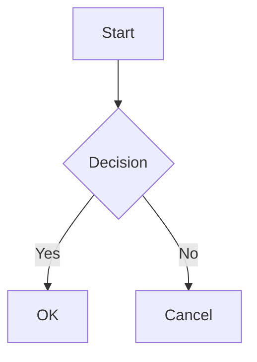

<p align="center">
  <a href="#/">English</a> | <a href="#/zh-cn/">简体中文</a> | <a href="#/zh-tw/">繁體中文</a> | <a href="#/ko/">한국어</a> | <a href="#/ja/">日本語</a> | <a href="#/es/">Español</a> | <strong>Português</strong>
</p>

<p align="center">
  
</p>

<h1 align="center">PlantUML Markdown Preview</h1>

<p align="center">
  <strong>3 modos para se adaptar ao seu fluxo de trabalho. Renderize PlantUML, Mermaid &amp; D2 inline — rápido, seguro ou sem configuração.</strong>
</p>

<p align="center">
  <a href="https://marketplace.visualstudio.com/items?itemName=yss-tazawa.plantuml-markdown-preview"></a>
  <a href="https://marketplace.visualstudio.com/items?itemName=yss-tazawa.plantuml-markdown-preview"></a>
  <a href="https://github.com/yss-tazawa/plantuml-markdown-preview/blob/main/LICENSE"></a>
</p>

<p align="center">
  
</p>

## Escolha seu Modo

| | **Fast** (padrão) | **Secure** | **Easy** |
|---|---|---|---|
| | Re-renderizações instantâneas | Privacidade máxima | Sem configuração |
| | Executa um servidor PlantUML no localhost — sem custo de inicialização de JVM, atualizações instantâneas | Sem rede, sem processos em segundo plano — tudo permanece na sua máquina | Java não é necessário — funciona imediatamente com um servidor PlantUML |
| **Java** | 11+ necessário | 11+ necessário | Não necessário |
| **Rede** | Nenhuma | Nenhuma | Necessária |
| **Privacidade** | Apenas local | Apenas local | Código fonte do diagrama enviado ao servidor PlantUML |
| **Configuração** | [Instalar Java →](#pré-requisitos) | [Instalar Java →](#pré-requisitos) | Nenhuma configuração necessária |

Alterne entre modos a qualquer momento com uma única configuração — sem migração, sem reiniciar.

> Veja [Modos de Renderização](#modos-de-renderização) para detalhes e [Início Rápido](#início-rápido) para instruções completas de configuração.

## Destaques

- **Renderização inline de PlantUML, Mermaid & D2** — diagramas aparecem diretamente na sua prévia do Markdown, não em um painel separado
- **Seguro por design** — política baseada em CSP nonce bloqueia toda execução de código a partir do conteúdo Markdown
- **Controle de escala de diagramas** — ajuste os tamanhos de diagramas PlantUML, Mermaid e D2 independentemente
- **Exportação HTML independente** — diagramas SVG incorporados inline, largura de layout e alinhamento configuráveis
- **Exportação para PDF** — exportação com um clique via Chromium headless; diagramas redimensionados automaticamente para caber na página
- **Sincronização de rolagem bidirecional** — editor e prévia rolam juntos, em ambos os sentidos
- **Navegação & TOC** — botões ir para o topo / ir para o fim e uma barra lateral de Sumário (TOC) no painel de prévia
- **Visualizador de Diagramas** — clique com o botão direito em qualquer diagrama para abrir um painel de pan & zoom com sincronização ao vivo e fundo correspondente ao tema
- **Prévia de diagrama independente** — abra arquivos `.puml`, `.mmd` e `.d2` diretamente com pan & zoom, atualizações em tempo real e suporte a temas — sem necessidade de Markdown
- **Salvar ou copiar diagramas como PNG / SVG** — clique com o botão direito em qualquer diagrama na prévia ou no Visualizador de Diagramas para salvar ou copiar para a área de transferência
- **14 temas de prévia** — 8 temas claros + 6 escuros, incluindo GitHub, Atom, Solarized, Dracula, Monokai e mais
- **Assistência ao editor** — completamento de palavras-chave, seletor de cores e trechos de código (snippets) para PlantUML, Mermaid e D2
- **Internacionalização** — interface em Inglês, Chinês (Simplificado / Tradicional), Japonês, Coreano, Espanhol e Português Brasileiro
- **Suporte a matemática** — fórmulas inline `$...$` e em bloco `$$...$$` renderizadas com [KaTeX](https://katex.org/)

## Sumário

- [Escolha seu Modo](#escolha-seu-modo)
- [Destaques](#destaques)
- [Funcionalidades](#funcionalidades)
- [Início Rápido](#início-rápido)
- [Uso](#uso)
- [Configuração](#configuração)
- [Snippets](#snippets)
- [Completamento de Palavras-chave](#completamento-de-palavras-chave)
- [Atalhos de Teclado](#atalhos-de-teclado)
- [FAQ](#faq)
- [Contribuição](#contribuição)
- [Licenças de Terceiros](#licenças-de-terceiros)
- [Licença](#licença)

## Funcionalidades

### Prévia de Diagrama Inline

Blocos de código ```` ```plantuml ````, ```` ```mermaid ```` e ```` ```d2 ```` são renderizados como diagramas SVG inline ao lado do seu conteúdo Markdown regular.

- Atualizações de prévia em tempo real enquanto você digita (debouncing em dois estágios)
- Atualização automática ao salvar o arquivo
- Acompanhamento automático ao alternar abas do editor
- Indicador de carregamento durante a renderização do diagrama
- Erros de sintaxe exibidos inline com números de linha e contexto do código
- PlantUML: renderizado via Java (modo Secure / Fast) ou servidor PlantUML remoto (modo Easy) — veja [Modos de Renderização](#modos-de-renderização)
- Mermaid: renderizado no lado do cliente usando [mermaid.js](https://mermaid.js.org/) — sem necessidade de Java ou ferramentas externas
- D2: renderizado no lado do cliente usando [@terrastruct/d2](https://d2lang.com/) (Wasm) — sem necessidade de ferramentas externas

### Suporte a Matemática

Renderize expressões matemáticas usando [KaTeX](https://katex.org/).

- **Matemática inline** — `$E=mc^2$` renderiza como uma fórmula inline
- **Matemática em bloco** — `$$\int_0^\infty e^{-x}\,dx = 1$$` renderiza como uma fórmula de exibição centralizada
- Renderização no lado do servidor — sem JavaScript no Webview, apenas HTML/CSS
- Funciona tanto na prévia quanto na exportação para HTML/PDF
- Desative com `enableMath: false` se os símbolos `$` causarem análise matemática indesejada

### Escala do Diagrama

Controle o tamanho de exibição dos diagramas PlantUML, Mermaid e D2 independentemente.

- **Escala PlantUML** — `auto` (encolher para caber) ou porcentagem fixa (70%–120%, padrão 100%). O SVG permanece nítido em qualquer escala.
- **Escala Mermaid** — `auto` (ajustar ao container) ou porcentagem fixa (50%–100%, padrão 80%).
- **Escala D2** — `auto` (ajustar ao container) ou porcentagem fixa (50%–100%, padrão 75%).

### Modos de Renderização

Escolha um modo predefinido que controla como os diagramas PlantUML são renderizados:

| | Fast (padrão) | Secure | Easy |
|---|---|---|---|
| **Java necessário** | Sim | Sim | Não |
| **Rede** | Nenhuma (apenas localhost) | Nenhuma | Necessária |
| **Privacidade** | Diagramas permanecem na sua máquina | Diagramas permanecem na sua máquina | Código fonte do diagrama enviado ao servidor PlantUML |
| **Velocidade** | Servidor PlantUML persistente — re-renderizações instantâneas | JVM inicia por renderização | Depende da rede |
| **Concorrência** | 50 (HTTP paralelo) | 1 (lote) | 5 (HTTP paralelo) |

- **Modo Fast** (padrão) — inicia um servidor PlantUML persistente em `localhost`. Elimina o custo de inicialização da JVM a cada edição, permitindo re-renderizações instantâneas com alta concorrência. Os diagramas nunca saem da sua máquina.
- **Modo Secure** — usa Java + JAR do PlantUML na sua máquina. Os diagramas nunca saem da sua máquina. Sem acesso à rede. Imagens locais são bloqueadas por padrão para segurança máxima.
- **Modo Easy** — envia o código fonte do PlantUML para um servidor PlantUML para renderização. Nenhuma configuração necessária. Usa o servidor público (`https://www.plantuml.com/plantuml`) por padrão, ou configure seu próprio URL de servidor auto-hospedado para maior privacidade.

Se o Java não for encontrado ao abrir uma prévia, uma notificação oferecerá a mudança para o modo Easy.

### Barra de Status

A barra de status mostra o modo de renderização atual (Fast / Secure / Easy) e, no modo Fast, o estado do servidor local (executando, iniciando, erro, parado).

- Clique no item da barra de status para alternar os modos via Quick Pick — sem necessidade de abrir as Configurações
- Mesma função que o comando **Select Rendering Mode** na Command Palette

### Exportação para HTML

Exporte seu documento Markdown para um arquivo HTML independente.

- Diagramas PlantUML, Mermaid e D2 incorporados como SVG inline
- CSS de realce de sintaxe incluído — sem dependências externas
- Exportar e abrir no navegador em um único comando
- Largura do layout configurável (640px–1440px ou ilimitada) e alinhamento (centro ou esquerda)
- **Opção Fit-to-width** dimensiona diagramas e imagens para preencher a largura da página

### Exportação para PDF

Exporte seu documento Markdown para PDF usando um navegador baseado em Chromium headless.

- Requer Chrome, Edge ou Chromium instalado no seu sistema
- Os diagramas são redimensionados automaticamente para caber na largura da página
- Margens de impressão são aplicadas para um layout limpo

### Navegação

- **Ir para o topo / Ir para o fim** — botões no canto superior direito do painel de prévia
- **Barra lateral de Sumário** — clique no botão TOC para abrir uma barra lateral listando todos os cabeçalhos; clique em um cabeçalho para pular para ele

### Visualizador de Diagramas

Clique com o botão direito em qualquer diagrama PlantUML, Mermaid ou D2 na prévia e selecione **Open in Diagram Viewer** para abri-lo em um painel separado de pan & zoom.

- Zoom com a roda do mouse (centralizado no cursor) e arraste para mover (pan)
- Barra de ferramentas: Ajustar à Janela, Redefinir 1:1, Zoom por etapas (+/-)
- Sincronização ao vivo — as alterações no editor são refletidas em tempo real enquanto preservam sua posição de zoom
- A cor de fundo corresponde ao tema de prévia atual
- Fechado automaticamente ao alternar para um arquivo fonte diferente
- **Salvar ou copiar como PNG / SVG** — clique com o botão direito em um diagrama na prévia ou no Visualizador de Diagramas para salvá-lo como arquivo ou copiar o PNG para a área de transferência
- **Localizar no visualizador** — pressione `Cmd+F` / `Ctrl+F` para abrir o widget de localização
- Desative com `enableDiagramViewer: false`

### Suporte a `!include` no PlantUML

Use diretivas `!include` para compartilhar estilos comuns, macros e definições de componentes entre diagramas.

- Arquivos incluídos são resolvidos em relação à raiz da área de trabalho (ou ao diretório configurado em `plantumlIncludePath`)
- Salvar um arquivo incluído atualiza automaticamente a prévia (você também pode clicar no botão **Reload** ↻ para forçar uma atualização manual)
- **Go to Include File** — clique com o botão direito em uma linha `!include` em arquivos `.puml` ou Markdown para abrir o arquivo referenciado (o item do menu aparece apenas quando o cursor está em uma linha `!include`)
- **Open Include Source** — clique com o botão direito em um diagrama PlantUML na prévia para abrir seus arquivos incluídos diretamente
- Funciona nos modos Fast e Secure. Não disponível no modo Easy (o servidor remoto não pode acessar arquivos locais).

### Prévia de Diagrama Independente

Abra arquivos `.puml`, `.plantuml`, `.mmd`, `.mermaid` ou `.d2` diretamente — sem necessidade de Markdown.

- Mesma interface de pan & zoom do Visualizador de Diagramas
- Atualizações de prévia ao vivo enquanto você digita (com debouncing)
- Acompanhamento automático ao alternar entre arquivos do mesmo tipo
- Seleção de tema independente (tema da prévia + tema do diagrama)
- Salvar ou copiar como PNG / SVG via botão direito
- **Localizar na prévia** — pressione `Cmd+F` / `Ctrl+F` para abrir o widget de localização
- PlantUML: suporta todos os três modos de renderização (Fast / Secure / Easy)
- Mermaid: renderizado no lado do cliente usando mermaid.js
- D2: renderizado usando @terrastruct/d2 (Wasm) com tema e motor de layout configuráveis

### Sincronização de Rolagem Bidirecional

O editor e a prévia permanecem sincronizados enquanto você rola qualquer um deles.

- Mapeamento de rolagem baseado em âncoras entre o editor e a prévia
- Restauração estável da posição após a re-renderização

### Temas

**Temas de prévia** controlam a aparência geral do documento:

**Temas claros:**

| Tema | Estilo |
|-------|-------|
| GitHub Light | Fundo branco (padrão) |
| Atom Light | Texto cinza suave, inspirado no editor Atom |
| One Light | Branco gelo, paleta equilibrada |
| Solarized Light | Bege quente, amigável aos olhos |
| Vue | Acentos verdes, inspirado na documentação do Vue.js |
| Pen Paper Coffee | Papel quente, estética manuscrita |
| Coy | Quase branco, design limpo |
| VS | Cores clássicas do Visual Studio |

**Temas escuros:**

| Tema | Estilo |
|-------|-------|
| GitHub Dark | Fundo escuro |
| Atom Dark | Paleta Tomorrow Night |
| One Dark | Escuro inspirado no Atom |
| Dracula | Escuro vibrante |
| Solarized Dark | Teal profundo, amigável aos olhos |
| Monokai | Sintaxe vívida, inspirado no Sublime Text |

Alterne os temas de prévia instantaneamente a partir do ícone na barra de título — não é necessária re-renderização (troca apenas via CSS). Mudanças no tema do PlantUML disparam uma re-renderização.

**Temas PlantUML** controlam o estilo do diagrama independentemente. A extensão descobre os temas disponíveis da sua instalação do PlantUML e os apresenta em um QuickPick combinado junto com os temas de prévia.

**Temas Mermaid** controlam o estilo dos diagramas Mermaid: `default`, `dark`, `forest`, `neutral`, `base`. Também disponíveis no seletor de temas QuickPick.

**Temas D2** — 19 temas integrados (ex: `Neutral Default`, `Dark Mauve`, `Terminal`). Configuráveis através das definições ou do seletor de temas QuickPick.

### Realce de Sintaxe

Mais de 190 linguagens suportadas via highlight.js. Blocos de código são estilizados para corresponder ao tema de prévia selecionado.

### Segurança

- Content Security Policy com restrições de script baseadas em nonce
- Sem execução de código a partir do conteúdo Markdown
- Tags `<script>` escritas pelo usuário são bloqueadas
- O carregamento de imagens locais segue o modo predefinido por padrão (`allowLocalImages: "mode-default"`); o modo Secure desativa por padrão para segurança máxima
- O carregamento de imagens via HTTP está desativado por padrão (`allowHttpImages`); ativar adiciona `http:` à diretiva `img-src` da CSP, o que permite requisições de imagem não criptografadas — use apenas em redes confiáveis (intranet, servidores de desenvolvimento local)

### Integração com a Prévia de Markdown Nativa

Diagramas PlantUML, Mermaid e D2 também são renderizados na prévia de Markdown integrada do VS Code (`Markdown: Open Preview to the Side`). Nenhuma configuração adicional é necessária.

> **Nota:** A prévia integrada não suporta os temas de prévia desta extensão, sincronização de rolagem bidirecional ou exportação para HTML. Para o conjunto completo de funcionalidades, use o painel de prévia da própria extensão (`Cmd+Alt+V` / `Ctrl+Alt+V`).
>
> **Nota:** A prévia integrada renderiza diagramas de forma síncrona. Diagramas PlantUML grandes ou complexos podem congelar o editor brevemente. Para diagramas pesados, use o painel de prévia da extensão.

## Início Rápido

### Pré-requisitos

**Mermaid** — sem pré-requisitos. Funciona imediatamente.

**D2** — sem pré-requisitos. Renderizado usando o Wasm integrado do [D2](https://d2lang.com/) — funciona imediatamente.

**PlantUML (modo Easy)** — sem pré-requisitos. O código fonte do diagrama é enviado a um servidor PlantUML para renderização.

**PlantUML (modo Fast / Secure)** — padrão:

| Ferramenta | Propósito | Verificar |
|------|---------|--------|
| [Java 11+ (JRE ou JDK)](#configuração) | Executa o PlantUML (o JAR v1.2026.2 incluído requer Java 11+) | `java -version` |
| [Graphviz](https://graphviz.org/) | Opcional — necessário para diagramas de classe, componentes e outros dependentes de layout (veja [Suporte a Diagramas](#suporte-a-diagramas)) | `dot -V` |

> **Nota:** Um JAR do PlantUML (LGPL, v1.2026.2) vem incluído com a extensão. Nenhum download separado é necessário. **Java 11 ou posterior é obrigatório.**
>
> **Dica:** Se o Java não estiver instalado, a extensão oferecerá a mudança para o modo Easy quando você abrir uma prévia.

### Suporte a Diagramas

O que funciona depende da sua configuração:

| Diagrama | LGPL (incluído) | Win: JAR GPLv2 | Mac/Linux: + Graphviz |
|---------|:-:|:-:|:-:|
| Sequence | ✓ | ✓ | ✓ |
| Activity (nova sintaxe) | ✓ | ✓ | ✓ |
| Mind Map | ✓ | ✓ | ✓ |
| WBS | ✓ | ✓ | ✓ |
| Gantt | ✓ | ✓ | ✓ |
| JSON / YAML | ✓ | ✓ | ✓ |
| Salt / Wireframe | ✓ | ✓ | ✓ |
| Timing | ✓ | ✓ | ✓ |
| Network (nwdiag) | ✓ | ✓ | ✓ |
| Class | — | ✓ | ✓ |
| Use Case | — | ✓ | ✓ |
| Object | — | ✓ | ✓ |
| Component | — | ✓ | ✓ |
| Deployment | — | ✓ | ✓ |
| State | — | ✓ | ✓ |
| ER (Entidade Relacionamento) | — | ✓ | ✓ |
| Activity (legado) | — | ✓ | ✓ |

- **LGPL (incluído)** — funciona imediatamente. Não precisa de Graphviz.
- **Win: JAR GPLv2** — a [versão GPLv2](https://plantuml.com/download) inclui o Graphviz (apenas Windows, extraído automaticamente). Configure [`plantumlJarPath`](#configuração) para usá-lo.
- **Mac/Linux: + Graphviz** — instale o [Graphviz](https://graphviz.org/) separadamente. Funciona tanto com o JAR LGPL quanto com o GPLv2.

### Instalar

1. Abra o VS Code
2. Procure por **PlantUML Markdown Preview** na visualização de Extensões (`Ctrl+Shift+X` / `Cmd+Shift+X`)
3. Clique em **Install**

### Configuração

**Modo Fast** (padrão): Inicia um servidor PlantUML local persistente para re-renderizações instantâneas. Requer Java 11+.

**Para usar o modo Secure**: Defina `mode` como `"secure"`. Usa Java 11+ por renderização sem um servidor em segundo plano ou acesso à rede.

**Para usar o modo Easy** (sem configuração): Defina `mode` como `"easy"`. O código fonte do diagrama é enviado para um servidor PlantUML para renderização. A extensão também sugerirá a troca quando o Java não for detectado.

**Modos Fast e Secure**: O JAR LGPL incluído suporta diagramas de sequência, atividade, mapa mental e outros sem configuração extra (veja [Suporte a Diagramas](#suporte-a-diagramas)). Para habilitar diagramas de classe, componentes, casos de uso e outros dependentes de layout, siga os passos para sua plataforma abaixo.

#### Windows

1. Instale o Java se ainda não estiver instalado (abra o PowerShell e execute):
   ```powershell
   winget install Microsoft.OpenJDK.21
   ```
2. Se o `java` não estiver no seu PATH, encontre o caminho completo no PowerShell:
   ```powershell
   Get-Command java
   # ex: C:\Program Files\Microsoft\jdk-21.0.6.7-hotspot\bin\java.exe
   ```
   Abra as configurações do VS Code (`Ctrl+,`), procure por `plantumlMarkdownPreview.javaPath` e insira o caminho mostrado acima
3. Baixe a [versão GPLv2 do PlantUML](https://plantuml.com/download) (`plantuml-gplv2-*.jar`) para uma pasta de sua escolha (inclui Graphviz — sem necessidade de instalação separada)
4. Abra as configurações do VS Code (`Ctrl+,`), procure por `plantumlMarkdownPreview.plantumlJarPath` e insira o caminho completo para o arquivo `.jar` baixado (ex: `C:\tools\plantuml-gplv2-1.2026.2.jar`)

#### Mac

1. Instale o Java e o Graphviz via Homebrew:
   ```sh
   brew install openjdk graphviz
   ```
2. Se o `dot` não estiver no seu PATH, encontre o caminho completo e configure-o no VS Code:
   ```sh
   which dot
   # ex: /opt/homebrew/bin/dot
   ```
   Abra as configurações do VS Code (`Cmd+,`), procure por `plantumlMarkdownPreview.dotPath` e insira o caminho mostrado acima

#### Linux

1. Instale o Java e o Graphviz:
   ```sh
   # Debian / Ubuntu
   sudo apt install default-jdk graphviz

   # Fedora
   sudo dnf install java-21-openjdk graphviz
   ```
2. Se o `dot` não estiver no seu PATH, encontre o caminho completo e configure-o no VS Code:
   ```sh
   which dot
   # ex: /usr/bin/dot
   ```
   Abra as configurações do VS Code (`Ctrl+,`), procure por `plantumlMarkdownPreview.dotPath` e insira o caminho mostrado acima

> **Nota:** `javaPath` tem como padrão `"java"`. Se deixado no padrão, o caminho `JAVA_HOME/bin/java` é tentado primeiro, depois o `java` no PATH. `dotPath` e `plantumlJarPath` têm como padrão `"dot"` e o JAR incluído, respectivamente. Configure-os apenas se esses comandos não estiverem no seu PATH ou se quiser usar um JAR diferente.

## Uso

### Abrir Prévia

- **Atalho de teclado:** `Cmd+Alt+V` (Mac) / `Ctrl+Alt+V` (Windows / Linux)
- **Menu de contexto:** Clique com o botão direito em um arquivo `.md` no Explorer ou dentro do editor → **PlantUML Markdown Preview** → **Open Preview to Side**
- **Command Palette:** `PlantUML Markdown Preview: Open Preview to Side`

A prévia usa seu próprio tema independente do VS Code — o padrão é fundo branco (GitHub Light).

### Abrir Prévia de Diagrama

Abra arquivos `.puml` / `.plantuml`, `.mmd` / `.mermaid` ou `.d2` diretamente em uma prévia com pan & zoom — sem necessidade de Markdown.

- **Atalho de teclado:** `Cmd+Alt+V` (Mac) / `Ctrl+Alt+V` (Windows / Linux) — o mesmo atalho, seleciona automaticamente com base no tipo de arquivo
- **Menu de contexto:** Clique com o botão direito em um arquivo `.puml` / `.plantuml`, `.mmd` / `.mermaid` ou `.d2` no Explorer ou editor → **Preview PlantUML File** / **Preview Mermaid File** / **Preview D2 File**
- **Command Palette:** `PlantUML Markdown Preview: Preview PlantUML File`, `Preview Mermaid File` ou `Preview D2 File`

### Exportar para HTML

- **Menu de contexto:** Clique com o botão direito em um arquivo `.md` → **PlantUML Markdown Preview** → **Export as HTML**
- **Painel de prévia:** Clique com o botão direito dentro do painel de prévia → **Export as HTML** ou **Export as HTML & Open in Browser**
- **Command Palette:** `PlantUML Markdown Preview: Export as HTML`
- **Command Palette:** `PlantUML Markdown Preview: Export as HTML & Open in Browser`
- **Command Palette:** `PlantUML Markdown Preview: Export as HTML (Fit to Width)`
- **Command Palette:** `PlantUML Markdown Preview: Export as HTML & Open in Browser (Fit to Width)`

O arquivo HTML é salvo ao lado do arquivo `.md` de origem. Para exportar e abrir no seu navegador em um único passo, escolha **Export as HTML & Open in Browser**.

### Exportar para PDF

- **Menu de contexto:** Clique com o botão direito em um arquivo `.md` → **PlantUML Markdown Preview** → **Export as PDF**
- **Painel de prévia:** Clique com o botão direito dentro do painel de prévia → **Export as PDF** ou **Export as PDF & Open**
- **Command Palette:** `PlantUML Markdown Preview: Export as PDF`
- **Command Palette:** `PlantUML Markdown Preview: Export as PDF & Open`

O arquivo PDF é salvo ao lado do arquivo `.md` de origem. Chrome, Edge ou Chromium são necessários.

### Salvar / Copiar Diagrama como PNG / SVG

- **Painel de prévia:** Clique com o botão direito em um diagrama → **Copy Diagram as PNG**, **Save Diagram as PNG** ou **Save Diagram as SVG**
- **Visualizador de Diagramas:** Clique com o botão direito dentro do visualizador → **Copy Diagram as PNG**, **Save Diagram as PNG** ou **Save Diagram as SVG**
- **Prévia de diagrama independente:** Clique com o botão direito dentro da prévia → **Copy Diagram as PNG**, **Save Diagram as PNG** ou **Save Diagram as SVG**

### Navegação

- **Ir para o topo / Ir para o fim:** Botões no canto superior direito do painel de prévia
- **Reload:** Clique no botão ↻ para atualizar manualmente a prévia e limpar os caches (arquivos incluídos também são atualizados automaticamente ao salvar)
- **Sumário:** Clique no botão TOC no canto superior direito do painel de prévia para abrir uma barra lateral listando todos os cabeçalhos; clique em um cabeçalho para pular para ele

### Mudar Tema

Clique no ícone de tema na barra de título do painel de prévia, ou use a Command Palette:

- **Command Palette:** `PlantUML Markdown Preview: Change Preview Theme`

O seletor de temas mostra todas as quatro categorias de temas em uma única lista — temas de prévia, temas PlantUML, temas Mermaid e temas D2 — para que você possa alternar qualquer um deles em um só lugar.

### Sintaxe PlantUML

````markdown
```plantuml
Alice -> Bob: Hello
Bob --> Alice: Hi!
```
````

Wrappers `@startuml` / `@enduml` são adicionados automaticamente se omitidos.

### Sintaxe Mermaid

````markdown

````

### Sintaxe D2

````markdown
```d2
server -> db: query
db -> server: result
```
````

Veja a [documentação do D2](https://d2lang.com/) para detalhes de sintaxe.

### Sintaxe Matemática

A matemática inline usa cifrões simples, a matemática em bloco usa cifrões duplos:

````markdown
A famosa equação de Einstein $E=mc^2$ mostra a equivalência massa-energia.

$$\int_0^\infty e^{-x}\,dx = 1$$
````

> Desative com `enableMath: false` se os símbolos `$` causarem uma análise matemática indesejada (ex: `$100`).

## Snippets

Digite um prefixo de snippet e pressione `Tab` para expandir. Dois conjuntos de snippets estão disponíveis:

- **Snippets Markdown** (fora de blocos demarcados) — prefixados com `plantuml-`, `mermaid-` ou `d2-`, expande um bloco demarcado completo
- **Snippets de Template** (dentro de blocos demarcados) — prefixados com `tmpl-`, expande apenas o corpo do diagrama. Digite `tmpl` para ver todos os templates disponíveis

### Snippets Markdown (fora de blocos demarcados)

Expande um bloco completo `` ```plantuml ... ``` `` incluindo as demarcações:

| Prefixo | Diagrama |
| --- | --- |
| `plantuml` | Bloco PlantUML vazio |
| `plantuml-sequence` | Diagrama de sequência |
| `plantuml-class` | Diagrama de classe |
| `plantuml-activity` | Diagrama de atividade |
| `plantuml-usecase` | Diagrama de caso de uso |
| `plantuml-component` | Diagrama de componente |
| `plantuml-state` | Diagrama de estado |
| `plantuml-er` | Diagrama ER |
| `plantuml-object` | Diagrama de objeto |
| `plantuml-deployment` | Diagrama de implantação |
| `plantuml-mindmap` | Mapa mental |
| `plantuml-gantt` | Gráfico de Gantt |

### Snippets PlantUML (dentro de blocos demarcados)

Templates de diagrama (digite `tmpl` para ver todos):

| Prefixo | Conteúdo |
| --- | --- |
| `tmpl-seq` | Diagrama de sequência |
| `tmpl-cls` | Definição de classe |
| `tmpl-act` | Diagrama de atividade |
| `tmpl-uc` | Diagrama de caso de uso |
| `tmpl-comp` | Diagrama de componente |
| `tmpl-state` | Diagrama de estado |
| `tmpl-er` | Definição de entidade |
| `tmpl-obj` | Diagrama de objeto |
| `tmpl-deploy` | Diagrama de implantação |
| `tmpl-mind` | Mapa mental |
| `tmpl-gantt` | Gráfico de Gantt |

Snippets curtos:

| Prefixo | Conteúdo |
| --- | --- |
| `part` | declaração de participante |
| `actor` | declaração de ator |
| `note` | bloco de nota |
| `intf` | definição de interface |
| `pkg` | definição de pacote |

### Snippets Markdown Mermaid (fora de blocos demarcados)

Expande um bloco completo `` ```mermaid ... ``` `` incluindo as demarcações:

| Prefixo | Diagrama |
| --- | --- |
| `mermaid` | Bloco Mermaid vazio |
| `mermaid-flow` | Fluxograma |
| `mermaid-sequence` | Diagrama de sequência |
| `mermaid-class` | Diagrama de classe |
| `mermaid-state` | Diagrama de estado |
| `mermaid-er` | Diagrama ER |
| `mermaid-gantt` | Gráfico de Gantt |
| `mermaid-pie` | Gráfico de pizza |
| `mermaid-mindmap` | Mapa mental |
| `mermaid-timeline` | Linha do tempo |
| `mermaid-git` | Gráfico Git |

### Snippets Mermaid (dentro de blocos demarcados)

Templates de diagrama (digite `tmpl` para ver todos):

| Prefixo | Conteúdo |
| --- | --- |
| `tmpl-flow` | Fluxograma |
| `tmpl-seq` | Diagrama de sequência |
| `tmpl-cls` | Diagrama de classe |
| `tmpl-state` | Diagrama de estado |
| `tmpl-er` | Diagrama ER |
| `tmpl-gantt` | Gráfico de Gantt |
| `tmpl-pie` | Gráfico de pizza |
| `tmpl-mind` | Mapa mental |
| `tmpl-timeline` | Linha do tempo |
| `tmpl-git` | Gráfico Git |

### Snippets Markdown D2 (fora de blocos demarcados)

Expande um bloco completo `` ```d2 ... ``` `` incluindo as demarcações:

| Prefixo | Diagrama |
| --- | --- |
| `d2` | Bloco D2 vazio |
| `d2-basic` | Conexão básica |
| `d2-sequence` | Diagrama de sequência |
| `d2-class` | Diagrama de classe |
| `d2-comp` | Diagrama de componente |
| `d2-grid` | Layout de grade |
| `d2-er` | Diagrama ER |
| `d2-flow` | Fluxograma |
| `d2-icon` | Nó de ícone |
| `d2-markdown` | Nó de texto Markdown |
| `d2-tooltip` | Tooltip e link |
| `d2-layers` | Camadas/etapas |
| `d2-style` | Estilo personalizado |

### Snippets D2 (dentro de blocos demarcados)

Templates de diagrama (digite `tmpl` para ver todos):

| Prefixo | Conteúdo |
| --- | --- |
| `tmpl-seq` | Diagrama de sequência |
| `tmpl-cls` | Diagrama de classe |
| `tmpl-comp` | Diagrama de componente |
| `tmpl-er` | Diagrama ER |
| `tmpl-flow` | Fluxograma |
| `tmpl-grid` | Layout de grade |

Snippets curtos:

| Prefixo | Conteúdo |
| --- | --- |
| `conn` | Conexão |
| `icon` | Nó de ícone |
| `md` | Nó Markdown |
| `tooltip` | Tooltip e link |
| `layers` | Camadas/etapas |
| `style` | Estilo personalizado |
| `direction` | Direção do layout |

## Seletor de Cores

Amostras de cores e um seletor de cores inline para PlantUML, Mermaid e D2. Funciona em arquivos independentes (`.puml`, `.mmd`, `.d2`) e blocos demarcados de Markdown.

- **Hex de 6 dígitos** — `#FF0000`, `#1565C0` etc.
- **Hex de 3 dígitos** — `#F00`, `#ABC` etc.
- **Cores nomeadas** (apenas PlantUML) — `#Red`, `#LightBlue`, `#Salmon` etc. (20 cores)
- Escolher uma nova cor substitui o valor pelo formato `#RRGGBB`
- Linhas de comentário são excluídas (`'` para PlantUML, `%%` para Mermaid, `#` para D2)

## Completamento de Palavras-chave

Sugestões de palavras-chave sensíveis ao contexto para PlantUML, Mermaid e D2. Funciona tanto em arquivos independentes quanto em blocos demarcados de Markdown.

### PlantUML

- **Palavras-chave de início de linha** — `@startuml`, `participant`, `class`, `skinparam`, `!include`, etc.
- **Parâmetros de `skinparam`** — digite `skinparam` seguido de um espaço para obter sugestões para `backgroundColor`, `defaultFontName`, `arrowColor`, etc.
- **Nomes de cores** — digite `#` para obter sugestões de cores (`Red`, `Blue`, `LightGreen`, etc.)
- **Caracteres de gatilho**: `@`, `!`, `#`

### Mermaid

- **Declarações de tipo de diagrama** — `flowchart`, `sequenceDiagram`, `classDiagram`, `gantt`, etc. na primeira linha
- **Palavras-chave específicas do diagrama** — as sugestões mudam com base no tipo de diagrama declarado (ex: `subgraph` para fluxograma, `participant` para sequência)
- **Valores de direção** — digite `direction` seguido de um espaço para obter `TB`, `LR`, etc.

### D2

- **Tipos de forma (shape)** — digite `shape:` para obter sugestões (`rectangle`, `cylinder`, `person`, etc.)
- **Propriedades de estilo** — digite `style.` para obter `fill`, `stroke`, `font-size`, etc.
- **Valores de direção** — digite `direction:` para obter `right`, `down`, `left`, `up`
- **Valores de restrição (constraint)** — digite `constraint:` para obter `primary_key`, `foreign_key`, `unique`
- **Caracteres de gatilho**: `:`, `.`

## Configuração

Todas as configurações usam o prefixo `plantumlMarkdownPreview.`.

| Configuração | Padrão | Descrição |
|---------|---------|-------------|
| `mode` | `"fast"` | Modo predefinido. `"fast"` (padrão) — servidor local, re-renderizações instantâneas. `"secure"` — sem rede, segurança máxima. `"easy"` — sem configuração (código fonte enviado ao servidor PlantUML). |
| `javaPath` | `"java"` | Caminho para o executável Java. Se definido, é usado como está; caso contrário, tenta `JAVA_HOME/bin/java`, depois `java` no PATH. (Modos Fast e Secure) |
| `plantumlJarPath` | `""` | Caminho para o `plantuml.jar`. Deixe vazio para usar o JAR incluído (LGPL). (Modos Fast e Secure) |
| `dotPath` | `"dot"` | Caminho para o executável `dot` do Graphviz (Modos Fast e Secure) |
| `plantumlIncludePath` | `""` | Diretório base para diretivas `!include` do PlantUML. Deixe vazio para usar a raiz da área de trabalho. Não disponível no modo Easy. |
| `allowLocalImages` | `"mode-default"` | Resolve caminhos de imagem relativos (ex: ``) na prévia. `"mode-default"` usa a predefinição do modo (Fast: ligado, Secure: desligado, Easy: ligado). `"on"` / `"off"` para sobrescrever. |
| `allowHttpImages` | `false` | Permite carregar imagens via HTTP (não criptografado) na prévia. Útil para intranet ou servidores de desenvolvimento local. |
| `previewTheme` | `"github-light"` | Tema da prévia (veja [Temas](#temas)) |
| `plantumlTheme` | `"default"` | Tema do diagrama PlantUML. `"default"` não aplica tema. Outros valores (ex: `"cyborg"`, `"mars"`) são passados como `-theme` para a CLI do PlantUML ou injetados como diretiva `!theme` no modo Easy. |
| `mermaidTheme` | `"default"` | Tema do diagrama Mermaid: `"default"`, `"dark"`, `"forest"`, `"neutral"` ou `"base"`. |
| `plantumlScale` | `"100%"` | Escala do diagrama PlantUML. `"auto"` encolhe diagramas que excedem a largura do container. Uma porcentagem (70%–120%) renderiza nessa fração do tamanho natural. |
| `mermaidScale` | `"80%"` | Escala do diagrama Mermaid. `"auto"` ajusta à largura do container. Uma porcentagem (50%–100%) renderiza nessa fração do tamanho natural. |
| `d2Theme` | `"Neutral Default"` | Tema do diagrama D2. 19 temas integrados disponíveis (ex: `"Neutral Default"`, `"Dark Mauve"`, `"Terminal"`). |
| `d2Layout` | `"dagre"` | Motor de layout D2: `"dagre"` (padrão, rápido) ou `"elk"` (melhor para grafos complexos com muitos nós). |
| `d2Scale` | `"75%"` | Escala do diagrama D2. `"auto"` ajusta à largura do container. Uma porcentagem (50%–100%) renderiza nessa fração do tamanho natural. |
| `htmlMaxWidth` | `"960px"` | Largura máxima do corpo do HTML exportado. Opções: `"640px"` – `"1440px"`, ou `"none"` para sem limite. |
| `htmlAlignment` | `"center"` | Alinhamento do corpo do HTML. `"center"` (padrão) ou `"left"`. |
| `enableMath` | `true` | Habilita a renderização matemática KaTeX. Suporta `$...$` (inline) e `$$...$$` (bloco). Defina como `false` se os símbolos `$` causarem análise indesejada. |
| `debounceNoDiagramChangeMs` | _(vazio)_ | Atraso de debounce (ms) para alterações de texto que não sejam diagramas (diagramas servidos do cache). Deixe vazio para usar o padrão do modo (Fast: 100, Secure: 100, Easy: 100). |
| `debounceDiagramChangeMs` | _(vazio)_ | Atraso de debounce (ms) para alterações no conteúdo do diagrama. Deixe vazio para usar o padrão do modo (Fast: 100, Secure: 300, Easy: 300). |
| `plantumlLocalServerPort` | `0` | Porta para o servidor PlantUML local (apenas modo Fast). `0` = atribui automaticamente uma porta livre. |
| `plantumlServerUrl` | `"https://www.plantuml.com/plantuml"` | URL do servidor PlantUML para o modo Easy. Configure para um URL de servidor auto-hospedado para maior privacidade. |
| `enableDiagramViewer` | `true` | Habilita o item de menu de contexto "Open in Diagram Viewer" ao clicar com o botão direito em um diagrama. Requer reabrir a prévia para fazer efeito. |
| `retainPreviewContext` | `true` | Retém o conteúdo da prévia quando a aba é ocultada. Evita re-renderização ao trocar de aba, mas usa mais memória. Requer reabrir a prévia para fazer efeito. |

> **Nota:** `allowLocalImages` e `allowHttpImages` aplicam-se apenas ao painel de prévia. A exportação para HTML sempre gera caminhos de imagem originais sem restrições de CSP.

<details>
<summary><strong>Opções de tema da prévia</strong></summary>

| Valor | Descrição |
|-------|-------------|
| `github-light` | GitHub Light — fundo branco (padrão) |
| `atom-light` | Atom Light — texto cinza suave, inspirado no Atom |
| `one-light` | One Light — branco gelo, paleta equilibrada |
| `solarized-light` | Solarized Light — bege quente, amigável aos olhos |
| `vue` | Vue — acentos verdes, inspirado na documentação do Vue.js |
| `pen-paper-coffee` | Pen Paper Coffee — papel quente, estética manuscrita |
| `coy` | Coy — quase branco, design limpo |
| `vs` | VS — cores clássicas do Visual Studio |
| `github-dark` | GitHub Dark — fundo escuro |
| `atom-dark` | Atom Dark — paleta Tomorrow Night |
| `one-dark` | One Dark — escuro inspirado no Atom |
| `dracula` | Dracula — paleta escura vibrante |
| `solarized-dark` | Solarized Dark — teal profundo, amigável aos olhos |
| `monokai` | Monokai — sintaxe vívida, inspirado no Sublime Text |

</details>

## Atalhos de Teclado

| Comando | Mac | Windows / Linux |
|---------|-----|-----------------|
| Open Preview to Side (Markdown) | `Cmd+Alt+V` | `Ctrl+Alt+V` |
| Preview PlantUML File | `Cmd+Alt+V` | `Ctrl+Alt+V` |
| Preview Mermaid File | `Cmd+Alt+V` | `Ctrl+Alt+V` |
| Preview D2 File | `Cmd+Alt+V` | `Ctrl+Alt+V` |
| Select Rendering Mode | — | — |

## FAQ

<details>
<summary><strong>Diagramas PlantUML não estão renderizando</strong></summary>

**Modo Fast / Secure:**
1. Execute `java -version` no seu terminal para confirmar se o Java 11 ou posterior está instalado
2. Se você usa diagramas de classe, componentes ou outros dependentes de layout, execute `dot -V` para confirmar se o Graphviz está instalado (veja [Suporte a Diagramas](#suporte-a-diagramas))
3. Se você configurou um `plantumlJarPath` personalizado, verifique se ele aponta para um arquivo `plantuml.jar` válido. Se o caminho não existir, a extensão volta para o JAR incluído com um aviso. Se `plantumlJarPath` estiver vazio (padrão), o JAR LGPL incluído é usado automaticamente
4. Verifique o painel Output do VS Code para mensagens de erro

**Modo Easy:**
1. Verifique se o URL do servidor está correto (padrão: `https://www.plantuml.com/plantuml`)
2. Verifique sua conexão de rede — a extensão precisa alcançar o servidor PlantUML
3. Se estiver usando um servidor auto-hospedado, certifique-se de que ele está rodando e acessível
4. As requisições para o servidor expiram após 15 segundos (os modos Fast e Secure também têm um tempo limite de 15 segundos por diagrama)

</details>

<details>
<summary><strong>Diagramas D2 não estão renderizando</strong></summary>

O D2 é renderizado usando um módulo Wasm integrado — nenhuma CLI externa é necessária.

1. Recarregue a janela do VS Code (`Developer: Reload Window`)
2. Verifique o painel Output do VS Code para mensagens de erro
3. Certifique-se de que a sintaxe da sua fonte D2 é válida

</details>

<details>
<summary><strong>Posso usar PlantUML sem instalar Java?</strong></summary>

Sim. Defina o `mode` para `"easy"` nas configurações da extensão. O modo Easy envia o texto do seu PlantUML para um servidor PlantUML para renderização e não requer Java. Por padrão, o servidor público em `https://www.plantuml.com/plantuml` é usado. Para privacidade, você pode rodar seu próprio servidor PlantUML e configurar `plantumlServerUrl` para o seu URL.

</details>

<details>
<summary><strong>O modo Secure está lento com muitos diagramas. Como posso acelerar?</strong></summary>

Mude para o **modo Fast** (`mode: "fast"`). Ele inicia um servidor PlantUML persistente no localhost, então as re-renderizações são instantâneas — sem custo de inicialização de JVM por edição. A concorrência também é muito maior (50 requisições paralelas vs 1 no modo Secure).

</details>

<details>
<summary><strong>Meus dados de diagrama estão seguros no modo Easy?</strong></summary>

No modo Easy, o texto fonte do PlantUML é enviado para o servidor configurado. O servidor público padrão (`https://www.plantuml.com/plantuml`) é operado pelo projeto PlantUML. Se seus diagramas contiverem informações sensíveis, considere rodar um [servidor PlantUML auto-hospedado](https://plantuml.com/server) e configurar o `plantumlServerUrl` para o seu URL, ou use o modo Fast ou Secure onde os diagramas nunca saem da sua máquina.

</details>

<details>
<summary><strong>Diagramas ficam estranhos com um tema escuro</strong></summary>

Configure um tema de diagrama para corresponder ao seu tema de prévia. Abra o seletor de temas a partir do ícone na barra de título e selecione um tema escuro do PlantUML (ex: `cyborg`, `mars`) ou defina o tema Mermaid para `dark`.

</details>

<details>
<summary><strong>O <code>!include</code> não está funcionando</strong></summary>

O `!include` requer o modo Fast ou Secure — ele não funciona no modo Easy porque o servidor remoto não pode acessar seus arquivos locais.

- Os caminhos são resolvidos em relação à raiz da área de trabalho por padrão. Configure `plantumlIncludePath` para usar um diretório base diferente.
- Salvar um arquivo incluído atualiza automaticamente a prévia. Você também pode clicar no botão **Reload** (↻) para forçar uma atualização manual.

</details>

<details>
<summary><strong>Posso usar <code>!theme</code> dentro do meu código PlantUML?</strong></summary>

Sim. Uma diretiva `!theme` inline tem precedência sobre a configuração da extensão.

</details>

## Contribuição

Veja [CONTRIBUTING.md](CONTRIBUTING.md) para configuração de desenvolvimento, instruções de build e diretrizes para pull requests.

## Licenças de Terceiros

Esta extensão inclui os seguintes softwares de terceiros:

- [PlantUML](https://plantuml.com/) (versão LGPL) — [GNU Lesser General Public License v3 (LGPL-3.0)](https://www.gnu.org/licenses/lgpl-3.0.html). Veja a [página de licença do PlantUML](https://plantuml.com/license) para detalhes.
- [mermaid.js](https://mermaid.js.org/) — [Licença MIT](https://github.com/mermaid-js/mermaid/blob/develop/LICENSE)
- [KaTeX](https://katex.org/) — [Licença MIT](https://github.com/KaTeX/KaTeX/blob/main/LICENSE)
- [@terrastruct/d2](https://d2lang.com/) (build Wasm) — [Mozilla Public License 2.0 (MPL-2.0)](https://github.com/terrastruct/d2/blob/master/LICENSE.txt)

## Licença

[MIT](LICENSE)
