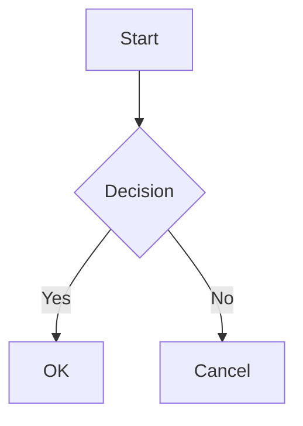

<p align="center">
  <a href="#/">English</a> | <strong>简体中文</strong> | <a href="#/zh-tw/">繁體中文</a> | <a href="#/ko/">한국어</a> | <a href="#/ja/">日本語</a> | <a href="#/es/">Español</a> | <a href="#/pt-br/">Português</a>
</p>

<p align="center">
  
</p>

<h1 align="center">PlantUML Markdown Preview</h1>

<p align="center">
  <strong>3 种模式适配您的工作流。内联渲染 PlantUML、Mermaid 和 D2 — 快速、安全或零配置。</strong>
</p>

<p align="center">
  <a href="https://marketplace.visualstudio.com/items?itemName=yss-tazawa.plantuml-markdown-preview"></a>
  <a href="https://marketplace.visualstudio.com/items?itemName=yss-tazawa.plantuml-markdown-preview"></a>
  <a href="https://github.com/yss-tazawa/plantuml-markdown-preview/blob/main/LICENSE"></a>
</p>

<p align="center">
  
</p>

## 选择模式

| | **Fast**（默认） | **Secure** | **Easy** |
| --- | --- | --- | --- |
| | 即时重渲染 | 最高隐私保护 | 零配置 |
| | 在 localhost 运行 PlantUML 服务器 — 无 JVM 启动开销，即时更新 | 无网络、无后台进程 — 一切在本机完成 | 无需 Java — 使用 PlantUML 服务器开箱即用 |
| **Java** | 需要 11+ | 需要 11+ | 不需要 |
| **网络** | 无 | 无 | 需要 |
| **隐私** | 仅本地 | 仅本地 | 图表源码发送至 PlantUML 服务器 |
| **配置** | [安装 Java →](#prerequisites) | [安装 Java →](#prerequisites) | 无需配置 |

随时通过一个设置切换模式 — 无需迁移，无需重启。

> 详情请参阅[渲染模式](#渲染模式)，完整配置说明请参阅[快速开始](#快速开始)。

## 亮点

- **内联渲染 PlantUML、Mermaid 和 D2** — 图表直接显示在 Markdown 预览中，而非独立面板
- **安全设计** — 基于 CSP nonce 的策略阻止所有来自 Markdown 内容的代码执行
- **图表缩放控制** — 独立调整 PlantUML、Mermaid 和 D2 图表大小
- **自包含 HTML 导出** — SVG 图表内联嵌入，可配置布局宽度和对齐方式
- **PDF 导出** — 通过无头 Chromium 一键导出，图表自动缩放适配页面
- **双向滚动同步** — 编辑器与预览双向联动滚动
- **导航与目录** — 跳转至顶部/底部按钮及预览面板目录侧边栏
- **图表查看器** — 右键任意图表打开平移和缩放面板，实时同步并匹配主题背景
- **独立图表预览** — 直接预览 `.puml`、`.mmd`、`.d2` 文件，支持平移缩放、实时更新和主题 — 无需 Markdown 包装
- **保存/复制图表为 PNG/SVG** — 在预览或图表查看器中右键图表保存或复制到剪贴板
- **14 种预览主题** — 亮色 8 种 + 暗色 6 种（GitHub、Atom、Solarized、Dracula、Monokai 等）
- **编辑器辅助** — PlantUML、Mermaid、D2 的关键字补全、颜色选择器和代码片段
- **国际化** — 支持英语、简体中文和日语界面
- **数学公式支持** — 使用 [KaTeX](https://katex.org/) 渲染 `$...$` 内联公式和 `$$...$$` 块级公式

## 目录

- [选择模式](#选择模式)
- [亮点](#亮点)
- [功能](#功能)
- [快速开始](#快速开始)
- [使用方法](#使用方法)
- [配置](#配置)
- [代码片段](#代码片段)
- [关键字补全](#关键字补全)
- [键盘快捷键](#键盘快捷键)
- [常见问题](#常见问题)
- [贡献](#贡献)
- [第三方许可证](#第三方许可证)
- [许可证](#许可证)

## 功能

### 内联图表预览

```` ```plantuml ````、```` ```mermaid ````、```` ```d2 ```` 代码块与普通 Markdown 内容一起渲染为内联 SVG 图表。

- 输入时实时更新预览（两阶段防抖）
- 保存文件时自动更新
- 切换编辑器标签时自动跟随
- 图表渲染时显示加载指示器
- 内联显示语法错误，附带行号和源码上下文
- PlantUML：通过 Java（Secure/Fast 模式）或远程 PlantUML 服务器（Easy 模式）渲染
- Mermaid：使用 [mermaid.js](https://mermaid.js.org/) 在客户端渲染 — 无需 Java 或外部工具
- D2：使用 [@terrastruct/d2](https://d2lang.com/)（Wasm）在客户端渲染 — 无需外部工具

### 数学公式支持

使用 [KaTeX](https://katex.org/) 渲染数学公式。

- **内联公式** — `$E=mc^2$` 渲染为内联公式
- **块级公式** — `$$\int_0^\infty e^{-x}\,dx = 1$$` 渲染为居中公式
- 服务端渲染 — Webview 中无需 JavaScript，仅使用 HTML/CSS
- 适用于预览和 HTML/PDF 导出
- 如果 `$` 符号导致意外的公式解析，可通过 `enableMath: false` 禁用

### 图表缩放

独立控制 PlantUML、Mermaid 和 D2 的图表显示大小。

- **PlantUML 缩放** — `auto`（缩小以适应宽度）或固定百分比（70%–120%，默认 100%）
- **Mermaid 缩放** — `auto`（适应容器宽度）或固定百分比（50%–100%，默认 80%）
- **D2 缩放** — `auto`（适应容器宽度）或固定百分比（50%–100%，默认 75%）

### 渲染模式

控制 PlantUML 图表渲染方式的预设模式：

| | Fast（默认） | Secure | Easy |
| --- | --- | --- | --- |
| **需要 Java** | 是 | 是 | 否 |
| **网络** | 无（仅 localhost） | 无 | 需要 |
| **隐私** | 图表保留在本机 | 图表保留在本机 | 图表源码发送至 PlantUML 服务器 |
| **速度** | 常驻 PlantUML 服务器 — 即时重渲染 | 每次渲染启动 JVM | 依赖网络 |
| **并发数** | 50（并行 HTTP） | 1（批处理） | 5（并行 HTTP） |

- **Fast 模式**（默认）— 在 `localhost` 启动常驻 PlantUML 服务器。消除每次编辑的 JVM 启动开销，以高并发实现即时重渲染。图表不会发送到机器外部。
- **Secure 模式** — 在本地使用 Java + PlantUML jar。图表不会发送到机器外部。无网络访问。为最高安全性，默认阻止本地图片。
- **Easy 模式** — 将 PlantUML 源码发送至服务器渲染。无需配置。默认使用公共服务器（`https://www.plantuml.com/plantuml`）。可设置自己的服务器 URL 保护隐私。

未检测到 Java 时，打开预览会提示切换到 Easy 模式。

### 状态栏

- **模式徽章** — 状态栏显示当前渲染模式（Fast/Secure/Easy）。点击可切换模式
- **服务器状态** — Fast 模式下显示服务器状态（启动中/运行中/已停止）

### 导航与目录

- **跳转至顶部/底部** — 预览面板右上角的按钮
- **目录侧边栏** — 点击 TOC 按钮打开列出所有标题的侧边栏；点击标题跳转

### 图表查看器

右键预览中的任意 PlantUML/Mermaid/D2 图表，选择**在图表查看器中打开**，打开平移和缩放专用面板。

- 鼠标滚轮缩放（以光标为中心）、拖拽平移
- 工具栏：适应窗口、1:1 重置、步进缩放（+/−）
- 实时同步 — 编辑器变更实时反映，缩放位置保持不变
- 背景色与当前预览主题匹配
- 切换到其他源文件时自动关闭
- **保存/复制为 PNG/SVG** — 在预览或图表查看器中右键图表保存或复制到剪贴板
- **查看器内搜索** — `Cmd+F` / `Ctrl+F` 打开搜索控件
- 可通过 `enableDiagramViewer: false` 禁用

### PlantUML `!include` 支持

使用 `!include` 指令在图表间共享公共样式、宏和组件定义。

- 包含文件相对于工作区根目录（或 `plantumlIncludePath` 设置的目录）解析
- 保存包含文件自动刷新预览（也可点击**重新加载**按钮 ↻ 手动刷新）
- **跳转到包含文件** — 在 `.puml` 或 Markdown 文件的 `!include` 行右键打开引用文件（仅在光标位于 `!include` 行时显示菜单项）
- 适用于 Fast 和 Secure 模式。Easy 模式不可用（远程服务器无法访问本地文件）

### 独立图表预览

直接打开 `.puml`、`.plantuml`、`.mmd`、`.mermaid`、`.d2` 文件 — 无需 Markdown 包装。

- 与图表查看器相同的平移缩放 UI
- 输入时实时更新预览（防抖）
- 在同类型文件间切换时自动跟随
- 独立主题选择（预览主题+图表主题）
- 右键保存/复制为 PNG/SVG
- **预览内搜索** — `Cmd+F` / `Ctrl+F` 打开搜索控件
- PlantUML：支持三种渲染模式（Fast/Secure/Easy）
- Mermaid：使用 mermaid.js 客户端渲染
- D2：使用 @terrastruct/d2（Wasm）渲染，可配置主题和布局引擎

### 双向滚动同步

编辑器与预览在任意一侧滚动时保持同步。

- 基于锚点的滚动映射
- 重渲染后位置稳定恢复

### 主题

**预览主题**控制文档整体外观：

**亮色主题：**

| 主题 | 风格 |
| --- | --- |
| GitHub Light | 白色背景（默认） |
| Atom Light | 柔和灰色文字，Atom 编辑器风格 |
| One Light | 米白色，均衡配色 |
| Solarized Light | 暖米色，护眼 |
| Vue | 绿色点缀，Vue.js 文档风格 |
| Pen Paper Coffee | 温暖纸张感，手写风格 |
| Coy | 近白色，简洁设计 |
| VS | 经典 Visual Studio 配色 |

**暗色主题：**

| 主题 | 风格 |
| --- | --- |
| GitHub Dark | 深色背景 |
| Atom Dark | Tomorrow Night 配色 |
| One Dark | Atom 风格暗色 |
| Dracula | 鲜艳暗色 |
| Solarized Dark | 深青色，护眼 |
| Monokai | 鲜艳语法，Sublime Text 风格 |

通过标题栏图标即时切换预览主题 — 无需重渲染（仅 CSS 切换）。PlantUML 主题变更会触发重渲染。

**PlantUML 主题**独立控制图表样式。扩展从 PlantUML 安装中发现可用主题，并与预览主题合并在同一个 QuickPick 中显示。

**Mermaid 主题**控制 Mermaid 图表样式：`default`、`dark`、`forest`、`neutral`、`base`。也可通过 QuickPick 主题选择器选择。

**D2 主题** — 19 种内置主题（如 `Neutral Default`、`Dark Mauve`、`Terminal`）。可通过设置或 QuickPick 主题选择器配置。

### 语法高亮

通过 highlight.js 支持 190+ 种语言。代码块样式与所选预览主题匹配。

### 安全

- 基于 nonce 的脚本限制内容安全策略（CSP）
- 阻止所有来自 Markdown 内容的代码执行
- 阻止用户编写的 `<script>` 标签
- 本地图片加载默认遵循模式预设（`allowLocalImages: "mode-default"`）；Secure 模式为最高安全性默认禁用
- HTTP 图片加载默认关闭（`allowHttpImages`）；启用后会将 `http:` 添加到 CSP `img-src` 指令，允许未加密的图片请求 — 仅在可信网络（内网、本地开发服务器）使用

### 与 VS Code 内置 Markdown 预览集成

PlantUML、Mermaid 和 D2 图表也可在 VS Code 内置 Markdown 预览（`Markdown: 打开侧边预览`）中渲染。无需额外配置。

> **注意：** 内置预览不支持此扩展的预览主题、双向滚动同步或 HTML 导出。如需完整功能，请使用扩展自带的预览面板（`Cmd+Alt+V` / `Ctrl+Alt+V`）。
>
> **注意：** 内置预览以同步方式渲染图表。大型或复杂的 PlantUML 图表可能导致编辑器短暂卡顿。对于复杂图表，建议使用扩展自带的预览面板。

## 快速开始

### 前提条件

**Mermaid** — 无前提条件，开箱即用。

**D2** — 无前提条件。使用内置 [D2](https://d2lang.com/) Wasm — 开箱即用。

**PlantUML（Easy 模式）** — 无前提条件。图表源码发送至 PlantUML 服务器渲染。

**PlantUML（Fast/Secure 模式）** — 默认：

| 工具 | 用途 | 验证 |
| --- | --- | --- |
| Java 11+（JRE 或 JDK） | 运行 PlantUML（内置 PlantUML 1.2026.2 需要 Java 11+） | `java -version` |
| [Graphviz](https://graphviz.org/) | 可选 — 类图、组件图等布局相关图表需要 | `dot -V` |

> **注意：** PlantUML jar（LGPL，v1.2026.2）已内置于扩展中，无需单独下载。**需要 Java 11 或更高版本。**
>
> **提示：** 如未安装 Java，打开预览时扩展会提示切换到 Easy 模式。

### 图表支持

可用图表取决于您的配置：

| 图表 | LGPL（内置） | Win: GPLv2 jar | Mac/Linux: + Graphviz |
| --- | :-: | :-: | :-: |
| 序列图 | ✓ | ✓ | ✓ |
| 活动图（新语法） | ✓ | ✓ | ✓ |
| 思维导图 | ✓ | ✓ | ✓ |
| WBS | ✓ | ✓ | ✓ |
| 甘特图 | ✓ | ✓ | ✓ |
| JSON / YAML | ✓ | ✓ | ✓ |
| Salt / 线框图 | ✓ | ✓ | ✓ |
| 时序图 | ✓ | ✓ | ✓ |
| 网络图（nwdiag） | ✓ | ✓ | ✓ |
| 类图 | — | ✓ | ✓ |
| 用例图 | — | ✓ | ✓ |
| 对象图 | — | ✓ | ✓ |
| 组件图 | — | ✓ | ✓ |
| 部署图 | — | ✓ | ✓ |
| 状态图 | — | ✓ | ✓ |
| ER 图 | — | ✓ | ✓ |
| 活动图（旧语法） | — | ✓ | ✓ |

- **LGPL（内置）** — 开箱即用，无需 Graphviz。
- **Win: GPLv2 jar** — [GPLv2 版本](https://plantuml.com/download)内置 Graphviz（仅 Windows，自动解压）。通过 `plantumlJarPath` 设置使用。
- **Mac/Linux: + Graphviz** — 单独安装 [Graphviz](https://graphviz.org/)。LGPL 或 GPLv2 jar 均可使用。

### 安装

1. 打开 VS Code
2. 在扩展视图（`Ctrl+Shift+X` / `Cmd+Shift+X`）中搜索 **PlantUML Markdown Preview**
3. 点击**安装**

### 设置

**Fast 模式**（默认）：启动常驻本地 PlantUML 服务器，即时重渲染。需要 Java 11+。

**使用 Secure 模式**：将 `mode` 设为 `"secure"`。无后台服务器或网络访问，每次渲染使用 Java 11+。

**使用 Easy 模式**（无需配置）：将 `mode` 设为 `"easy"`。图表源码发送至 PlantUML 服务器渲染。未检测到 Java 时扩展也会提示切换。

**Fast 和 Secure 模式**：内置 LGPL jar 无需额外配置即可支持序列图、活动图、思维导图等。要启用类图、组件图、用例图等布局相关图表，请按以下平台步骤操作。

#### Windows

1. 如未安装 Java，请安装（打开 PowerShell 运行）：

   ```powershell
   winget install Microsoft.OpenJDK.21
   ```

2. 如 `java` 不在 PATH 中，在 PowerShell 中查找完整路径：

   ```powershell
   Get-Command java
   # 例：C:\Program Files\Microsoft\jdk-21.0.6.7-hotspot\bin\java.exe
   ```

   打开 VS Code 设置（`Ctrl+,`），搜索 `plantumlMarkdownPreview.javaPath`，输入上述路径

3. 将 [GPLv2 版 PlantUML](https://plantuml.com/download)（`plantuml-gplv2-*.jar`）下载到任意文件夹（内置 Graphviz — 无需单独安装）
4. 打开 VS Code 设置（`Ctrl+,`），搜索 `plantumlMarkdownPreview.plantumlJarPath`，输入下载的 `.jar` 完整路径（如 `C:\tools\plantuml-gplv2-1.2026.2.jar`）

#### Mac

1. 通过 Homebrew 安装 Java 和 Graphviz：

   ```sh
   brew install openjdk graphviz
   ```

2. 如 `dot` 不在 PATH 中，查找完整路径并在 VS Code 中设置：

   ```sh
   which dot
   # 例：/opt/homebrew/bin/dot
   ```

   打开 VS Code 设置（`Cmd+,`），搜索 `plantumlMarkdownPreview.dotPath`，输入上述路径

#### Linux

1. 安装 Java 和 Graphviz：

   ```sh
   # Debian / Ubuntu
   sudo apt install default-jdk graphviz

   # Fedora
   sudo dnf install java-21-openjdk graphviz
   ```

2. 如 `dot` 不在 PATH 中，查找完整路径并在 VS Code 中设置：

   ```sh
   which dot
   # 例：/usr/bin/dot
   ```

   打开 VS Code 设置（`Ctrl+,`），搜索 `plantumlMarkdownPreview.dotPath`，输入上述路径

> **注意：** `javaPath` 默认为 `"java"`。默认情况下先尝试 `JAVA_HOME/bin/java`，再尝试 PATH 中的 `java`。`dotPath` 和 `plantumlJarPath` 分别默认为 `"dot"` 和内置 jar。仅在这些命令不在 PATH 中或需要使用其他 jar 时才进行配置。

## 使用方法

### 打开预览

- **键盘快捷键：** `Cmd+Alt+V`（Mac）/ `Ctrl+Alt+V`（Windows/Linux）
- **右键菜单：** 在资源管理器或编辑器中右键 `.md` 文件 → **PlantUML Markdown Preview** → **打开侧边预览**
- **命令面板：** `PlantUML Markdown Preview: Open Preview to Side`

预览使用独立于 VS Code 的主题 — 默认为白色背景（GitHub Light）。

### 打开图表预览

直接在平移缩放预览中打开 `.puml`/`.plantuml`、`.mmd`/`.mermaid`、`.d2` 文件 — 无需 Markdown 包装。

- **键盘快捷键：** `Cmd+Alt+V`（Mac）/ `Ctrl+Alt+V`（Windows/Linux）— 相同快捷键，根据文件类型自动选择
- **右键菜单：** 在资源管理器或编辑器中右键对应文件 → **预览 PlantUML 文件** / **预览 Mermaid 文件** / **预览 D2 文件**
- **命令面板：** `PlantUML Markdown Preview: Preview PlantUML File`、`Preview Mermaid File` 或 `Preview D2 File`

### 导出为 HTML

- **右键菜单：** 右键 `.md` 文件 → **PlantUML Markdown Preview** → **导出为 HTML**
- **预览面板：** 在预览内右键 → **导出为 HTML** 或 **导出为 HTML 并在浏览器中打开**
- **命令面板：** `PlantUML Markdown Preview: Export as HTML`

HTML 文件保存在源 `.md` 文件旁边。

### 导出为 PDF

- **右键菜单：** 右键 `.md` 文件 → **PlantUML Markdown Preview** → **导出为 PDF**
- **预览面板：** 在预览内右键 → **导出为 PDF** 或 **导出为 PDF 并打开**
- **命令面板：** `PlantUML Markdown Preview: Export as PDF`

PDF 文件保存在源 `.md` 文件旁边。需要 Chrome、Edge 或 Chromium。

### 将图表保存/复制为 PNG/SVG

- **预览面板：** 右键图表 → **复制图表为 PNG**、**保存图表为 PNG** 或 **保存图表为 SVG**
- **图表查看器：** 在查看器内右键 → 同上
- **独立图表预览：** 在预览内右键 → 同上

### 导航

- **跳转至顶部/底部：** 预览面板右上角的按钮
- **重新加载：** 点击 ↻ 按钮手动刷新预览并清除缓存
- **目录：** 点击预览面板右上角的 TOC 按钮打开侧边栏

### 更改主题

点击预览面板标题栏的主题图标，或使用命令面板：

- **命令面板：** `PlantUML Markdown Preview: Change Preview Theme`

### PlantUML 语法

````markdown
```plantuml
Alice -> Bob: Hello
Bob --> Alice: Hi!
```
````

省略 `@startuml` / `@enduml` 时自动添加。

### Mermaid 语法

````markdown

````

### D2 语法

````markdown
```d2
server -> db: query
db -> server: result
```
````

语法详情请参阅 [D2 文档](https://d2lang.com/)。

### 数学语法

内联数学使用单个美元符号，块级数学使用双美元符号：

````markdown
爱因斯坦的著名公式 $E=mc^2$ 展示了质能等价。

$$\int_0^\infty e^{-x}\,dx = 1$$
````

> 如果 `$` 符号导致意外的数学解析（如 `$100`），可通过 `enableMath: false` 禁用。

## 代码片段

输入代码片段前缀并按 `Tab` 展开。提供两种代码片段：

- **Markdown 代码片段**（围栏块外）— 前缀为 `plantuml-`、`mermaid-` 或 `d2-`，展开为完整围栏块
- **模板代码片段**（围栏块内）— 前缀为 `tmpl-`，仅展开图表主体。输入 `tmpl` 查看所有可用模板

### Markdown 代码片段（围栏块外）

展开为包含围栏的完整 `` ```plantuml ... ``` `` 块：

| 前缀 | 图表 |
| --- | --- |
| `plantuml` | 空 PlantUML 块 |
| `plantuml-sequence` | 序列图 |
| `plantuml-class` | 类图 |
| `plantuml-activity` | 活动图 |
| `plantuml-usecase` | 用例图 |
| `plantuml-component` | 组件图 |
| `plantuml-state` | 状态图 |
| `plantuml-er` | ER 图 |
| `plantuml-object` | 对象图 |
| `plantuml-deployment` | 部署图 |
| `plantuml-mindmap` | 思维导图 |
| `plantuml-gantt` | 甘特图 |

### Mermaid Markdown 代码片段

| 前缀 | 图表 |
| --- | --- |
| `mermaid` | 空 Mermaid 块 |
| `mermaid-flow` | 流程图 |
| `mermaid-sequence` | 序列图 |
| `mermaid-class` | 类图 |
| `mermaid-state` | 状态图 |
| `mermaid-er` | ER 图 |
| `mermaid-gantt` | 甘特图 |
| `mermaid-pie` | 饼图 |
| `mermaid-mindmap` | 思维导图 |
| `mermaid-timeline` | 时间线 |
| `mermaid-git` | Git 图 |

### D2 Markdown 代码片段

| 前缀 | 图表 |
| --- | --- |
| `d2` | 空 D2 块 |
| `d2-basic` | 基本连接 |
| `d2-sequence` | 序列图 |
| `d2-class` | 类图 |
| `d2-comp` | 组件图 |
| `d2-grid` | 网格布局 |
| `d2-er` | ER 图 |
| `d2-flow` | 流程图 |

## 颜色选择器

PlantUML、Mermaid 和 D2 的颜色色板和内联颜色选择器。适用于独立文件（`.puml`、`.mmd`、`.d2`）和 Markdown 围栏块。

- **6 位十六进制** — `#FF0000`、`#1565C0` 等
- **3 位十六进制** — `#F00`、`#ABC` 等
- **颜色名称**（仅 PlantUML）— `#Red`、`#LightBlue`、`#Salmon` 等（20 种颜色）

## 关键字补全

PlantUML、Mermaid 和 D2 的上下文感知关键字建议。适用于独立文件和 Markdown 围栏块。

## 配置

所有设置使用 `plantumlMarkdownPreview.` 前缀。

| 设置 | 默认值 | 描述 |
| --- | --- | --- |
| `mode` | `"fast"` | 预设模式。`"fast"`（默认）— 本地服务器，即时重渲染。`"secure"` — 无网络，最高安全性。`"easy"` — 无需配置（图表源码发送至 PlantUML 服务器）。 |
| `javaPath` | `"java"` | Java 可执行文件路径。设置后直接使用；否则回退到 `JAVA_HOME/bin/java`，再到 PATH 中的 `java`。（Fast 和 Secure 模式） |
| `plantumlJarPath` | `""` | `plantuml.jar` 路径。留空使用内置 jar（LGPL）。（Fast 和 Secure 模式） |
| `dotPath` | `"dot"` | Graphviz `dot` 可执行文件路径（Fast 和 Secure 模式） |
| `plantumlIncludePath` | `""` | PlantUML `!include` 指令的基础目录。留空使用工作区根目录。Easy 模式不可用。 |
| `allowLocalImages` | `"mode-default"` | 在预览中解析相对图片路径。`"mode-default"` 使用模式预设（Fast: 开，Secure: 关，Easy: 开）。 |
| `allowHttpImages` | `false` | 允许在预览中通过 HTTP 加载图片。适用于内网或本地开发服务器。 |
| `previewTheme` | `"github-light"` | 预览主题 |
| `plantumlTheme` | `"default"` | PlantUML 图表主题 |
| `mermaidTheme` | `"default"` | Mermaid 图表主题：`"default"`、`"dark"`、`"forest"`、`"neutral"` 或 `"base"` |
| `plantumlScale` | `"100%"` | PlantUML 图表缩放。`"auto"` 缩小超出容器宽度的图表。 |
| `mermaidScale` | `"80%"` | Mermaid 图表缩放。`"auto"` 适应容器宽度。 |
| `d2Theme` | `"Neutral Default"` | D2 图表主题。19 种内置主题可用。 |
| `d2Layout` | `"dagre"` | D2 布局引擎：`"dagre"`（默认，快速）或 `"elk"`（适合复杂图）。 |
| `d2Scale` | `"75%"` | D2 图表缩放。 |
| `htmlMaxWidth` | `"960px"` | 导出 HTML 的最大宽度。 |
| `htmlAlignment` | `"center"` | HTML 对齐方式。`"center"`（默认）或 `"left"`。 |
| `enableMath` | `true` | 启用 KaTeX 数学渲染。 |
| `plantumlServerUrl` | `"https://www.plantuml.com/plantuml"` | Easy 模式的 PlantUML 服务器 URL。 |
| `enableDiagramViewer` | `true` | 启用右键菜单中的"在图表查看器中打开"项。 |

## 键盘快捷键

| 命令 | Mac | Windows / Linux |
| --- | --- | --- |
| 打开侧边预览（Markdown） | `Cmd+Alt+V` | `Ctrl+Alt+V` |
| 预览 PlantUML 文件 | `Cmd+Alt+V` | `Ctrl+Alt+V` |
| 预览 Mermaid 文件 | `Cmd+Alt+V` | `Ctrl+Alt+V` |
| 预览 D2 文件 | `Cmd+Alt+V` | `Ctrl+Alt+V` |
| 选择渲染模式 | — | — |

## 常见问题

<details>
<summary><strong>PlantUML 图表无法渲染</strong></summary>

**Fast/Secure 模式：**

1. 运行 `java -version` 确认已安装 Java 11 或更高版本
2. 如使用类图、组件图等，运行 `dot -V` 确认已安装 Graphviz
3. 检查 VS Code 输出面板中的错误信息

**Easy 模式：**

1. 确认服务器 URL 正确（默认：`https://www.plantuml.com/plantuml`）
2. 检查网络连接

</details>

<details>
<summary><strong>可以不安装 Java 使用 PlantUML 吗？</strong></summary>

可以。在扩展设置中将 `mode` 设为 `"easy"`。Easy 模式将 PlantUML 文本发送至 PlantUML 服务器渲染，无需 Java。

</details>

<details>
<summary><strong>暗色主题下图表显示异常</strong></summary>

设置与预览主题匹配的图表主题。从标题栏图标打开主题选择器，选择暗色 PlantUML 主题（如 `cyborg`、`mars`）或将 Mermaid 主题设为 `dark`。

</details>

<details>
<summary><strong><code>!include</code> 不起作用</strong></summary>

`!include` 需要 Fast 或 Secure 模式 — Easy 模式不可用，因为远程服务器无法访问本地文件。

</details>

## 贡献

开发环境配置、构建说明和 PR 指南请参阅 [CONTRIBUTING.md](CONTRIBUTING.md)。

## 第三方许可证

此扩展包含以下第三方软件：

- [PlantUML](https://plantuml.com/)（LGPL 版本）— [GNU Lesser General Public License v3 (LGPL-3.0)](https://www.gnu.org/licenses/lgpl-3.0.html)
- [mermaid.js](https://mermaid.js.org/) — [MIT License](https://github.com/mermaid-js/mermaid/blob/develop/LICENSE)
- [KaTeX](https://katex.org/) — [MIT License](https://github.com/KaTeX/KaTeX/blob/main/LICENSE)
- [@terrastruct/d2](https://d2lang.com/)（Wasm 构建）— [Mozilla Public License 2.0 (MPL-2.0)](https://github.com/terrastruct/d2/blob/master/LICENSE.txt)

## 许可证

[MIT](LICENSE)
